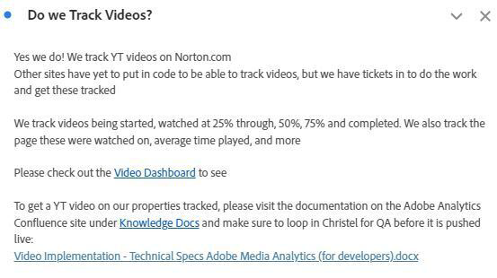
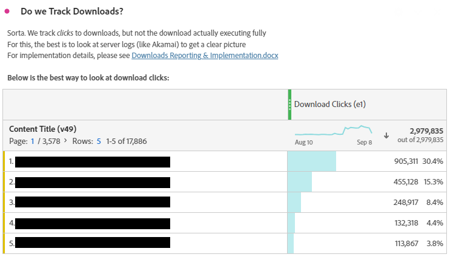

# Erstellen operativer Dashboards in Analysis Workspace

_Erfahren Sie, wie betriebliche Dashboards in [!DNL Adobe Analytics] Workspace die Kommunikation und Effizienz revolutionieren. Erfahren Sie, wie Sie häufig gestellte Fragen, Nachrichten und Ankündigungen sowie Bugs- und Feature-Dashboards erstellen, um vereinfachte Informationen, ein besseres Benutzererlebnis und eine verbesserte Interaktion zu erhalten._

Wie viele Administratoren betreibe ich einen internen Info-Hub (Confluence oder Ähnliches) für [!DNL Adobe Analytics]. Im Laufe der Zeit hatte ich es satt, immer wieder dieselben Fragen zu beantworten, und brauchte einen sanfteren Weg, um meine Benutzer zu erreichen, ohne mich zu fühlen, als ob ich sie die ganze Zeit anpingte und störte. Ich benötigte Repositorys für Informationen, die weniger statisch waren.

Mir fiel auf, dass Benutzer meine Verweise auf die Confluence-Website oft ignorierten, z. B. mit Gründen wie „Mein VPN ist ausgeschaltet“ oder „Ich kann es jetzt nicht lesen“. Grundsätzlich bedeutet „Ich werde das Dokument später lesen“, dass es nie gelesen wird und die gleiche Frage wird nächste Woche wieder gestellt werden.

***Der Realisierungserfolg:**&#x200B;Vielseitigkeit von Workspace könnte alles verändern. Anwender bevorzugen schnelle, direkte Antworten innerhalb von Workspace. Lassen Sie sie also dort bleiben, um zusätzliche Schritte zu vermeiden.*

Ich habe daraufhin betriebliche Dashboards erstellt, um unternehmensweit freizugeben. Bisher haben sie die Nutzer informiert, zentralisiert informiert und die Frustration verringert. Dies ist ein einfacher, sich entwickelnder Prozess, der die Effizienz im Laufe der Zeit steigert.

Die Menschen haben es geschafft, viele gute Informationen ohne mich zu erhalten, Bereiche der Website zu verstehen, zu sehen, wie cool [!DNL Adobe Analytics] ist, und (wichtig für mich ??) stellen Sie mir weniger Fragen und nehmen weniger Zeit.

**Es wird dringend empfohlen, Dashboards für alle Eigenschaften oder Hauptbereiche Ihrer Site zu erstellen.** Sie sollten einen Überblick über die Eigenschaft/Site/App/den Fluss geben und über grundlegende Informationen und schnelle Einblicke verfügen. Sie sollten für das gesamte Unternehmen freigegeben werden, sodass alle Benutzer ein Verständnis der Eigenschaft ohne Handhabe erhalten. Für mich beantworten diese Dashboards in der Regel 80% der Fragen, die ich bekomme, und sparen mir wertvolle Zeit.

Nichts davon hält Sie davon ab, Ihre Confluence-Site zu behalten, was immer noch sehr nützlich ist. Ich verweise sogar oben auf jedem operativen Dashboard darauf. Aber ich liebe Shortcuts - sowohl für mich als auch für meine User.

Lassen Sie mich Ihnen die drei operativen Dashboards zeigen, die ich für meine Firma GenDigital erstellt habe und die mir geholfen haben, diese Ziele zu erreichen.

1. Häufig gestellte Fragen (FAQ)
1. Nachrichten und Ankündigungen
1. Protokolle zu Fehlern, Funktionen und Hauptversionen

## 1. FAQ-Dashboard

Müde von der endlosen Schleife sich wiederholender Antworten? Stopp! Sparen Sie Zeit durch die Erstellung eines häufig gestellten Dashboards. Benutzer können es vor der Anfrage einsehen oder Sie können in Ihren Antworten schnell darauf verlinken.

Erstellen Sie einfach [Textvisualisierungen](https://experienceleague.adobe.com/docs/analytics/analyze/analysis-workspace/visualizations/text.html) mit Fragen, die als Titel formatiert sind, und Antworten/Erklärungen als Inhalt, die alle reduziert werden, um nur die Frage anzuzeigen. Gruppieren Sie sie nach Relevanz (z. B. Seiten oder Produkte) oder verwenden Sie Bedienfelder. Halten Sie es einfach und priorisieren Sie allgemeine Abfragen am Anfang.

Aktualisieren Sie Ihr FAQ-Dashboard, anstatt lange E-Mails zu schreiben oder alte Erklärungen wiederzuentdecken. Beginnen Sie jetzt und erweitern Sie im Laufe der Zeit. Verwenden Sie Hyperlinks, um auf andere Dashboards oder zugehörige FAQs in Berichten zu verweisen. Stellen Sie bei Bedarf komplexen Kontext bereit, indem Sie Links von anderen Dashboards zu häufig gestellten Fragen erstellen.

Bei Gen Digital konzentrieren sich unsere FAQs auf die kundenspezifische [!DNL Adobe Analytics] und nicht auf Grundlagen. E-Mail-spezifische FAQ-Links durch Rechtsklick, Auswahl von „Visualisierungs-Link abrufen“ und Freigabe der Vanity-URL. Dadurch wird der genaue Inhalt für Benutzerinnen und Benutzer hervorgehoben. Verwenden Sie Freiformtabellen für die Datenvisualisierung, indem Sie weitere Erklärungen mit „Beschreibung bearbeiten“ hinzufügen.

Sobald sich Ihre häufig gestellten Fragen umfassend anfühlen, teilen Sie sie mit dem Unternehmen, um gemeinsamen Zugriff zu erhalten und zu lernen. Verbessern Sie nach Bedarf weiter.

Im Folgenden finden Sie einige Screenshots dazu, wie ein häufig gestelltes Dashboard aussehen kann:

## 2. Dashboard für Nachrichten und Ankündigungen

Ein weiteres nützliches operatives Dashboard ist ein Dashboard für Nachrichten und Ankündigungen. Ich habe dieses Programm gestartet, weil ich Informationen an meine User weitergeben wollte, aber ich hatte das Gefühl, stattdessen habe ich sie gepingt und genervt. Braucht jeder dieses Update? Welche Benutzer? Nur Power-User? Sollte ich einen wöchentlichen Newsletter versenden, den niemand lesen wird? Wenn Sie das Update stattdessen direkt in Workspace haben, können Benutzer es sehen, sobald sie sich anmelden, und ich muss keine weitere Unternehmens-E-Mail versenden, die niemand lesen möchte.

Da diese Dashboards unternehmensweit angezeigt werden, steigen Aktualisierungen sofort an die Spitze. Die folgenden Informationen werden im Dashboard „Nachrichten und Ankündigungen“ angezeigt:

- Funktionsveröffentlichungen und -aktualisierungen auf unserer Seite (hauptsächlich Code-Versionen)
- Wichtige neue Funktionen von [!DNL Adobe]
- Office Hours-Zeitplan
- Liste aller Überblick-Dashboards und coolen Berichte zum Auschecken

Es behandelt unsere neuen Funktionen, Tracking und wichtigen Dashboards. Hyperlinks in Textberichten (oder über anderen Berichten über Rechtsklick und Bearbeitungsbeschreibung) ermöglichen Links zu anderen Dashboards auf der Seite mit den Funktionen von [!DNL Adobe Analytics] oder [!DNL Adobe].

So sieht mein Nachrichten- und Ankündigungs-Dashboard aus:

## 3. Protokoll zu Bugs, Features und Hauptversionen

Das Ziel dieses operativen Dashboards ist es, einen zentralen Ort für alle Fehler und Fehler zu haben. Früher habe ich das in Excel verwaltet, aber es war mühsam und schwer zu teilen. Warum nicht direkt in Workspace?

Sie können ihn in das Dashboard Nachrichten und Ankündigungen integrieren, wenn Sie möchten, dass er weniger prominent ist. Wenn jedoch die Fehlerberichterstattung für Ihr Unternehmen wesentlich oder kritisch ist, kann ein separates Dashboard ratsam sein.

Ich verwende eine Textvisualisierung und halte sie mit Aufzählungspunkten sehr einfach. Dem Aufzählungspunkt sind das Datum des Fehlers sowie die Eigenschaft vorangestellt (z. B.: &#39;3jan23-17jan23 - Norton.com&#39;, &#39;Vor 14sep22 - Chat&#39;). Ich füge dann die Details hinzu und versuche, sie kurz und prägnant zu halten. Ich vermeide es, anzugeben, welches Team schuld war, und vermeide es, zu viele technische Details hinzuzufügen, die Ihren Benutzern wahrscheinlich egal sind.

Der neueste Fehler befindet sich oben, während ältere in jährlichen Textberichten enthalten sind (z. B. „2022 - Bekannte Fehler, Fehler und Änderungen„) - alle reduziert.

Nichts Besonderes. Es ist wirklich einfach, und Sie müssen zugeben, viel besser als diese Excel-Datei, die Sie auf Ihrer Festplatte haben und immer auf Confluence aktualisieren.

Ich verweise hier auch auf Übersichts-Dashboards und coole Berichte, ähnlich wie andere operative Dashboards. Links zu häufig gestellten Fragen und Nachrichten- und Ankündigungs-Dashboards befinden sich oben.

Im Folgenden finden Sie ein Beispiel dafür, wie Ihr Protokoll aussehen kann:

Die Erstellung operativer Dashboards in [!DNL Adobe Analytics] Workspace hat für mich eine Wende herbeigeführt. Wie viele Administratoren managte ich einen internen Hub und hatte mit doppelten Antworten und effektiver Benutzerkommunikation zu kämpfen. Der Bedarf an dynamischen Repositorys führte zu der Erkenntnis, dass die Vielseitigkeit von Workspace die Interaktion revolutionieren könnte. Ich hoffe, Sie nutzen die Leistungsfähigkeit von operativen Dashboards in [!DNL Adobe Analytics] Workspace. Verbessern Sie das Benutzererlebnis, sparen Sie Zeit und profitieren Sie von einer besser organisierten Umgebung. Ihr Journey beginnt jetzt, und diese Dashboards sind Ihre Schlüssel zu Effizienz und Benutzerfreundlichkeit.

## Autor

Dieses Dokument wurde verfasst von:

**Christel Guidon**, Digital [!DNL Analytics] Platform Manager bei Gen

[!DNL Adobe Analytics] Champion
