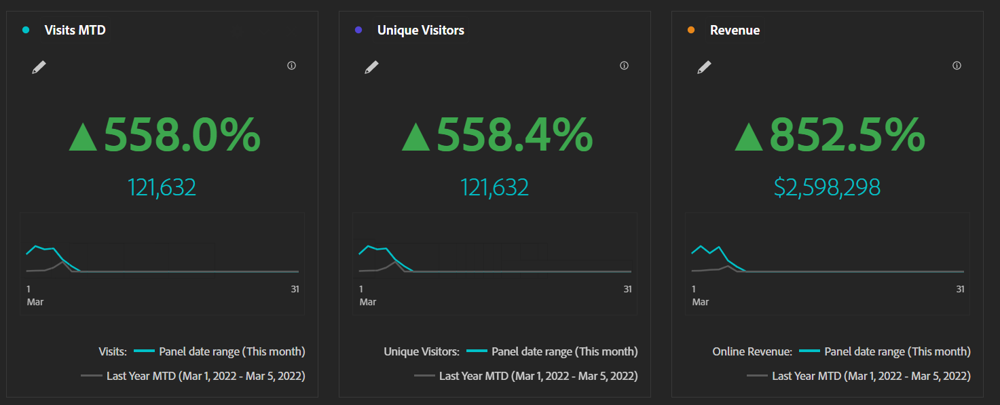

# Fördern des Erfolgs mit Dashboards mit Executive Summary

_Führungskräfte verfügen häufig nicht über aktuelle und relevante Informationen für ihre Sites und Apps, sondern verlassen sich auf monatliche Excel-Diagramme oder ertrinken in granularen Daten. Die Lösung: Experience Manager Cloud ManagerMarketo EngageExecutive Summary-Dashboard._

Stellen Sie sich vor, Sie fahren von Seattle nach San Francisco. Richtungsweisend, ist es ziemlich einfach. Steigen Sie auf die I-5 South für zwölf bis sechzehn Stunden und Sie sind dort. Einfach, oder? Stellen Sie sich vor, ich habe ein Stück Pappe über Ihr Armaturenbrett gelegt, und ich sage Ihnen das am Ende
Während Ihrer Reise erhalten Sie ein Dashboard, das Ihnen Ihre Geschwindigkeit, Ihren Kraftstoffstand und die zurückgelegte Strecke mitteilt:

Wenn Sie die Grafik betrachten, bemerken Sie vielleicht ein paar Dinge:

1. Ihre Geschwindigkeit variierte stark, überstieg die erlaubte Geschwindigkeitsbegrenzung an einigen Stellen weit, und war an anderen Stellen sehr niedrig, aufgrund von Dingen wie dem Verkehr in Portland

1. Die zurückgelegte Strecke bleibt für Stunden 6-9 statisch

1. Der Grund dafür ist, dass der Treibstoff auf 0 % gesunken ist und man auf Pannenhilfe warten musste, um durch den Verkehr in Portland zu kommen und den Benzintank wieder aufzufüllen

Eine solche Reise wäre offensichtlich miserabel, unvorhersehbar und gefährlich. Es ist nicht so, wie man fährt. Sie benötigen kontinuierliche Informationen über Geschwindigkeit, zurückgelegte Strecke und Kraftstoffstand, um fortlaufende Anpassungen in der Art und Weise, wie Sie fahren, vornehmen zu können. Zweifellos würde eine vernünftige Person den Karton vom Armaturenbrett reißen und regelmäßig nachsehen, was die Reisedauer um Stunden reduzieren würde, das Risiko, keinen Sprit zu haben, nahezu ausschalten und Sie mit der richtigen Geschwindigkeit in Bewegung halten würde, um einen Strafzettel für zu schnelles Fahren zu vermeiden.

Warum akzeptieren so viele Führungskräfte dies als vernünftige Methode, ihre Sites und Apps zu betreiben?

Viele Führungskräfte haben keinen Zugriff auf laufende, relevante Informationen, die sie benötigen, um rechtzeitig Maßnahmen ergreifen zu können. Stattdessen erhalten sie einmal im Monat ein Deck mit Statistiken, die von [!DNL Adobe Analytics] nach Excel exportiert, grafisch dargestellt und dann in einen PowerPoint verschoben werden. Wenn ein Wendepunkt zu Beginn des Monats auftritt, wissen sie erst zu Beginn des nächsten Monats davon, lange nachdem sie Fragen stellen oder Maßnahmen ergreifen können. Benutzerdefinierte Warnhinweise sind auch eine gute Option, aber wir alle wissen, wie der E-Mail-Posteingang eines Exec aussieht.

Man möchte, dass die Führungskräfte genügend Daten haben, um sofort zu erfahren, wann ihre Aufmerksamkeit benötigt wird, und nicht so sehr, dass sie frustriert ihre Hände heben. Wenn Sie eine Nachricht von einem Produkteigentümer oder Marketing-Manager erhalten, dass ein Manager von einer Anomalie wissen möchte, erreichen Sie das Optimum.

An dieser Stelle kommt das Dashboard „Executive Summary“ als fröhliches Medium ins Spiel. Wir wissen, dass die mobile Scorecard sich hervorragend für einen schnellen Check-in für einen leitenden Angestellten unterwegs eignet. Ein Dashboard für die Executive Summary erleichtert es Führungskräften jedoch, etwas tiefer zu gehen, wenn sie an ihrem Schreibtisch sitzen. Die mobile Scorecard kann sie über ein Problem informieren, aber über das Dashboard „Executive Summary“ können sie dann genügend Informationen erhalten, um den richtigen Personen die richtigen Fragen zu stellen.

Die meisten Führungskräfte haben um die drei KPIs, die ihnen am Herzen liegen. Im Einzelhandel können es Bestellungen, Umsatz und AOV sein. Für B2B: Leads, Lead-Qualität und Konversionsrate. Services sind möglicherweise an Besuchen, Terminen und wiederkehrenden Besuchern interessiert. Was auch immer die drei sind, stellen Sie sie in große, kühne Zahlen mit einer jährlichen Änderung und einem Diagramm. Die Visualisierung der Zusammenfassung der Schlüsselmetriken macht dies so einfach:

Fügen Sie historische Daten für diese drei Metriken hinzu, damit Sie langfristige Trends leicht erkennen können:

Fügen Sie einige Dropdown-Listen für alle Elemente hinzu, die für Ihr Unternehmen wichtig sind. Ich finde, dass Gerätetyp und Marketing-Kanal in der Regel gute Wetten sind:

![Social [!DNL Campaign]s.png](assets/social-campaigns.png)

Beides ist insgesamt ziemlich wichtig, aber stellen Sie wie immer sicher, dass das, was Sie auswählen, für Ihre Site oder Ihr Programm relevant ist.

Schließlich, am Ende, fügen Sie einige Details. Ich finde, dass die Leistung von Seiten oft bei Führungskräften beliebt ist, aber der Schlüssel ist, dass sie unter der Falte ist. Sie können ihn bei Bedarf abfragen, verfügen aber ansonsten über die Daten, die sie benötigen, um sofort Fragen zu stellen:

Mit diesem Endprodukt müssen Sie nur:

- Trainieren Sie Ihre Führungskräfte darin, wie man es liest

- Schulung zur Verwendung der Filter

- Trainieren Sie sie in einem einfachen Drilldown

- Trinken Sie etwas Kaffee und bereiten Sie sich vor, denn nachdem die Manager mit Daten ausgestattet sind, kommen sie mit vielen Fragen zu Ihnen

Zusammenfassend lässt sich sagen, dass Executive Summary Dashboards kontinuierliche, relevante Informationen für eine zeitnahe Entscheidungsfindung bieten. Monatliche Decks mit Excel-Diagrammen sind nicht ausreichend und die Bereitstellung von zu vielen granularen Daten kann Führungskräfte überfordern. Ein gutes Medium ist es, sich auf die drei wichtigsten KPIs mit historischen Daten und Dropdown-Listen für relevante Faktoren zu konzentrieren. Durch Schulung
Führungskräfte können fundierte Entscheidungen über die Verwendung des Dashboards treffen und Fragen stellen. Executive Summary-Dashboards können die Leistung von Sites und Apps verbessern und den Erfolg fördern.

## Autor

Dieses Dokument wurde verfasst von:

**Gitai Ben-Ammi**, Principal Consultant bei Concentrix Catalyst

[!DNL Adobe Analytics] Champion

