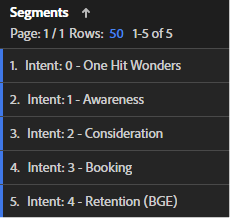
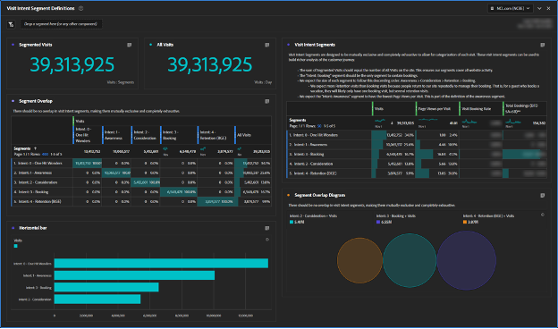

# Erstellen von Journey-Segmenten für Kunden

Erfahren Sie, wie Sie verhaltensbasierte Kundensegmente in [!DNL Adobe Analytics] erstellen und das Kundenerlebnis mit [!DNL Adobe]-Experience Cloud verbessern können, indem Sie diese schrittweise Anleitung befolgen.

Erstellen wir bessere Journey-Segmente für Kunden! In dieser Reihe verwenden wir [!DNL Adobe Analytics], um verhaltensbasierte Segmente zu definieren, Zielgruppengrößen zu schätzen und Benutzerbewegungen zu verfolgen. Am Ende können Sie Medien personalisieren und das Kundenerlebnis mit [!DNL Adobe] Experience Cloud verbessern. Beachten Sie, dass diese Segmente aktuell sind und aktualisiert werden sollten, wenn Sie mehr über Ihre Kunden erfahren. Auch wenn die Berichterstellung einige Herausforderungen darstellen kann, machen Sie sich keine Sorgen, ich werde Sie durch sie führen! Beginnen wir mit der Erstellung unseres ersten Segments für Customer Journey, beginnend mit dem Segment &quot;One Hit Wonders&quot;.

Heute erstellen wir Platzhalter für unsere ersten Kundensegmente, erstellen eine [!DNL Adobe Analytics] Workspace, um uns bei der Definition unserer Journey zu unterstützen, und definieren unser erstes Segment &quot;One Hit Wonders&quot;.

Am Ende dieser Serie können Sie Kundensegmente in [!DNL Adobe Analytics] erstellen, die auf Verhaltenssignalen basieren. Sie können die Größe der einzelnen Zielgruppen in jeder Phase des Journey schätzen und verstehen, mit welcher Rate Benutzer zwischen diesen Phasen wechseln. Außerdem können Sie diese Journey-Zielgruppen für Kunden in [!DNL Adobe] Experience Cloud exportieren, um Personalisierung und Medien-Targeting zu ermöglichen.

Jedes Unternehmen ist anders, was bedeutet, dass Ihre Journey-Segmente Ihrer Kunden anders aussehen als meine. Anstatt spezifische Formeln für Ihre Segmente zu formulieren, sollten Sie daher einige Dinge vorschlagen, die Sie untersuchen sollten, und einen allgemeinen Prozess für deren Erstellung.

Beachten Sie außerdem, dass Ihre Journey-Segmente lebende Segmente sein werden. Dies ist keine einmalige Übung. Wenn Sie mehr über Ihre Kunden erfahren, aktualisieren Sie diese Segmente. Dies stellt einige Herausforderungen für die Berichterstellung dar. Die Benutzer möchten Kohärenz in ihren Berichten sicherstellen. Wenn sich unsere Segmentdefinitionen ändern, ändern sich auch die Zahlen in den Berichten.

## Erste Schritte mit Besuchsabsichten-Segmenten

Der erste Schritt beim Erstellen von Kundensegmenten besteht darin, zu erkennen, warum ein Journey auf Ihrer Website mithilfe von Verhaltenssignalen und, falls verfügbar, mithilfe von Kundendaten angezeigt wird. Wir werden eine Reihe von Besuchsinstanzen erstellen, um alle Besuche auf der Website zu kategorisieren. An dieser Stelle müssen sich unsere Besuchsabsichten-Segmente gegenseitig ausschließen und vollständig erschöpfend sein. Jeder Besuch sollte zu einem Segment gehören, und nur zu einem Segment mit Besuchsabsicht .

Die Segmente für Besuchsabsichten beschreiben einen Besuch. Daher verwenden wir den Besuchsbehälter in der Segmentdefinition.

Zu meinen anfänglichen Segmenten für den Besuchsabsichten gehörten:

* One Hit Wonders
* Bewusstsein
* Betrachtung
* Buchung (Kauf)
* Bindung (Buchung/Kauf verwalten)

Damit meine Segmente für den Besuchsabsichten einfach zu verwenden sind, habe ich meinen Segmentnamen den Präfix &quot;Intent:&quot;, gab ihnen eine Nummer, um die Sortierung zu ermöglichen, und habe sie mit &quot;Intent&quot;getaggt. Meine Segmente sahen wie das folgende Bild aus.

**Erstellen Sie zunächst Ihre Besuchsabsichten-Segmente mithilfe des Besuchsbehälters mit einer Platzhalterdefinition für Seitenansichten >= 1.**

Wie wir sehen werden, ist der Aufbau dieser Segmente ein iterativer und vernetzter Prozess. Ich werde den Prozess der Erstellung dieser Segmente in einem zukünftigen Beitrag beschreiben.

## Die Segmentdatenqualität Workspace für Besuchsabsichten

Ich habe einen einfachen Arbeitsbereich verwendet, um sicherzustellen, dass ich meine Segmente für den Besuchsabsichten gut definiert habe. Beachten Sie, dass jeder Besuch zu einem Segment und nur einem Segment für den Besuchsabsichten gehören muss. Der von mir eingerichtete Arbeitsbereich stellt sicher, dass alle Besuche berücksichtigt werden und dass keine Überschneidungen zwischen den Segmenten vorliegen.

Ich habe diesen Arbeitsbereich mit den Tags &quot;Datenqualität&quot;, &quot;Besuchsabsichten&quot;und &quot;Journey&quot;bezeichnet. Später erstellen wir ein Dashboard für Besuchsabsichten, sodass das Präfix &quot;DATENQUALITÄT&quot;anzeigt, dass dieser Arbeitsbereich für die Einrichtung und Wartung der Segmente dient. Es handelt sich dabei um ein Admin-Dashboard, das wenig Geschäftserfahrung hat, aber wichtig ist, um sicherzustellen, dass die Segmente gepflegt werden. Es empfiehlt sich, regelmäßig zu diesem Dashboard zurückzukehren oder Warnhinweise einzurichten, um sicherzustellen, dass Ihre Segmente korrekt definiert bleiben.

Die wichtigste Visualisierung in diesem Arbeitsbereich ist die Freiformvisualisierung der Segmentüberlagerung in der Mitte links. Erstellen Sie mithilfe der Metrik Besuche Spaltenfilter für jedes Ihrer Besuchsabsichten-Segmente sowie das Segment Alle Besuche in der Spalte ganz rechts. Erstellen Sie Zeilen für jedes Segment mit Besuchsabsichten auf der linken Seite. Sie verfügen jetzt über eine tabulatorübergreifende Visualisierung. Wenn Ihre Segmente korrekt konfiguriert sind, gibt es nur Daten in einer Spalte und einer Zeile an der Schnittmenge jedes Besuchsinteressent-Segments mit sich selbst.

Die nächsten wichtigsten Visualisierungen sind die Zusammenfassungsmetriken oben links. Die Zusammenfassung segmentierter Besuche nimmt ihren Wert aus der Spalte &quot;Alle Besuche&quot;in der Visualisierung der Segmentüberschneidung direkt unten an. Die Zusammenfassung &quot;Alle Besuche&quot;verfügt über eine eigene ausgeblendete Tabelle.

Oben rechts habe ich zusätzliche Metriken zu den einzelnen Segmenten hinzugefügt, um einen &quot;Geschmack&quot;für die Gestaltung der Segmente zu geben. Da sich diese Segmente gegenseitig ausschließen, erwarte ich nur Buchungen für das Segment &quot;Buchungsabsicht&quot;. (Angst nicht, wir werden zu Konversionsraten kommen, wenn wir diese Besuchsabsichten segmentieren, die auf Besuchern basieren.

Denken Sie daran, dass wir soeben Platzhaltersegmente erstellt haben. Zunächst wird Ihr Arbeitsbereich also erstaunlich aussehen. Alle Segmente mit Besuchsabsichten überschneiden sich zu 100 %, da sie dieselbe Definition aufweisen. Dies ist richtig und genau das, was Sie an dieser Stelle im Prozess sehen möchten. Während wir die Segmentdefinitionen erstellen, werden Sie sehen, wie diese Segmente anfangen, Gestalt anzunehmen.

## Erstellen des Segments für den ersten Besuch

Die Definition von Besuchsabsichten-Segmenten ist ein wenig ein Eliminierungsprozess, und es gibt eine große Interdependenz zwischen ihnen. Ich baute diese Segmente also nicht in der Reihenfolge der Journey, ich baute sie, um sie von den am einfachsten definierten zu den schwierigsten zu ordnen. Das gab mir die folgende Reihenfolge:

1. Intent: 0 - One Hit Wonders
1. Absicht: 3 - Buchung
1. Absicht: 4 - Bindung
1. Intent: 2 - Überlegungen
1. Absicht: 1 - Bewusstsein

Ziemlich zufällig, nicht wahr? Die Definition dieser Besuchsabsichten-Segmente war ein iterativer Prozess, ein Prozess, und oft erforderte die Anpassung an ein Segment Aktualisierungen an anderen Segmenten. Dies wird klarer, da ich beschreibe, wie ich die einzelnen Segmente definiert habe.

Heute definieren wir unser erstes und einfachstes Segment, One Hit Wonders

## Erstellen des Segments &quot;One Hit Wonders&quot;

Mein erstes Segment, &quot;One Hit Wonders&quot;, war einfach zu definieren. Es handelt sich lediglich um einen Besuch mit nur einem Seitenaufruf. Wir wissen wirklich nicht, warum dieser Benutzer auf der Website war, weil er abgestürzt war. Ich vermute, dass wir einen Intent auf Grundlage seiner Entrypage erraten könnten, aber mit nur einem Seitenaufruf gibt es einfach nicht genug Informationen, um eine fundierte Einschätzung des Intents vorzunehmen.

Nachdem Sie dieses Segment definiert haben, sehen Sie, wie Ihr Besuchsabsichten-Workspace Gestalt annimmt.

Die Erstellung von Kundensegmenten mit [!DNL Adobe Analytics] ist ein anspruchsvoller, aber lohnender Prozess. Durch die Erstellung verhaltensbasierter Segmente, die Schätzung der Zielgruppengrößen und die Verfolgung von Benutzerbewegungen können Unternehmen Medien personalisieren und das Kundenerlebnis verbessern. Jedes Unternehmen ist einzigartig, und es gibt keine spezifischen Formeln zum Erstellen von Segmenten, sondern Richtlinien und einen Prozess, der befolgt werden muss. Segmente sollten aktualisiert werden, wenn Unternehmen mehr über ihre Kunden erfahren, was Berichterstellungsprobleme mit sich bringt. Indem Unternehmen dem Prozess der Erstellung von Besuchsabsichten-Segmenten folgen, können sie das Kundenerlebnis insgesamt verbessern.

## Autor

Dieses Dokument wurde geschrieben von:

**Aaron Fossum**, Director, Digital [!DNL Analytics]

[!DNL Adobe Analytics] Champion
