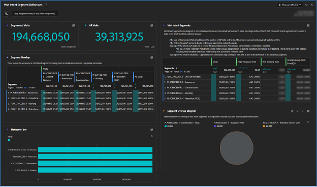
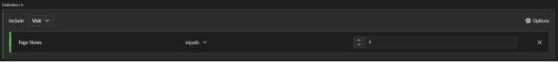

# Erstellen von Kunden-Journey-Segmenten

Erfahren Sie, wie Sie in [!DNL Adobe Analytics] verhaltensbasierte Kunden-Journey-Segmente erstellen und das Kundenerlebnis mit [!DNL Adobe] Experience Cloud verbessern können, indem Sie diese schrittweise Anleitung befolgen.

Erstellen wir bessere Kunden-Journey-Segmente! In dieser Reihe verwenden wir [!DNL Adobe Analytics], um verhaltensbasierte Segmente zu definieren, Zielgruppengrößen zu schätzen und Benutzerbewegungen zu verfolgen. Am Ende werden Sie in der Lage sein, Medien zu personalisieren und das Kundenerlebnis mit [!DNL Adobe] Experience Cloud zu verbessern. Denken Sie daran, dass diese Segmente noch vorhanden sind und aktualisiert werden sollten, wenn Sie mehr über Ihre Kunden erfahren. Auch wenn die Berichterstellung einige Herausforderungen mit sich bringen kann, keine Sorge, ich werde Sie durch diese führen! Beginnen wir mit der Erstellung unserer ersten Gruppe von Kunden-Journey-Segmenten, beginnend mit dem Segment „One Hit Wonders“.

Heute erstellen wir Platzhalter für unsere ersten Kundensegmente, erstellen eine [!DNL Adobe Analytics] Workspace, mit der wir unsere Journey definieren können, und definieren unser erstes Segment, „One Hit Wonders“.

Am Ende dieser Serie werden Sie in der Lage sein, auf der Grundlage von Verhaltenssignalen Kunden-Journey-Segmente in [!DNL Adobe Analytics] zu erstellen. Sie können die Größe der einzelnen Zielgruppen in jedem Stadium des Journey schätzen und verstehen, mit welcher Geschwindigkeit sich Benutzer zwischen diesen Stadien bewegen. Außerdem können Sie diese Kunden-Journey-Zielgruppen auf [!DNL Adobe] Experience Cloud exportieren, um Personalisierung und Medien-Targeting zu ermöglichen.

Jedes Unternehmen ist anders, und das bedeutet, dass Ihre Kunden-Journey-Segmente anders aussehen als meine. Anstatt spezifische Formeln für Ihre Segmente vorzuschreiben, schlagen Sie einige Dinge vor, die Sie beachten sollten, und einen allgemeinen Prozess für ihre Erstellung.

Beachten Sie außerdem, dass es sich bei Ihren Kunden-Journey-Segmenten um aktive Segmente handelt. Dies ist keine einmalige Aufgabe. Wenn Sie mehr über Ihre Kunden erfahren, aktualisieren Sie diese Segmente. Dies stellt das Reporting vor einige Herausforderungen. Die Benutzer wünschen Konsistenz in ihren Berichten. Wenn sich unsere Segmentdefinitionen ändern, ändern sich auch die Zahlen in den Berichten.

## Erste Schritte mit Besuchsabsichtssegmenten

Der erste Schritt zum Erstellen von Kunden-Journey-Segmenten besteht darin, mithilfe von Verhaltenssignalen und, falls verfügbar, Voice of Customer-Daten abzuleiten, warum sich ein Gast auf Ihrer Website befindet. Wir erstellen eine Reihe von Segmenten für die Besuchsabsicht, um alle Besuche auf der Website zu kategorisieren. An dieser Stelle müssen sich unsere Besuchsabsichtssegmente gegenseitig ausschließen und vollständig erschöpfend sein. Jeder Besuch sollte einem und nur einem Besuchsabsichtssegment angehören.

Die Besuchsabsichtssegmente beschreiben einen Besuch. Daher verwenden wir den Besuchs-Container in der Segmentdefinition.

Zu meinem ersten Satz von Besuchsabsichtssegmenten gehörten:

* Ein Treffer wundert sich
* Bewusstheit
* Hinweis
* Buchung (Kauf)
* Aufbewahrung (Buchung/Kauf verwalten)

Um die Verwendung meiner Besuchsabsichtssegmente zu vereinfachen, habe ich meinen Segmentnamen das Präfix „Absicht:“ vorangestellt, ihnen eine Nummer zur Aktivierung der Sortierung gegeben und sie mit „Absicht“ versehen. Meine Segmente sahen wie im folgenden Bild aus.

**Erstellen Sie anschließend Ihre Besuchsabsichtssegmente mithilfe des Besuchs-Containers mit einer Platzhalterdefinition von Seitenansichten >= 1.**

Wie wir sehen werden, ist der Aufbau dieser Segmente ein iterativer und vernetzter Prozess. Ich werde den Prozess zum Erstellen dieser Segmente in einem zukünftigen Beitrag beschreiben.

## Workspace zur Datenqualität des Besuchssegments

Ich habe einen einfachen Arbeitsbereich verwendet, um sicherzustellen, dass ich meine Besuchsabsichtssegmente gut definiert habe. Denken Sie daran, dass jeder Besuch zu einem und nur einem Segment mit der Besuchsabsicht gehören muss. Der von mir eingerichtete Arbeitsbereich stellt sicher, dass alle Besuche berücksichtigt werden und es keine Überschneidungen zwischen den Segmenten gibt.

Ich habe diesen Arbeitsbereich „DATENQUALITÄT: Besuchsabsichtssegmente“ mit den Tags „Datenqualität“, „Besuchsabsicht“ und „Kunden-Journey&quot; benannt. Später erstellen wir ein „Besuchsabsicht-Dashboard“, sodass das Präfix „DATENQUALITÄT“ anzeigt, dass dieser Arbeitsbereich für die Einrichtung und Verwaltung der Segmente verwendet wird. Es handelt sich dabei um ein administratives Dashboard, das wenig geschäftliche Einblicke bietet, aber wichtig ist, um sicherzustellen, dass die Segmente gepflegt werden. Es empfiehlt sich, routinemäßig zu diesem Dashboard zurückzukehren oder Warnhinweise einzurichten, um sicherzustellen, dass Ihre Segmente korrekt definiert bleiben.

Die wichtigste Visualisierung in diesem Arbeitsbereich ist die Freiformvisualisierung für Segmentüberschneidungen in der linken Mitte. Erstellen Sie mithilfe der Metrik Besuche Spaltenfilter für jedes Ihrer Besuchsabsichtssegmente plus das Segment Alle Besuche in der Spalte ganz rechts. Erstellen Sie Zeilen für jedes Segment mit Besuchsabsicht auf der linken Seite. Jetzt verfügen Sie über eine tabellenübergreifende Visualisierung. Wenn Ihre Segmente richtig konfiguriert sind, gibt es nur Daten in einer Spalte und einer Zeile, am Schnittpunkt jedes Besuchsabsichtssegments mit sich selbst.

Die nächstwichtigsten Visualisierungen sind die Zusammenfassungsmetriken oben links. Die segmentierte Besuchsübersicht übernimmt ihren Wert aus der Spalte Alle Besuche in der Visualisierung der Segmentüberschneidung direkt unten. Die Zusammenfassung „Alle Besuche“ verfügt über eine eigene ausgeblendete Tabelle.

Oben rechts habe ich zusätzliche Metriken zu jedem der Segmente hinzugefügt, um der Entwicklung der Segmente einen gewissen „Geschmack“ zu verleihen. Da sich diese Segmente gegenseitig ausschließen, erwarte ich insbesondere nur Buchungen für das Segment „Buchungsvorgabe“ (fürchten Sie nicht, wir werden Konversionsraten erzielen, wenn wir diese Segmente für Besuchsabsicht besucherbasiert gestalten.

Denken Sie daran, dass wir gerade Platzhaltersegmente erstellt haben. Zunächst sieht Ihr Arbeitsbereich also nicht immer gut aus. Alle Besuchsabsichtssegmente überschneiden sich zu 100 %, da sie dieselbe Definition haben. Das ist richtig und genau das, was Sie an dieser Stelle im Prozess sehen möchten. Beim Erstellen der Segmentdefinitionen sehen Sie, wie diese Segmente Gestalt annehmen.

## Erstellen des ersten Besuchszielsegments

Die Definition der Besuchsabsichtssegmente ist ein wenig ein Eliminierungsprozess, und es besteht eine große Interdependenz zwischen ihnen. Ich habe diese Segmente nicht in der Reihenfolge der Journey erstellt, sondern in der Reihenfolge der am einfachsten zu den anspruchsvollsten. Das gab mir diesen Befehl:

1. Absicht: 0 - One Hit Wonders
1. Absicht: 3 - Buchung
1. Absicht: 4. Bindung
1. Absicht: 2 - Überlegungen
1. Absicht: 1 - Bewusstheit

Ziemlich zufällig, was? Die Definition dieser Besuchsabsichtssegmente war ein iterativer, wechselseitiger Prozess und oft erforderte eine Anpassung an ein Segment die Aktualisierung anderer Segmente. Dies wird noch deutlicher werden, wenn ich beschreibe, wie ich jedes dieser Segmente definiert habe.

Heute definieren wir unser erstes und einfachstes Segment, die One Hit Wonders

## Erstellen des Segments „One Hit Wonders“

Mein erstes Segment, „One Hit Wonders“, war einfach zu definieren. Es ist einfach jeder Besuch mit nur einer Seitenansicht. Wir wissen wirklich nicht, warum dieser Benutzer auf der Website war, denn sie haben sich abgewiesen. Ich nehme an, wir können einen Intent anhand seiner Einstiegsseite erraten, aber mit nur einer Seitenansicht gibt es einfach nicht genug Informationen, um einen fundierten Intent zu erraten.

Nachdem Sie dieses Segment definiert haben, werden Sie sehen, wie sich Ihre Besuchsabsicht Workspace entwickelt.

Die Erstellung von Kunden-Journey-Segmenten mithilfe von [!DNL Adobe Analytics] ist ein anspruchsvoller, aber lohnender Prozess. Durch die Erstellung verhaltensbasierter Segmente, die Schätzung der Zielgruppengrößen und die Verfolgung von Benutzerbewegungen können Unternehmen Medien personalisieren und das Kundenerlebnis verbessern. Jedes Unternehmen ist einzigartig, und es gibt keine spezifischen Formeln zum Erstellen von Segmenten, sondern Richtlinien und einen Prozess, der befolgt werden muss. Segmente sollten aktualisiert werden, wenn Unternehmen mehr über ihre Kunden erfahren, was Reporting-Herausforderungen mit sich bringt. Durch Befolgen des Prozesses zum Erstellen von Besuchsabsichtssegmenten können Unternehmen die allgemeine Kundenerfahrung verbessern.

## Autor

Dieses Dokument wurde verfasst von:

**Aaron Fossum**, Director, [!DNL Analytics]

[!DNL Adobe Analytics] Champion
