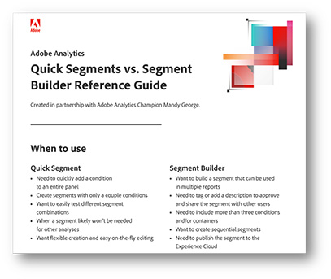

# Unterschiede zwischen Segment Builder und Schnellsegmenten in Analysis Workspace

Segmente können eines der leistungsfähigsten Tools in Ihrem Toolkit für die Datenanalyse sein. Lernen Sie die Unterschiede zwischen der Verwendung von Segment Builder und Schnellsegmenten in Analysis Workspace kennen, um Effizienz zu erzielen.

>[!TIP]
>
> Klicken Sie unten auf der Seite auf das Bild, um eine hilfreiche Erinnerung dazu herunterzuladen, wann die einzelnen Tools in Analysis Workspace verwendet werden sollten.

Segmente können eines der leistungsfähigsten Tools in Ihrem Toolkit für die Datenanalyse sein. Wenn Sie bestimmte Traffic-Gruppen, Site-Bereiche oder Kunden-Journeys betrachten möchten, können Sie die Segmentierung als eine gute Möglichkeit nutzen, Ihre Analyse auf eine bestimmte Untergruppe von Traffic auf Ihrer Site zu konzentrieren. Mein Hintergrund ist der Einzelhandel, und einige der nützlichsten Segmente, die ich erstellt habe, sind für verschiedene Kundengruppen, z. B. neue oder vorhandene Kundinnen und Kunden, angemeldete Kundinnen und Kunden gegenüber Gästen usw. Sie können sie aber auch für verschiedene Site-Bereiche, Kundinnen oder Kunden, die bestimmte Aktionen durchführen, oder für alles andere erstellen, was Ihnen einfällt!

**Es gibt zwei Möglichkeiten, Segmente zu erstellen:**

* Verwenden von Segment Builder im Menü „Komponenten“
* Verwenden der Schnellsegmente oben in einem Bedienfeld

Wenn Sie Ihr Segment mit Segment Builder erstellen, können Sie es speichern, um es in anderen Projekten wiederzuverwenden. Dies ist eine hervorragende Möglichkeit, um sich auf bestimmte Gruppen von Kundinnen und Kunden zu konzentrieren, z. B. Personen, die bestimmte Bereiche der Site besuchen und dann einen Kauf tätigen. Wenn Sie hingegen eine Sondierungsanalyse durchführen und verschiedene Segmenteinstellungen testen möchten, kann der Builder für Schnellsegmente eine große Hilfe sein. Sehen wir uns einige der wichtigsten Vorteile jeder Methode an.

## Schnellsegmente

Am oberen Rand jedes Bedienfelds können Sie auf das Schnellsegmentsymbol (ein Trichter mit dem Symbol +) klicken, um den Builder zu öffnen. Auf diese Weise können Sie ein Segment auf jeder Ebene (Treffer, Besuch oder Besucherin bzw. Besucher) mit bis zu drei Bedingungen erstellen. Ähnlich wie Segment Builder gibt Ihnen dies auf der rechten Seite einen Hinweis dazu, ob das Segment Daten zurückgibt, und den Prozentsatz der gesamten Traffic-Population, der im Segment enthalten ist. Dies ist jedoch eine stärker vereinfachte Version gegenüber der vollständige Ansicht des Segmentvolumens, die in Segment Builder angezeigt wird. Wenn Sie mehr als eine Bedingung hinzufügen, können Sie die Operatoren „and“ und „or“ verwenden. Leider gibt es keine „then“-Option für Schnellsegmente. Wenn Sie also sequenzielle Segmente benötigen, müssen Sie den vollständigen Segment Builder verwenden. Es gibt außerdem eine Höchstgrenze von einem Container pro Schnellsegment. Das liegt daran, dass dies wirklich für grundlegende Segmente verwendet werden sollte, die schnell erstellt und bearbeitet werden können. Sobald ein Schnellsegment auf ein Bedienfeld angewendet oder gespeichert wurde, kann es nicht mehr im Bedienfeld bearbeitet werden.

Wenn Sie eine explorative Analyse durchführen und verschiedene Segmenttypen testen möchten, um zu sehen, wie verschiedene Kundengruppen reagieren oder wie verschiedene Kategorien funktionieren, dann ist die Verwendung von Schnellsegmenten wesentlich schneller als die Verwendung von Segment Builder. Darüber hinaus sind diese Segmente nur in dem Projekt verfügbar, in dem sie erstellt wurden. Wenn sich also herausstellt, dass sie nicht die gewünschten Ergebnisse liefern, müssen Sie sich nicht darum kümmern, das gespeicherte Segment aus der primären Liste zu löschen. Wenn Sie nach dem Testen der Segmente feststellen, dass es nützlich für andere Projekte sein könnte, können Sie jederzeit auf die Schaltfläche „Builder öffnen“ klicken, um das Segment im vollständigen Segment Builder zu öffnen und es als normales Segment zu speichern. Danach können Sie sie jedoch nicht mehr im Builder für Schnellsegmente bearbeiten.

## Segment Builder

Sie können auf Segment Builder zugreifen, indem Sie auf das Symbol „+“ über der Segmentliste im Komponentenmenü links klicken oder aus dem Dropdown-Menü „Komponenten“ die Option „Segment erstellen…“ auswählen. Im Gegensatz zu den Schnellsegmenten stehen Ihnen hier alle Optionen zur Verfügung. Um mehrere Bedingungen hinzuzufügen, können Sie sequenzielle Segmente mit dem Operator „then“ erstellen. Mit sequenziellen Segmenten können Sie auch „Logikgruppe“ als Ebene (anstelle von Treffer, Besuch oder Besucherin bzw. Besucher) verwenden. Mit Segment Builder können Sie den Segmenten auch eine Beschreibung hinzufügen. So können Sie Kontexte dazu hinzufügen, wer das Segment erstellt hat oder welche Datentypen für die Filterung erstellt wurden, oder sogar einfach für Organisationszwecke „Tags“ zum Segment hinzufügen, was beides im Builder für Schnellsegmente nicht möglich ist.

Die Verwendung von Segment Builder ist wichtig, wenn Ihr Segment mehr als drei Bedingungen aufweisen soll, wenn Sie Container verwenden oder sequenzielle Segmente benötigen. Der vollständige Segment Builder bietet wesentlich mehr Optionen, um komplexere Segmente zu erstellen. Dies kann Ihnen helfen, verschiedene Kundentypen, Kategorien, Kunden-Journeys usw. aufzuschlüsseln. Nachdem diese Segmente erstellt und gespeichert wurden, werden sie zur primären Segmentliste hinzugefügt, d. h. sie können getaggt, genehmigt, freigegeben, in mehreren Berichten verwendet und in Experience Cloud veröffentlicht werden. Durch die Veröffentlichung auf der Experience Cloud können Sie das Segment in anderen [!DNL Adobe] Produkte, wie z. B. in [!DNL Adobe] Targeting für Personalisierung. In Segment Builder erstellte Segmente können nicht im Schnellsegmente-Bedienfeld bearbeitet werden, sondern Sie müssen Segment Builder öffnen, um Änderungen daran vorzunehmen. Glücklicherweise bietet die Vorschau rechts eine detailliertere Analyse des Traffics, den das Segment in den letzten 90 Tagen einbringen würde. Dies bedeutet, dass Sie einfacher sicherstellen können, dass das Segment das einbringt, was Sie möchten, bevor Sie speichern.

## Anwendungsfälle

In verschiedenen Branchen können Ihre Verwendungszwecke für das Erstellen benutzerdefinierter Segmente unterschiedlich sein. In der E-Commerce-Abteilung eines großen Einzelhändlers führen wir häufig Sondierungsanalysen durch, um festzustellen, welche Wege Kundinnen und Kunden zum Kauf einschlagen. Wenn bei Aktionen wie dem Hinzufügen von Produkten zum Warenkorb oder dem Platzieren von Bestellungen Spitzen oder Rückgänge auftreten, kann die Verwendung der Schnellsegmente nützlich sein. Während einer Analyse kann ich schnell ein Segment für einen bestimmten Kundentyp oder für bestimmte Aktionen bzw. Links, auf die geklickt wird, erstellen. Wenn ich nicht Segment Builder öffnen und jedes Segment speichern muss, kann ich die Bedingungen schnell hinzufügen und sie dann genauso schnell entfernen. Dies spart viel Zeit, wenn erklärt werden soll, warum eine Änderung auf unserer Site zu sehen ist.

Ansonsten kann es vorkommen, dass Segment Builder meine erste Anlaufstelle ist. Nicht jede Kundin und nicht jeder Kunde ist gleich, und oft möchten wir bestimmte Typen von Kundinnen oder Kunden betrachten, die über von ihnen gewählte Aktionen oder Pfade identifiziert werden. Mithilfe von Segment Builder können wir mehrere Bedingungen hinzufügen, um die verschiedenen Arten von Kundinnen und Kunden zu identifizieren und die Segmente zu speichern, damit sie für mehrere Analystinnen oder Analysten freigegeben und von diesen verwendet werden können. Es ist wichtig, dass diese Segmenttypen in allen Berichten konsistent sind. Daher ist es besser, eine Version zu haben, die von allen verwendet werden kann, als dass jede Person ihre eigene Version erstellt, da dies zu unterschiedlichen Ergebnissen führen kann.

Insgesamt sind sowohl die Schnellsegmente als auch Segment Builder hervorragende Tools für Ihre Analyse. Sie haben jeweils ihre Zwecke, Vorteile und Nachteile. Sehen Sie sich unser praktisches Blatt mit Tipps und Tricks zum Herunterladen an, um eine kurze Anleitung zu erhalten.

## Autor

Dieses Dokument wurde verfasst von:

**Mandy George**, Digital Analyst III bei Best Buy Canada

Adobe Analytics-Experte

## Download

