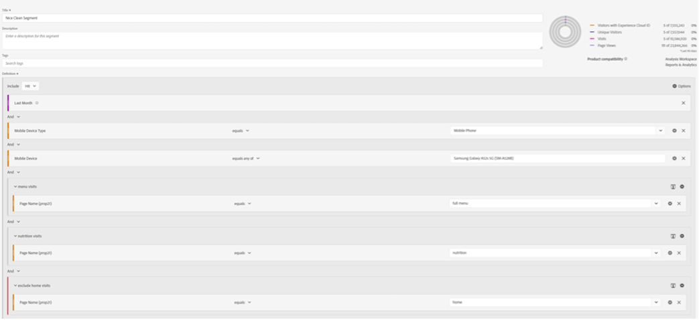

# Warten Sie jetzt einfach ein Segment ... Verwenden Sie Segmente, um neue Einblicke in Analysis Workspace zu erhalten.

Unabhängig davon, ob Sie ein neuer [!DNL Adobe Analytics]-Benutzer oder ein erfahrener Profi sind, werden Sie Segmente in Ihren Analysis Workspace-Projekten ziemlich stark nutzen. Wie [[!DNL Adobe] Experience League](https://experienceleague.adobe.com/docs/analytics/components/segmentation/seg-overview.html?lang=en) beschreibt, &quot;ermöglichen es Ihnen Segmente, Besucheruntergruppen anhand von Merkmalen oder Website-Interaktionen zu identifizieren&quot;. Während das grundlegende Ergebnis dieser Funktion das Isolieren von Gruppen von Benutzern, Besuchen oder Treffern auf Ihrer Site bedeutet, können sich besonders interessierte Analytiker wie Sie mit diesem Tool kreativ beschäftigen und neue Möglichkeiten finden, Einblicke in Ihre Site-Aktivität zu gewinnen. Die Liste der möglichen Optionen ist umfangreich. Daher zögern Sie nicht, Ihre eigene zu erstellen und sie mit anderen in Ihrer Organisation oder online in Communitys wie der [[!DNL Adobe Analytics] Community](https://experienceleaguecommunities.adobe.com/t5/adobe-analytics/ct-p/adobe-analytics-community?profile.language=de) auf der Experience League oder der [#Measure Slack](https://www.measure.chat/) Community zu teilen.

Wenn Sie einen schnellen Auffrischungskurs zum Erstellen eines Segments benötigen, lesen Sie bitte die Experience League-Dokumentation zur Verwendung des [Segmentaufbaus](https://experienceleague.adobe.com/docs/analytics/components/segmentation/segmentation-workflow/seg-build.html?lang=en) in Analysis Workspace.

## Vergleichen und Vergleichen von Segmenten

In Analysis Workspace können Sie zwei Segmente mit &quot;[Segmentvergleich](https://experienceleague.adobe.com/docs/analytics/analyze/analysis-workspace/panels/segment-comparison/segment-comparison.html?lang=en)&quot;vergleichen. Segmentvergleiche finden Sie im Abschnitt Bedienfelder in der linken Navigationsleiste:

Manchmal benötigen Sie jedoch keinen vollständigen Vergleichsbereich, um Ihre Endbenutzer über wichtige Einblicke zu informieren. Glücklicherweise können einige Funktionen auch in einem Standardbedienfeld verglichen werden.

Die [Venn-Diagrammvisualisierung](https://experienceleague.adobe.com/docs/analytics/analyze/analysis-workspace/visualizations/venn.html?lang=en) kann Ihnen dabei helfen, einen schnellen Vergleich zu erstellen, sodass Sie den Mauszeiger über die überlappenden Sitzungen, Bestellungen, Benutzer usw. halten und sie anzeigen können. zwischen 2 und 3 benutzerdefinierten Segmenten. Sie können auch schnell Segmente erstellen, indem Sie mit der rechten Maustaste auf einen der überlappenden Abschnitte klicken:

Manchmal sind die wichtigen Informationen nicht in den überlappenden Daten enthalten, sondern in den Daten, die sich nicht überschneiden. Eine schnelle Möglichkeit, dies anzuzeigen, besteht darin, eine Kopie eines Segments zu erstellen und es zu einem &quot;Ausschließen&quot;-Segment zu machen:

Durch die Stapelung Ihres Segments &quot;Ausschließen&quot;mit dem anderen Segment in Ihrem Vergleich können Sie jetzt schnell berechnen, wie viele Besuche Ihre Menüseite erreichen, ohne auch die Startseite in derselben Sitzung anzuzeigen:

## Stapelattacken

Auf ähnliche Weise können Sie die sich überschneidenden Daten eines Venn-Diagramms erstellen, indem Sie einfach alle Segmente stapeln. Es gibt keine Beschränkung für die Anzahl der Segmente oder einzelnen Dimensionen, die Sie stapeln. Wenn ich zum Beispiel schnell herausfinden wollte, welche Wochentage meine Site im letzten Monat auf einem Mobiltelefon besucht hat, insbesondere auf einem Samsung Galaxy A52s, das meine Menü- und Ernährungsseiten gesehen hat, aber NICHT meine Homepage gesehen hat, kann ich sie schnell wie folgt erstellen:

Noch besser ist jedoch, dass ich, sobald ich diese perfekte Untergruppe meiner Benutzer- oder Besuchsbasis gefunden habe, alle diese Werte auswählen, mit der rechten Maustaste klicken und sofort ein Segment erstellen kann:

Das ist eine Menge Macht in einem Segment.

## Ein Nummernsegment für eine Reihe von Segmenten

Viele Benutzer betrachten beim Erstellen von Segmenten oft nominale, ordinale oder Intervallwerte - Dinge wie besuchte Seiten, eine Altersgruppe von Benutzern oder die Anzahl von Besuchen, die ein Benutzer in der Vergangenheit durchgeführt hat. Sie können jedoch auch bei der Erstellung eines Segments die Berichtsdaten verwenden, indem Sie diese Werte sammeln - ob es sich um Standarddimensionen, Standardmetriken oder benutzerdefinierte Variablen und Metriken für Ihr Unternehmen handelt.

Beispielsweise stehen vordefinierte Behälter für die Besuchszeit pro Seite oder die Zeit pro Besuch zur Verfügung:

Diese werden jedoch möglicherweise nicht immer den Anforderungen Ihres Unternehmens gerecht - die meisten Besuche der Site laufen möglicherweise kürzer als 10 Minuten. Sie können die granulare Messung verwenden, um Behälter unterschiedlicher Größe zu erstellen. Im Folgenden finden Sie einen Bericht zu Besuchen, die zwischen 1 Minute, 1 Sekunde und 1 Minute und 30 Sekunden dauern:

Nach der Erstellung kann ich nun meine Besuche, Bestellungen und anderen Ereignisse nach den verschiedenen zusammengefassten Zeitgruppen, die ich angepasst habe, untersuchen:

Sie können sogar damit beginnen zu untersuchen, wie sich Ihre KPIs (Key Performance Indicators) verändern, indem Sie ermitteln, wie viel Zeit ein Benutzer verbringt, wie viele Seiten er bei einem Besuch besucht hat, wie oft er in der Vergangenheit besucht hat, oder einen anderen numerischen Wert verwenden - im Grunde können Sie eine Metrik als Faktor einer anderen Metrik betrachten:

Die Möglichkeiten, Segmente zu verwenden, um neue Einblicke zu erhalten, sind endlos! Dies ist lediglich ein Ausgangspunkt. Probieren Sie einige von Ihnen aus und teilen Sie der Community mit, was Sie entdecken: [[!DNL Adobe Analytics] Community](https://experienceleaguecommunities.adobe.com/t5/adobe-analytics/ct-p/adobe-analytics-community?profile.language=de) auf Experience League oder die [#Measure Slack](https://www.measure.chat/) Community.

Frohes Segmentieren!

## Autor

Dieses Dokument wurde geschrieben von:

**Dan Cummings**, Sr. Product Engineering [!DNL Analytics] Manager bei McDonald&#39;s Corporation

[!DNL Adobe Analytics] Champion
