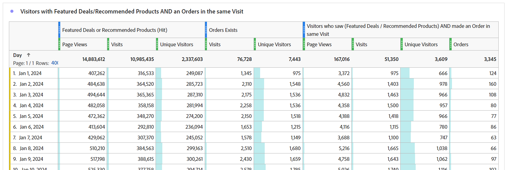

# Die Magie hinter dem Vorhang: Komplexe Segmente: Ausschlüsse, Container und Attribution

_Entdecken Sie die Komplexität der komplexen Datensegmentierung und erkunden Sie Ausschlüsse, Container und Attributionsmodelle. Wie ein Zaubertrick ermöglicht es Analysten, diese Techniken zu beherrschen, Datenmagie zu vollbringen, indem sie Einblicke mit Präzision und Finesse transformieren._

Die Vorhänge sind offen, die Bühne ist gesetzt.. das ist vielleicht kein magischer Akt von Las Vegas, aber wir können einige ziemlich erstaunliche Tricks beim Bau unserer Segmente durchführen.

Innerhalb dieses Moduls werden wir Folgendes abdecken:

- Logik ausschließen
- Container verwenden
- Attributionsmodell

## Einschließen vs. Ausschließen

Standardmäßig beginnen alle Container mit **include** type, was bedeutet, dass sie die Daten zurückgeben, die den Kriterien entsprechen. Sie können jedoch auch das Segment oder die Behälter innerhalb der Segmente ändern, um **exclude** -Typ, der es Ihnen ermöglicht, bestimmte Kriterien abzulehnen.

Während ein Zauberer Ihre Karte im Deck finden kann, ist es erstaunlich, wenn dieser Zauberer den Rest des Deck nicht existieren lässt. Ebenso möchten wir, dass in ausgeschlossenen Segmenten die unerwünschten Daten einfach aus unserem Datensatz verschwinden.

Sie sitzen vielleicht da und denken: &quot;Ok, aber ich habe schon die Optionen &quot;Does not equal&quot; und &quot;Does not contains&quot;, also sollte das mich nicht bedecken?&quot; Leider ist die Antwort darauf nein.. und es geht nicht nur darum, Gruppen der Logik ausschließen zu können, über ein einzelnes Element. Selbst bei Verwendung einer einzelnen Komponente müssen Sie häufig *excludes* um Ihr Ziel zu erreichen.

- **Enthält nicht / Ist nicht gleich** - Ist genau das, wie es sich anhört, wenn Sie Elemente abgleichen, die keine bestimmte Zeichenfolge enthalten
- **Ausschließen: Wert enthält / gleich** - Dies wird *exclude* Elemente, die mit der Zeichenfolge übereinstimmen

Auf den ersten Blick klingen beide gleich.. und so weiter. **Treffer** Segmente/Container erstellen, wären Sie korrekt, da sie dieselbe Aktion ausführen. Bei Verwendung von **Besuch** oder **Besucher** können Sie sehr unterschiedliche Ergebnisse erzielen.

**Abbildung 1: Enthält nicht / ist nicht gleich - Hit-Umfang**

*Beachten Sie, dass jeder Treffer den Wert &quot;true&quot;oder &quot;false&quot;zurückgibt und dass diese Werte zwischen &quot;does not&quot;und &quot;exclude&quot;umgekehrt werden.*

- Enthält &quot;Wert&quot;nicht &quot;Beispiel&quot;(ja), gibt daher &quot;true&quot;zurück und schließt diesen Treffer ein. Enthält auch &quot;Beispiel&quot;nicht &quot;Beispiel&quot;(nein, enthält ihn), gibt daher &quot;false&quot;zurück und schließen diesen Treffer nicht ein. Grundsätzlich geben Sie alle Daten zurück, die ein wahres Ergebnis zurückgeben.
- Enthält &quot;Wert&quot;&quot;Beispiel&quot;(nein), gibt daher &quot;false&quot;zurück und schließt diesen Treffer nicht aus. Enthält auch &quot;Beispiel&quot;&quot;Beispiel&quot;(ja), gibt daher &quot;true&quot;zurück und schließt diesen Treffer aus. Grundsätzlich können Daten zurückgegeben werden, die **not** ein wahres Ergebnis haben oder Daten zurückgeben, die Ihren Kriterien nicht entsprechen.
- Das können Sie am **Treffer** -Ebene verwenden, geben beide Logiksätze denselben Datensatz zurück.

**Abbildung 2: Enthält nicht / ist nicht gleich - Besuchsbereich**

*Wie oben gezeigt, wird jeder Treffer im **Besuch**wird mit demselben true/false ausgewertet. Der zurückgegebene Datensatz ist jedoch der des gesamten Besuchs.*

- Für jeden Treffer enthält &quot;Wert&quot;nicht &quot;Beispiel&quot;(ja), gibt daher &quot;true&quot;zurück. Ebenso wenig enthält &quot;Beispiel&quot;&quot;Beispiel&quot;(nein, es enthält es) und gibt daher &quot;false&quot;zurück.
   - Wenn **any** Treffer im Besuch gibt zurück **true**, dann die **Besuch** zurückgegeben.*
   - Wenn der Besuch vollständig aus Treffern bestand, die &quot;Beispiel&quot;enthielten, würden keine Treffer &quot;true&quot;zurückgeben und dieser Besuch würde **nicht zurückgegeben** in Ihrem Datensatz.
- Auch hier enthält &quot;Beispiel&quot;für jeden Treffer &quot;Beispiel&quot;&quot;Beispiel&quot;(Ja) und gibt daher &quot;true&quot;zurück.
   - Wenn **beliebige Treffer** return **true**, wird der gesamte Besuch **ausgeschlossen**
   - Wenn **alle Treffer** im Besuchsrücklauf **false** eingeben, wird dieser Besuch in Ihrem Datensatz zurückgegeben.
- Jetzt können Sie sehen, wo diese Logik zu divergieren beginnt. Im obigen Beispiel gibt es drei verschiedene Besuche:
   - Bei Verwendung von &quot;Enthält nicht / gleich&quot; **zwei der drei** Besuche werden zurückgegeben.
   - Bei Verwendung von &quot;Enthält ausschließen/Gleich&quot; **nur eine** von diesen Besuchen

**Abbildung 3: Enthält nicht / ist nicht gleich - Besuchsbereich**

*Wie oben beschrieben, wird jeder Treffer von der **Besucher**wird mit derselben true/false-Logik ausgewertet. Jetzt betrachten wir jedoch alle Treffer, die dieser Besucher über alle Besuche hinweg gemacht hat (innerhalb des ausgewählten Datumsbereichs).*

- Für jeden Treffer enthält &quot;Wert&quot;nicht &quot;Beispiel&quot;(ja), gibt daher &quot;true&quot;zurück. Ebenso wenig enthält &quot;Beispiel&quot;&quot;Beispiel&quot;(nein, es enthält es) und gibt daher &quot;false&quot;zurück.
   - Wenn **any** Treffer, die vom Besucher zurückgegeben werden **true**, dann die **Besuch** zurückgegeben.
   - Wenn der Besucher nie einen Treffer mit &quot;Beispiel&quot;tätigte, würden keine Treffer &quot;true&quot;zurückgeben und dieser Besucher würde **nicht zurückgegeben** in Ihrem Datensatz.
- Auch hier enthält &quot;Beispiel&quot;für jeden Treffer &quot;Beispiel&quot;&quot;Beispiel&quot;(Ja) und gibt daher &quot;true&quot;zurück.
   - Wenn **beliebige Treffer** return **true**, wird der gesamte Besucher (und anschließend alle Besuche) **ausgeschlossen.**
   - Wenn **alle Treffer** im Besuchsrücklauf **false** festgelegt ist, wird dieser Besucher in Ihrem Datensatz zurückgegeben und gibt somit erfolgreich Besucher zurück, die &quot;X&quot;nicht ausgeführt haben.
- Dies ist eine Erweiterung der Besuchslogik, bei der noch mehr Überlegungen vorliegen. Im obigen Beispiel gibt es zwei verschiedene Besucher mit jeweils 3 Besuchen:
   - Bei Verwendung von &quot;Enthält nicht / gleich&quot; **both** -Besucher werden zurückgegeben, ebenso wie alle **three** ihrer Besuche (unter Berücksichtigung von 2 Besuchern und 6 Gesamtbesuchen in Ihren Berichten)
   - Bei Verwendung von &quot;Enthält ausschließen/Gleich&quot; **nur eine** von diesen Besuchern zurückgegeben und nur die drei Besuche, die diesem Besucher zugeordnet sind, einbezogen werden (wobei 1 Besucher und 3 Gesamtbesuche in Ihren Berichten berücksichtigt werden).

>[!TIP]
>
>Diese Logik kann komplex sein, insbesondere wenn Sie mit dem Verschachteln von Containern beginnen... es ist immer empfehlenswert, mit kontrollierten Beispieldaten zu testen, um sicherzustellen, dass Ihr Segment tatsächlich die Daten zurückgibt, die Sie für erforderlich halten.

### Segmentbeispiel 1: Ausschließen von Besuchen, die einen Kauf tätigen

In diesem Beispiel möchte ich Benutzer ansprechen, die zu einer Site gelangt sind und *not* einen Kauf während ihres Besuchs tätigen (im Grunde möchte ich die Besuche ausschließen, die eine Transaktion getätigt haben; daher verbleiben mir die Besuche, bei denen eine Transaktion nicht abgeschlossen wurde)

Sehen wir uns zum Vergleich ein Segment an, das mit &quot;Existiert nicht&quot;erstellt wurde:

Beachten Sie, dass die Vorschau ein ganz anderes Ergebnis anzeigt.. Tatsächlich gibt dieses Segment 100 % meiner Besuche zurück, da jeder Besuch mindestens einen Treffer enthält, der nicht die Metrik &quot;Bestellung&quot;enthält.

Um dies weiter zu veranschaulichen, vergleichen wir die beiden Segmente nebeneinander:

Zunächst sehen Sie, dass trotz der *Besuch* Segmentebenenbereich verwenden, können wir das Segment mit anderen Metriken (z. B. Seitenansichten oder Unique Visitors) verbinden. Die erste Gruppe von Spalten ist nicht segmentiert, um auf einen Blick zu zeigen, dass das eine Segment (existiert nicht) fast 100 % der Daten zurückgibt. Nur das ausgeschlossene Segment tut das, was wir benötigen.

Die auffälligste Spalte sind die Bestellungen, die sofort deutlich werden sollten, dass der Container &quot;Existiert nicht&quot;falsch ist, da die meisten Bestellungen noch zurückgegeben werden.

### Segmentbeispiel 2: Ausschluss von Besuchern, die innerhalb des Berichtszeitraums einen Kauf getätigt haben

In diesem Beispiel möchte ich die Ideen aus der vorherigen Stichprobe verwenden (die speziell auf die Besuchsebene ausgerichtet war) und sie erweitern, um die Besucher zu finden, die im Zeitrahmen meines Berichts keinen Kauf getätigt haben.

Dieses Segment wird dem obigen Beispiel sehr ähnlich aussehen, fast identisch, aber der Umfang des Segments wird einen großen Unterschied ausmachen.

Wenn wir nun das Segment mit Besucherbereich mit dem oben genannten Segment mit Besuchsbereich vergleichen, werden deutlich mehr Daten und viel mehr Besuche ausgeschlossen, da *Besucher, die gekauft haben* auch Besuche hatten, bei denen keine Käufe getätigt wurden. Daher werden diese Besuche auch ausgeschlossen, da sie Teil des Lebenszyklus des Besuchers sind.

>[!IMPORTANT]
>
>Wenn Sie Daten im Besucherbereich betrachten, umso größer ist der Ausschluss, je länger Ihr Berichtszeitraum ist, da viele Besucher treue zurückkehrende Besucher auf Ihrer Site sind (natürlich werden einige Geschäftsmodelle eine höhere Auswirkung als andere erkennen).

>[!IMPORTANT]
>
>Während die Unterschiede zwischen Besuch und Besucher *subtile* (insbesondere in diesen Beispieldaten) sind sie eine eindeutige Logik, die berücksichtigt werden sollte. Je nach Site und Benutzerverhalten können sich Ihre Daten erheblich voneinander unterscheiden.

Es ist wichtig genau zu wissen, welche Daten oder *Geschichte*, versuchen Sie dies mit Ihrem Bericht zu sagen. Sicherstellen, dass Ihre Tabellen und Visualisierungen die Zielgruppe klar ausweisen ***what*** angezeigt wird, und die Verwendung des entsprechenden Segmentmodells ist für eine geeignete Analyse von entscheidender Bedeutung. Informierte Entscheidungen können nur dann richtig getroffen werden, wenn alle verstehen, was sie betrachten.

## Container verwenden

Container bieten uns die Möglichkeit, innerhalb der Hauptlogik des Segments eine &quot;Sub-Logik&quot;zu erstellen. Eine gängige falsche Vorstellung ist, dass der Umfang zwischen dem Segment und dem Container identisch sein muss.. aber dies nicht. Dies gibt uns mehr Freiheit, spezifische Szenarien im größeren Schema der Dinge zu erstellen, um komplexe Logik zu entwickeln.

Die beste Art, über Container nachzudenken, ist sich vorzustellen, dass jeder Container eine Box ist, und dass wir Kisten (logisch) in einer anderen Kiste stapeln können, in einer anderen Kiste.. aber im Gegensatz zu physischen Kisten, in denen jede Kiste kleiner sein muss als die äußere Kiste, können wir etwas Größeres hineinlegen, wenn das uns dazu bringt, die richtigen Daten zurückzubekommen. Stellen Sie sich das wie einen Zauberhut vor, in den das Unmögliche hineinpasst und wir die Zauberer von Daten sind...

### Umfang der Container

Zunächst eine kurze Aufschlüsselung *container* Umfang. liken *Segment* Du hast deine Grundkenntnisse **Treffer**, **Besuch** und **Besucher** Optionen für den Bereich, aber manchmal sehen Sie auch etwas namens **Logikgruppe** anstelle des Besuchers (dies tritt nur in sequenziellen Segmenten auf, und wir werden diese im nächsten Artikel behandeln).

Das Hinzufügen von Containern innerhalb Ihres Segments (oder innerhalb anderer Container) kann durch Zugriff auf die **options*** Menü (achten Sie beim Verschachteln mehrerer Elemente darauf, den richtigen Block hinzuzufügen - obwohl Sie zum Glück Behälter in der Benutzeroberfläche ziehen und ablegen können, wenn Sie ihn an der falschen Position hinzufügen)

**Abbildung 1: Hinzufügen eines Containers**

Der Umfang eines Containers ist unabhängig von dem übergeordneten Element, wie ich oben erwähnt habe. *nicht* müssen übereinstimmen, und je nachdem, was Sie zurückkehren möchten, müssen Sie möglicherweise den Plan entwerfen, um vollständig zu visualisieren, was Sie benötigen, zumindest bis Sie es in Ihrem Kopf bequem visualisieren können.

**Abbildung 2: Segmentbereich vs. Containerbereich**

>[!NOTE]
>
>Adobe hat Logik, um gültige und ungültige Segmente zu verstehen. Sie würden Ihnen keine Optionen zur Verfügung stellen, die *never* funktioniert... Wenn Sie also die Option sehen, einen Besucher-Scoped-Container in einem Hit-Scoped-Segment zu verwenden, ist dies eine gültige Option.

Genau wie bei einfachen Segmenten müssen Sie beim Erstellen eines komplexen Segments mit verschachtelten Behältern eine klare Vorstellung von ***what*** Art der Daten, die zurückgegeben werden sollen. ***How*** Planen Sie die Verwendung dieser Daten? ***Welcher*** Metriken planen Sie die Kopplung mit dem Segment?

Diese Fragen helfen bei der Bestimmung des Umfangs des Segments als Ganzes. Dies ist der Ausgangspunkt für jedes Segment.

Nur weil Sie ein Segment mit Ihrer Metrik für Unique Visitors verbinden möchten, bedeutet dies nicht, dass das Segment selbst Besucherebene sein sollte.. weit davon entfernt. Ein Segment auf Besucherebene gibt alle Daten für einen Besucher zurück ... Das bedeutet alle Besuche, alle Seitenansichten usw.. Sobald ein Besucher Ihren Segmentkriterien entspricht, kann Ihr Segment beginnen, Daten aus der *vergangene* für diesen Besucher (sofern er innerhalb des Datumsbereichs Ihres Arbeitsbereichs liegt).

>[!IMPORTANT]
>
>Auch wenn Sie planen, ein Segment mit der Metrik &quot;Unique Visitors&quot;zu verbinden, wird dies *bedeutet nicht* dass das Segment automatisch in den Besucherbereich einbezogen werden soll ... Dieses Missverständnis *may* zu überhöhten und falschen Ergebnissen führen.

Also habe ich viel über die Konzepte gesprochen, wie man den richtigen Bereich auswählt, aber keine Beispiele oder Details, die Ihnen wirklich helfen werden... also lassen Sie uns jetzt mit ein paar echten Anwendungsbeispielen darauf eingehen. Man sagt, ein Zauberer enthüllt nie seine Geheimnisse, aber das stimmt nicht ganz. In der Zauberwelt werden die Techniken und &quot;hinter dem Vorhang&quot;-Arbeiten oft mit Kollegen geteilt, sodass sie auf der Illusion aufbauen und sie verbessern können, und das ist es, was ich anstrebe zu tun.. um die Tür für die Möglichkeiten zu öffnen, die auf Sie warten.

### Segmentbeispiel 3: Ansichten auf bestimmten Seiten von Besuchern, die kürzlich eine Bestellung aufgegeben haben (im Berichtszeitraum)

In diesem Szenario möchte ich nur eine Reihe spezifischer Seiten zurückgeben, die von aktuellen Käufern getroffen wurden (beachten Sie, dass ich dies weiterhin mit Besuchen oder Unique Visitors verbinden kann, auch wenn sich das Segment selbst in einem HIT-Bereich befindet).

Dieser Szenario eignet sich gut, um zu sehen, ob Käufer bestimmte Seiten auf einer Site betrachten, Seiten, die möglicherweise nicht explizit mit einem bestimmten Ereignis verbunden sind.

Mein Beispiel zeigt die Seiten &quot;Sonderangebote&quot;und &quot;Empfohlene Produkte&quot;. Derzeit werden wir die Logik einfach halten und nicht in die sequenzielle Segmentierung einsteigen (zumindest noch nicht, aber wir werden uns mit komplexerer Logik wie dieser in einem zukünftigen Artikel befassen).

Eine weitere Frage ist **Why** Rufen wir uns von Treffern zurück? Technisch gesehen könnte ich hier nach Besuchen oder Besuchern abrufen, aber ich möchte auch diese spezifischen Seiten nach **Seitenansichten (für den jeweiligen Seitensatz) pro Besuch** oder **Seitenansichten (für den jeweiligen Satz) pro Besucher**, gibt mir dieser Umfang die Flexibilität, diese spezielle Mathematik durchzuführen. Da diese Treffer problemlos mit Besuchen oder Unique Visitors gepaart werden können, um die Anzahl der Besuche oder Besucher zu ermitteln, die diese Seiten sehen, wählt ich das flexibelste Segment, das ich für alle Szenarien verwenden kann.

Zunächst ist hier zum Vergleich ein einfaches HIT-basiertes Segment für die spezifischen Seiten.

Erstellen wir nun in der Komplexität:

Sie werden feststellen, dass ich nicht nur mehrere Container verwende, sondern dass ich den Umfang dieser Container vermische. Das Segment als Ganzes befindet sich auf der HIT-Ebene, aber ich suche auch nach BESUCHERN, die eine Bestellung getätigt haben.

Lass uns ein wenig Zeit verbringen, um das zu entpacken, denn es ist viel los.

Erstens: Statt eine tägliche Aufschlüsselung anzuzeigen, zeige ich eine Aufschlüsselung der Seite, da dies meiner Meinung nach dazu beitragen wird, die beiden Segmente besser zu veranschaulichen.

<table border="0">
    <tr>
        <td width="352" style="border: 0;">Die ersten drei Spalten (Seitenansichten, Besuche und Unique Visitors) sind nicht segmentiert und zeigen daher alle Seiten innerhalb der Site an. Beachten Sie, dass ich hier keine Bestellungen angegeben habe, da Bestellungen bei einer Aktion verfolgt werden und daher nicht Teil des Bereichs der Seitendimension sind.</td>
        <td style="border: 0;">&lt;img src="assets/segment-example-3/segment3c-comparison-table-detail1.png" width="352"
        </td>
    </tr>
</table>

<table border="0">
    <tr>
        <td width="352" style="border: 0;">Als Nächstes zeige ich das Ergebnis des einfachen Segments, das nur auf <strong>Treffer</strong> auf den beiden angegebenen Seiten. Sie werden feststellen, dass die anderen Seiten in der Aufschlüsselung alle zu 0 führen, wie erwartet.</td>
        <td style="border: 0;">&lt;img src="assets/segment-example-3/segment3c-comparison-table-detail2.png" width="352"
        </td>
    </tr>
</table>

<table border="0">
    <tr>
        <td width="352" style="border: 0;">Hier ist ein kleiner Bonustipp, bevor ich das Ergebnis des erweiterten Segments zeige, habe ich ein weiteres einfaches Segment von "Bestellungen existiert" (auf HIT-Ebene) verwendet und es mit Unique Visitors gepaart. Dies gibt mir die Gesamtzahl der UVs zurück, die in meinem Berichtszeitraum bestellt wurden, sowie die UVs, die jede dieser Seiten getroffen haben ... Dies hilft, die nächste Gruppe von Spalten besser zu veranschaulichen.</td>
        <td style="border: 0;">&lt;img src="assets/segment-example-3/segment3c-comparison-table-detail3.png" width="352"
        </td>
    </tr>
</table>

<table>
    <tr>
        <td width="352" style="border: 0;">Der endgültige Satz von Spalten wird mit meinem komplexen Segment gestapelt. Die allgemeinen UV-Daten mit Bestellungen stimmen mit dem einfachen Segment "Bestellungen vorhanden"auf jeder Seite überein, Sie werden jedoch feststellen, dass die Summe deutlich anders ist. Da dieser Datensatz den Datensatz explizit auf Besucher beschränkt, die Bestellungen getätigt haben UND die Seiten getroffen haben, bin ich ausdrücklich an dieser Tatsache interessiert.</td> <td style="border: 0;">
        </td>
    </tr>
</table>

### Segmentbeispiel 4: Besuche, die Sonderangebote ODER empfohlene Produkte treffen UND innerhalb desselben Besuchs eine Bestellung tätigen

Im obigen Beispiel wurde gezeigt, wie Sie einen Behälter mit größerem Umfang (d. h. Besucher) innerhalb eines kleineren Containers (d. h. Treffer) hinzufügen können, sodass es nicht verwunderlich sein sollte, dass Sie Trefferbehälter innerhalb von Besuchern oder besuchsbezogenen Segmenten hinzufügen können.

Wenn wir einige der Seiten verwenden, die wir zuvor gesehen haben, möchten wir jetzt nur die Besucher zurückbekommen, die entweder die Sonderangebote ODER die empfohlene Produktseite getroffen haben UND innerhalb desselben Besuchs eine Bestellung getätigt haben.

Dieses Segment kombiniert alle drei Bereiche. Die oberste Ebene des Segments ist der Besucher. Dadurch wird sichergestellt, dass ALLE Treffer aller Besuche für den übereinstimmenden Besucher zurückgegeben werden. Innerhalb dieses Containers haben wir einen Besuchsbereich-Container hinzugefügt. Dadurch wird sichergestellt, dass der Besucher mindestens einen Besuch gehabt haben muss, der den spezifischen Kriterien für eine Bestellung entspricht UND bestimmte Seiten besucht hat. Wir haben einen Trefferumfang-Container für die Seiten selbst hinzugefügt, sodass wir die ODER-Logik verwenden können, um nach der Seite mit den Sonderangeboten ODER der empfohlenen Produktseite zu suchen.

Der Vorteil für dieses Besuchersegment besteht darin, dass dies **ALL** Besuche von Besuchern, die diesen Kriterien entsprechen, sodass dieses Segment gut ist, wenn ich das Verhalten bei vorherigen Besuchen sehen möchte, die zu dieser Kombination führten, und die Aktionen dieser Besucher nach einem solchen Szenario.

Hier vergleiche ich Treffer zu speziellen Angeboten/empfohlenen Inhalten mit Bestellungen, die vorhanden sind, mit dem komplexen Segment, in dem sowohl die Reihenfolge als auch eine der angegebenen Seiten im selben Besuch vorhanden sind. Im komplexen Segment überschneiden sich die beiden ersten Segmente. Da es sich jedoch um den Besucherbereich handelt, werden auch alle anderen Besuche für diese Besucher zurückgegeben.

## Attributionsmodell

Die Attributionsmodellierung innerhalb einer Segmentdefinition bezieht sich hauptsächlich auf Dimensionen, die kein Trefferende haben. Daher sind Props (die immer Trefferebene sind) kein guter Kandidat. Ihre eVars, Marketingkanäle usw. sind jedoch genau das, wofür diese Einstellungen entwickelt wurden.

Bevor wir uns das Segment ansehen, sollten wir in einem einfachen Beispiel kurz überprüfen, wie die Attributionsmodellierung funktioniert.

Angenommen, wir haben zwei eVars, von denen eine den Besuchsablauf (eVar1) hat und eine 30-tägige Gültigkeit hat (eVar2). Aus Gründen der Einfachheit werden wir eine interne Kampagne (icid) verfolgen.

**Besuch 1**

- Seite A
   - **eVar1** ist nicht festgelegt
   - **eVar2** ist nicht festgelegt
- Klicken Sie in der URL auf das Angebotsbanner mit ?icid=promo-banner .
- Seite B
   - **eVar1** und **eVar2** auf &quot;promo-banner&quot;eingestellt sind
   - **Instanz von eVar1** ausgelöst
   - **Instanz von eVar2** ausgelöst
- Seite C
   - Beide **eVar1** und **eVar2** den Wert &quot;promo-banner&quot;beibehalten
   - Keiner der Instanzmetriken für die eVars wird ausgelöst, da beide eVars persistente Werte verwenden

**Besuch 2**

- Seite D
   - **eVar1** auf keinen Wert festgelegt ist und **Instanz von eVar1** ausgelöst
   - **eVar2** behält den Wert &quot;promo-banner&quot;aufgrund des Ablaufs von 30 Tagen bei
   - **Instanz von eVar2** nicht ausgelöst wird, da der Wert persistent und nicht tatsächlich festgelegt ist
- Klicken Sie in der URL auf Seitenschiene-Promotion mit ?icid=promo-side-rail .
- Seite E
   - **eVar1** und **eVar2** auf &quot;Seitenleiste der Promo-Leiste&quot;eingestellt sind
   - **Instanz von eVar1** ausgelöst
   - **Instanz von eVar2** ausgelöst
- Seite F
   - Beide **eVar1** und **eVar2** den Wert &quot;promo-side-rail&quot;beibehalten
   - Keiner der Instanzmetriken für die eVars wird ausgelöst, da beide eVars persistente Werte verwenden

Derzeit ist das erwartete Ergebnis dieser beiden Besuche zu finden:

<table><tr><th colspan="1" valign="top"></th><th colspan="1" valign="top"></th><th colspan="1" valign="top"><b>Seitenansichten</b></th><th colspan="1" valign="top"><b>Besuche</b></th><th colspan="1" valign="top"><b>Instanz von eVar1</b></th><th colspan="1" valign="top"><b>Instanz von eVar2</b></th></tr>
<tr><td colspan="1" valign="top"></td><td colspan="1" valign="top"></td><td colspan="1" valign="top">6</td><td colspan="1" valign="top">2</td><td colspan="1" valign="top">2</td><td colspan="1" valign="top">2</td></tr>
<tr><td colspan="1" rowspan="7" valign="top">Seite</td><td colspan="1" valign="top"></td><td colspan="1" valign="top">6</td><td colspan="1" valign="top">2</td><td colspan="1" valign="top">2</td><td colspan="1" valign="top">2</td></tr>
<tr><td colspan="1" valign="top">Seite A</td><td colspan="1" valign="top">1</td><td colspan="1" valign="top">1</td><td colspan="1" valign="top">0</td><td colspan="1" valign="top">0</td></tr>
<tr><td colspan="1" valign="top">Seite B</td><td colspan="1" valign="top">1</td><td colspan="1" valign="top">1</td><td colspan="1" valign="top">1</td><td colspan="1" valign="top">1</td></tr>
<tr><td colspan="1" valign="top">Seite C</td><td colspan="1" valign="top">1</td><td colspan="1" valign="top">1</td><td colspan="1" valign="top">0</td><td colspan="1" valign="top">0</td></tr>
<tr><td colspan="1" valign="top">Seite D</td><td colspan="1" valign="top">1</td><td colspan="1" valign="top">1</td><td colspan="1" valign="top">0</td><td colspan="1" valign="top">0</td></tr>
<tr><td colspan="1" valign="top">Seite E</td><td colspan="1" valign="top">1</td><td colspan="1" valign="top">1</td><td colspan="1" valign="top">1</td><td colspan="1" valign="top">1</td></tr>
<tr><td colspan="1" valign="top">Seite F</td><td colspan="1" valign="top">1</td><td colspan="1" valign="top">1</td><td colspan="1" valign="top">0</td><td colspan="1" valign="top">0</td></tr>
</table>

<table><tr><th colspan="1" valign="top"></th><th colspan="1" valign="top"></th><th colspan="1" valign="top"><b>Seitenansichten</b></th><th colspan="1" valign="top"><b>Besuche</b></th><th colspan="1" valign="top"><b>Instanz von eVar1</b></th></tr>
<tr><td colspan="1" valign="top"></td><td colspan="1" valign="top"></td><td colspan="1" valign="top">4</td><td colspan="1" valign="top">2</td><td colspan="1" valign="top">2</td></tr>
<tr><td colspan="1" rowspan="3" valign="top">eVar1</td><td colspan="1" valign="top"></td><td colspan="1" valign="top">4</td><td colspan="1" valign="top">2</td><td colspan="1" valign="top">2</td></tr>
<tr><td colspan="1" valign="top">promo-banner</td><td colspan="1" valign="top">2</td><td colspan="1" valign="top">1</td><td colspan="1" valign="top">1</td></tr>
<tr><td colspan="1" valign="top">Angebotsseite</td><td colspan="1" valign="top">2</td><td colspan="1" valign="top">1</td><td colspan="1" valign="top">1</td></tr>
</table>

<table><tr><th colspan="1" valign="top"></th><th colspan="1" valign="top"></th><th colspan="1" valign="top"><b>Seitenansichten</b></th><th colspan="1" valign="top"><b>Besuche</b></th><th colspan="1" valign="top"><b>Instanz von eVar2</b></th></tr>
<tr><td colspan="1" valign="top"></td><td colspan="1" valign="top"></td><td colspan="1" valign="top">5</td><td colspan="1" valign="top">2</td><td colspan="1" valign="top">2</td></tr>
<tr><td colspan="1" rowspan="3" valign="top">eVar2</td><td colspan="1" valign="top"></td><td colspan="1" valign="top">5</td><td colspan="1" valign="top">2</td><td colspan="1" valign="top">2</td></tr>
<tr><td colspan="1" valign="top">promo-banner</td><td colspan="1" valign="top">3</td><td colspan="1" valign="top">2</td><td colspan="1" valign="top">1</td></tr>
<tr><td colspan="1" valign="top">Angebotsseite</td><td colspan="1" valign="top">2</td><td colspan="1" valign="top">1</td><td colspan="1" valign="top">1</td></tr>
</table>

Schauen wir uns nun an, wo Sie die Attribution in Ihrem Segment festlegen können.

**Abbildung 4: Attributionsmodell**

*Über das Zahnradsymbol Ihrer Dimension können Sie die Attribution festlegen. Für jede Option stehen Informationen zur Verfügung, wenn Sie den Mauszeiger über das &quot;?&quot;bewegen. Symbol. Grundsätzlich:*

- Das Standardverhalten gibt alle Instanzen des eVar zurück, in dem der Wert festgelegt ist (entweder speziell oder über die festgelegte Attribution)
- Die Instanz gibt nur die Dimension zurück, bei der der Wert explizit festgelegt ist (d. h. bei den Treffern, bei denen die &quot;Instanz der eVar&quot;ausgelöst wird).
- Die nicht wiederholende Instanz gibt nur das erste Mal zurück, wenn der Dimensionswert festgelegt ist (d. h., obwohl im obigen Beispiel nicht näher erläutert, stellen Sie sich vor, dass der Benutzer mehrmals auf das Angebotsbanner geklickt hat. Dies würde auch die &quot;Instanz von eVar&quot;für jedes Mal inkrementieren, wenn auf das Banner geklickt wird. Diese Einstellung würde nur die erste eindeutige Instanz von &quot;Angebotsbanner&quot;annehmen und alle nachfolgenden Zahlen dieses Banners ignorieren)

### Segment-Beispiel 5: Marketing-Kanal &quot;Paid Search&quot;im Vergleich zu den direkten Instanzen der Paid Search

Wie wir alle wissen sollten, verfügen Marketing-Kanäle über ein langes Attributionsmodell (standardmäßig 30 Tage, dies kann jedoch an Ihre eigenen Anforderungen angepasst werden), und nach der Festlegung wird der Marketing-Kanal nicht durch nachfolgende &quot;direkte&quot;Besuche auf der Site überschrieben, sodass Ihre spezifischen Treiber die Konversionszuordnung erhalten. Manchmal müssen Sie jedoch die ***Einträge*** über einen bestimmten Marketing-Kanal in Ihre Site gelangen, und anhand von Einträgen müssen Sie sehen, wann der Marketing-Kanal speziell auf der Grundlage Ihrer Marketing-Verarbeitungsregeln festgelegt wird.

Lassen Sie uns die Dinge verändern und beginnen, indem wir uns die Vergleiche anschauen, dann werden wir in die Segmente eingraben.

<table>
    <tr>
        <td width="352" style="border: 0;">Die ersten vier Spalten sind nicht segmentiert und sollten leicht verständlich sein. Beachten Sie, dass *"Einstiege"im Wesentlichen ein berechneter Wert ist, der darauf basiert, wo Besucher die Sitzung beginnen. Ich habe es hier hinzugefügt, um zu zeigen, dass dies nicht die gesuchten Informationen zurückgibt, da Benutzer die Site über verschiedene Marketing-Kanäle aufrufen können (durch die Anzeige von sozialen Medien, Suchvorgänge, das Klicken auf Marketing-E-Mails usw.). alle innerhalb desselben Besuchs/derselben Sitzung).</td> <td style="border: 0;">
        </td>
    </tr>
</table>

<table>
    <tr>
        <td width="352" style="border: 0;">Der nächste Satz von Spalten verwendet ein "standardmäßiges Treffersegment", bei dem im Wesentlichen Treffer betrachtet werden, bei denen der Marketing-Kanal "Paid Search"lautet. Dies gibt jedoch ALLE Treffer basierend auf der Marketing-Kanal-Attribution zurück. Die tatsächlichen Clickthroughs der "gebührenpflichtigen Suche"werden nicht isoliert. Somit werden die benötigten Daten nicht zurückgegeben.</td> <td style="border: 0;">
        </td>
    </tr>
</table>

<table>
    <tr>
        <td width="352" style="border: 0;">Jetzt sehen die nächsten beiden Datensätze identisch aus, und tatsächlich geben sie dieselben Daten auf zwei verschiedene Arten zurück. Aber jetzt schaue ich speziell auf die <i>Instanzen</i> wo der Marketing-Kanal war <strong>set</strong> auf "Gebührenpflichtige Suche".</td> <td style="border: 0;">
        </td>
    </tr>
</table>

Dazu gibt es zwei Möglichkeiten:

Zunächst wird die &quot;standardmäßige&quot;Dimensionszuordnung verwendet und mit der spezifischen Metrik &quot;Marketing-Kanalinstanz&quot;gepaart (als *exists* -Logik):

Oder zweitens können Sie für ein einfacheres Segment die Attribution in &quot;Instanz&quot;ändern. Beachten Sie, dass sich der Dimensionsname von &quot;Marketing-Kanal&quot;in &quot;Marketing-Kanal (Instanz)&quot;ändert.

## Alles zusammenbringen

Wie jeder gute Zauberkünstler können wir mit jedem einzelnen Trick anfangen, das Publikum nach und nach aufzubauen und zum letzten &quot;Prestige&quot; zu führen. Hier leuchten wir wirklich, indem wir alle kleinen Tricks nehmen und sie in ein großes Finale einreißen. Die scheinbar voneinander getrennten Teile des Tricks nehmen und zeigen, dass sie tatsächlich alle zusammenarbeiten, um ein zusammenhängendes Ganzes zu bilden.

### Segmentbeispiel 6: Besucher, die während eines Besuchs eine Bestellung mit einer gebührenpflichtigen sozialen Instanz getätigt haben, ohne Besucher, die für einen Newsletter angemeldet sind

Auf diese Weise kann ich Besucher identifizieren, die während eines Besuchs in einer Social-Media-Kampagne aktiv einen Kauf getätigt haben, sich aber nicht für unsere Newsletter angemeldet haben. Dadurch kann unser Marketing-Team die potenzielle Gruppe von Benutzern sehen, die versuchen, für Newsletter und Marketing-E-Mails zu konvertieren.

## Finale

Es gibt so viele Möglichkeiten, die Logik zu kombinieren, um in sehr detaillierte Szenarien zu gelangen, dass ich nur die Oberfläche der Möglichkeiten kratzen kann.

Wie jeder große Zauberkünstler ist die wahre Kraft darin, die aufstrebende Generation dazu zu inspirieren, auf den Grundlagen aufzubauen, die Erkenntnisse in etwas Neues und Wunderbares neu vorzustellen! Ich freue mich darauf, zu sehen, was Sie alle haben!

## Autor

Dieses Dokument wurde verfasst von:

Jennifer Dungan, Optimization Manager Analytics bei Torstar

Adobe Analytics-Experte
