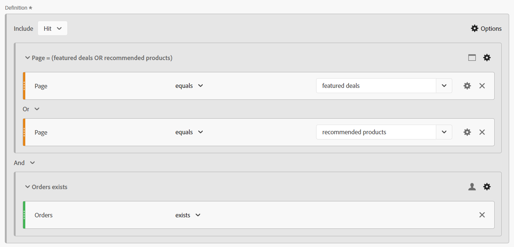
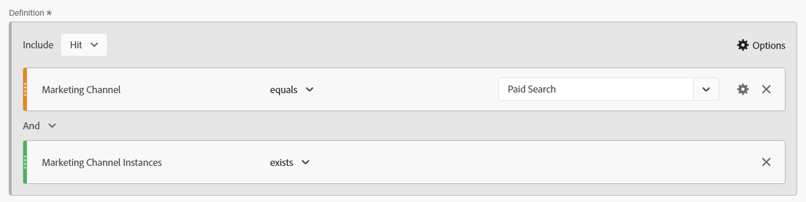

# Die Magie hinter dem Vorhang: Komplexe Segmente: Ausschlüsse, Container und Attribution

_Entdecken Sie die Feinheiten komplexer Datensegmentierung, untersuchen Sie Ausschlüsse, Container und Attributionsmodelle. Wie ein Zauberkünstler befähigt das Beherrschen dieser Techniken Analysten, Datenmagie auszuführen und Erkenntnisse mit Präzision und Finesse zu transformieren._

Die Vorhänge sind offen, die Bühne ist bereit … das ist vielleicht kein Las Vegas Magic Act, aber wir können einige ziemlich erstaunliche Tricks beim Erstellen unserer Segmente ausführen.

In diesem Modul wird Folgendes behandelt:

- Logik ausschließen
- Verwenden von Containern
- Attributionsmodell

## Ein- vs. Ausschließen

Standardmäßig beginnen alle Container mit dem Typ **include**, was bedeutet, dass sie die Daten zurückgeben, die den Kriterien entsprechen. Sie können jedoch auch das Segment bzw. die Container innerhalb der Segmente ändern, sodass sie vom Typ &quot;**&quot;** werden, sodass Sie bestimmte Kriterien ablehnen können.

Während ein Magier Ihre Karte im Deck finden kann, ist es erstaunlich, wenn dieser Magier den Rest des Decks nicht existieren lassen kann. Ebenso möchten wir, dass bei Ausschluss von Segmenten die unerwünschten Daten einfach aus unserem Datensatz verschwinden.

Sie könnten dort sitzen und denken, „Ok, aber ich habe schon die Optionen &#39;Ist nicht gleich&#39; und &#39;Enthält nicht&#39;, also sollte mich das nicht bedecken?“ Leider lautet die Antwort darauf Nein… und es geht nicht nur darum, Gruppen von Logik über ein einzelnes Element ausschließen zu können. Selbst wenn es um eine einzelne Komponente geht, müssen Sie häufig &quot;*&quot; verwenden* um Ihr Ziel zu erreichen.

- **Enthält nicht / Ist nicht gleich** - Ist genau das, wie es klingt, Abgleich für Elemente, die keine bestimmte Zeichenfolge enthalten
- **Ausschließen: Wert enthält / gleich** - Dadurch werden Elemente *ausgeschlossen* die mit der Zeichenfolge übereinstimmen.

Auf den ersten Blick klingen beide gleich… und bei **Treffer** Level-Segmenten/-Containern ist das korrekt, da sie die gleiche Aktion ausführen. Bei Verwendung des **Besuch**- oder **Besucher** Bereichs erhalten Sie jedoch sehr unterschiedliche Ergebnisse.

**Abbildung 1: Enthält nicht / ist nicht gleich - Trefferbereich**

*Beachten Sie, dass jeder Treffer einen Wert vom Typ „true“ oder „false“ zurückgibt und dass diese Werte zwischen den Werten „does not“ und „exclude“ umgekehrt und umgekehrt werden.*

- Enthält „Wert“ kein „Beispiel“ (ja), gibt daher „true“ zurück und schließt diesen Treffer ein; enthält „Beispiel“ ebenfalls kein „Beispiel“ (nein, es enthält es), gibt daher „false“ zurück und schließt diesen Treffer nicht ein. Geben Sie grundsätzlich alle Daten zurück, die ein wahres Ergebnis zurückgeben.
- Enthält „Wert“ „Beispiel“ (nein), gibt daher „false“ zurück und schließt diesen Treffer nicht aus; enthält „Beispiel“ ebenfalls „Beispiel“ (ja), gibt daher „true“ zurück und schließt diesen Treffer aus. Geben Sie grundsätzlich Daten zurück, die **nicht** ein wahres Ergebnis haben, oder geben Sie Daten zurück, die falsch sind, um Ihre Kriterien zu erfüllen.
- Sie können sehen, dass auf der **Treffer**-Ebene beide Logiksätze denselben Datensatz zurückgeben.

**Abbildung 2: Enthält nicht/ist nicht gleich - Besuchsumfang**

*Wie oben wird jeder Treffer innerhalb des **Besuchs**&#x200B;mit dem gleichen Wert „true/false“ ausgewertet. Der zurückgegebene Datensatz ist jedoch der des gesamten Besuchs.*

- Bei jedem Treffer enthält „Wert“ kein „Beispiel“ (ja), daher „true“ zurückgeben; ebenso enthält „Beispiel“ kein „Beispiel“ (nein, es enthält es), daher „false“ zurückgeben.
   - Wenn **irgendein** Treffer beim Besuch &quot;**&quot;**, wird der **gesamte Besuch** zurückgegeben.*
   - Wenn der Besuch ausschließlich aus Treffern bestand, die „Beispiel“ enthielten, würden keine Treffer den Wert „true“ zurückgeben, sodass dieser Besuch **Ihrem** zurückgegeben würde.
- Auch hier enthält „Beispiel“ bei jedem Treffer „Beispiel“ (ja) und gibt daher „true“ zurück
   - Wenn **irgendein Treffer** &quot;**&quot;**, wird der gesamte Besuch **ausgeschlossen**
   - Wenn **alle Treffer** im Besuch &quot;**&quot;**, wird dieser Besuch in Ihrem Datensatz zurückgegeben
- Jetzt können Sie sehen, wo diese Logik zu divergieren beginnt. Im obigen Beispiel gibt es drei verschiedene Besuche:
   - Bei Verwendung von „Enthält nicht / Gleich“ **zwei der drei** Besuche zurückgegeben.
   - Bei Verwendung von „Enthält / Gleich ausschließen **wird** dieser Besuche zurückgegeben

**Abbildung 3: Enthält nicht/ist nicht gleich - Besuchsumfang**

*Wie oben wird jeder Treffer, der vom **Besucher**&#x200B;gemacht wird, mit derselben Logik „true/false“ ausgewertet. Jetzt sehen wir uns jedoch alle Treffer an, die dieser Besucher bei allen Besuchen (innerhalb des ausgewählten Datumsbereichs) gemacht hat.*

- Bei jedem Treffer enthält „Wert“ kein „Beispiel“ (ja), daher „true“ zurückgeben; ebenso enthält „Beispiel“ kein „Beispiel“ (nein, es enthält es), daher „false“ zurückgeben.
   - Wenn **vom Besucher** Treffer &quot;**&quot;**, wird der **gesamte Besuch** zurückgegeben.
   - Wenn der Besucher nie einen Treffer getätigt hat, der „Beispiel“ enthält, geben keine Treffer „true“ zurück, sodass dieser Besucher **nicht zurückgegeben** in Ihrem Datensatz erhalten bleibt.
- Auch hier enthält „Beispiel“ bei jedem Treffer „Beispiel“ (ja) und gibt daher „true“ zurück.
   - Wenn **ein Treffer** &quot;**&quot;**, wird der gesamte Besucher (und anschließend alle seine Besuche) **ausgeschlossen.**
   - Wenn **alle Treffer** im Besuch &quot;**&quot;**, wird dieser Besucher in Ihrem Datensatz zurückgegeben, wodurch Besucher, die nicht das „X“ getan haben, erfolgreich zurückgegeben werden.
- Dies ist eine Erweiterung der Besuchslogik, bei der es noch mehr Überlegungen gibt. Im obigen Beispiel gibt es zwei verschiedene Besucher mit jeweils 3 Besuchen:
   - Bei Verwendung von „Enthält nicht / Gleich **werden** Besucher zurückgegeben, ebenso wie alle **drei** ihrer Besuche (wobei in Ihren Berichten 2 Besucher und 6 Besuche insgesamt berücksichtigt werden)
   - Bei Verwendung von „Enthält / Gleich ausschließen **wird nur** einer dieser Besucher zurückgegeben, und nur die drei mit diesem Besucher verknüpften Besuche werden einbezogen (wobei in Ihren Berichten 1 Besucher und 3 insgesamt Besuche berücksichtigt werden)

>[!TIP]
>
>Diese Logik kann komplex sein, insbesondere wenn Sie mit dem Verschachteln von Containern beginnen… Es ist immer empfehlenswert, sie mit kontrollierten Beispieldaten zu testen, um sicherzustellen, dass Ihr Segment tatsächlich die Daten zurückgibt, die Sie für richtig halten.

### Segmentbeispiel 1: Ausschließen von Besuchen, die einen Kauf tätigen

In diesem Beispiel möchte ich Benutzerinnen und Benutzer ansprechen, die zu einer Website kamen und während ihres Besuchs *keinen Kauf getätigt haben* (grundsätzlich möchte ich die Besuche ausschließen, die eine Transaktion durchgeführt haben; daher bleiben mir die Besuche, die keine Transaktion abgeschlossen haben)

Zum Vergleich sehen wir uns ein Segment an, das mit „existiert nicht“ erstellt wurde:

Beachten Sie, dass die Vorschau ein ganz anderes Ergebnis zeigt… Dieses Segment gibt tatsächlich 100 % meiner Besuche zurück, da jeder Besuch mindestens einen Treffer aufweist, der nicht die Metrik „Bestellung“ enthält.

Um dies weiter zu veranschaulichen, vergleichen wir die beiden Segmente nebeneinander:

Erstens können Sie sehen, dass wir trotz des *Besuch*-Bereichs des Segments das Segment mit anderen Metriken (z. B. Seitenansichten oder Unique Visitors) koppeln können. Der erste Satz von Spalten ist nicht segmentiert, um auf einen Blick zu zeigen, dass das eine Segment (nicht vorhanden) fast 100 % der Daten zurückgibt, nur das Ausschlusssegment tut, was wir tun müssen.

Die auffälligste Spalte sind die Bestellungen. Es sollte sofort ersichtlich sein, dass der Container „nicht vorhanden“ falsch ist, da die meisten Bestellungen noch zurückgegeben werden.

### Segmentbeispiel 2: Ausschließen von Besuchern, die innerhalb des Berichtszeitraums einen Kauf getätigt haben

In diesem Beispiel möchte ich die Ideen aus dem vorherigen Beispiel verwenden (das sich speziell mit der Besuchsebene befasst hat) und es erweitern, um die Besucher zu finden, die innerhalb des Zeitrahmens meines Berichts keinen Kauf getätigt haben.

Dieses Segment wird dem obigen Beispiel sehr ähnlich aussehen, fast identisch, aber der Umfang des Segments wird einen großen Unterschied machen.

Wenn wir das Segment mit dem Segment mit dem Bereich für Besuche oben vergleichen, sehen Sie, dass viel mehr Daten enthalten sind und viele weitere Besuche ausgeschlossen werden, da *Besucher, die Käufe getätigt*, auch Besuche hatten, bei denen keine Käufe getätigt wurden. Daher werden diese Besuche auch ausgeschlossen, da sie Teil des Lebenszyklus des Besuchers sind.

>[!IMPORTANT]
>
>Wenn Sie nach besucherspezifischen Daten suchen, ist der Ausschluss umso größer, je länger Ihr Berichtszeitraum ist, da viele Besucher Ihrer Site treue wiederkehrende Besucher sein werden (natürlich werden einige Geschäftsmodelle eine höhere Auswirkung haben als andere)

>[!IMPORTANT]
>
>Die Unterschiede zwischen Besuch und Besucher können zwar *subtil* sein (insbesondere in diesen Beispieldaten), sie sind jedoch eine einzigartige Logik, die berücksichtigt werden sollte. Ihre Daten können je nach Website und Benutzerverhalten auffallend unterschiedlich sein.

Es ist wichtig, genau zu wissen, welche Daten oder *Story* Sie mit Ihrem Bericht erzählen möchten. Es ist wichtig, sicherzustellen, dass Ihre Tabellen und Visualisierungen der Zielgruppe ***was*** angezeigt werden und dass das entsprechende Segmentmodell verwendet wird, um eine geeignete Analyse durchzuführen. Fundierte Entscheidungen können nur dann richtig getroffen werden, wenn jeder versteht, worauf er schaut.

## Verwenden von Containern

Container bieten uns die Möglichkeit, innerhalb der Hauptlogik des Segments eine „Unterlogik“ zu erstellen, und ein verbreiteter Irrtum ist, dass der Umfang zwischen dem Segment und dem Container alle gleich sein muss … aber das ist nicht der Fall. Dies gibt uns mehr Freiheit, um bestimmte Szenarien in der größeren Schema der Dinge zu erstellen, um komplexe Logik aufzubauen.

Der beste Weg, um über Container nachzudenken, ist, sich vorzustellen, dass jeder Container eine Box ist, und dass wir Kisten (von Logik) in einer anderen Box stapeln können, in einer anderen Box… aber im Gegensatz zu physischen Kisten, in denen jede Box kleiner als die äußere Box sein muss, können wir etwas Größeres in die Box einfügen, wenn das uns dazu bringt, die richtigen Daten zurückzubekommen. Stellen Sie es sich wie einen Zauberhut vor, in den das Unmögliche hineinpassen kann, und wir sind die Zauberer der Daten…

### Container-Umfang

Zunächst eine kurze Aufschlüsselung des Umfangs *Container*. Wie *Segment s* scope, haben Sie Ihre grundlegenden **Treffer**, **Besuch** und **Besucher** Umfang, aber manchmal sehen Sie auch etwas namens **Logikgruppe** anstelle von Besucher (dies geschieht nur innerhalb sequenzieller Segmente, und wir werden diese im nächsten Artikel behandeln).

Das Hinzufügen von Containern innerhalb Ihres Segments (oder innerhalb anderer Container) kann durch den Zugriff auf das Menü **Optionen*** erreicht werden (Achten Sie beim Verschachteln mehrerer Elemente darauf, den richtigen Block hinzuzufügen - obwohl Sie glücklicherweise Container per Drag-and-Drop in die Benutzeroberfläche ziehen können, wenn Sie ihn an die falsche Position hinzufügen)

**Abbildung 1: Hinzufügen eines Containers**

Der Umfang eines Containers ist unabhängig von den Eltern, wie ich oben erwähnt habe, diese *müssen nicht* übereinstimmen, und je nachdem, was Sie zurückgeben möchten, müssen Sie möglicherweise einen Plan aufstellen, um vollständig zu visualisieren, was Sie benötigen, zumindest bis Sie es in Ihrem Kopf visualisieren können.

**Abbildung 2: Segmentbereich vs. Container-Bereich**

>[!NOTE]
>
>Adobe verfügt über Logiken, um gültige und ungültige Segmente zu verstehen. Sie bieten Ihnen keine Optionen, die *nie* funktionieren könnten. Wenn Sie also die Option sehen, einen Container mit Besucherbereich in einem Segment mit Trefferbereich zu verwenden, bedeutet dies, dass es eine gültige Option ist.

Genau wie bei einfachen Segmenten müssen Sie, wenn Sie mit der Erstellung eines komplexen Segments mit verschachtelten Containern beginnen, eine klare Vorstellung davon haben, ***Art*** Daten Sie zurückgeben möchten. ***Wie*** Sie diese Daten verwenden? ***Welche*** Metriken planen Sie, eine Kopplung mit dem Segment durchzuführen?

Diese Fragen helfen dabei, den Umfang des Segments als Ganzes zu bestimmen. Dies ist der Ausgangspunkt für jedes Segment.

Nur weil Sie planen, ein Segment mit Ihrer Unique Visitors -Metrik zu koppeln, bedeutet dies nicht, dass das Segment selbst auf Besucherebene sein sollte … weit entfernt davon. Ein Segment auf Besucherebene gibt alle Daten für einen Besucher zurück. Das bedeutet alle seine Besuche, alle seine Seitenansichten usw… Sobald ein Besucher Ihren Segmentkriterien entspricht, könnte Ihr Segment beginnen, Daten aus der *Vergangenheit* für diesen Besucher zurückzugeben (solange es sich im Datumsbereich Ihres Arbeitsbereichs befindet).

>[!IMPORTANT]
>
>Selbst wenn Sie planen, ein Segment mit der Unique Visitors -Metrik zu *, bedeutet dies nicht* dass das Segment automatisch Besucherbereich sein sollte. Dieses Missverständnis *könnte* überhöhte und falsche Ergebnisse hervorrufen.

Ich habe viel über die Konzepte zur Auswahl des richtigen Umfangs gesprochen, aber ich habe keine Beispiele oder Besonderheiten angegeben, die Ihnen wirklich helfen… Lassen Sie uns nun mit einigen echten Anwendungsbeispielen darauf eingehen. Man sagt, ein Magier enthüllt nie seine Geheimnisse, aber das stimmt nicht ganz. Innerhalb der magischen Welt werden die Techniken und „hinter dem Vorhang“-Arbeiten oft mit Gleich gesinnten geteilt, sodass sie auf der Illusion aufbauen und sie verbessern können, und das ist es, was ich tun möchte… um die Tür für die Möglichkeiten zu öffnen, die auf Sie warten.

### Segmentbeispiel 3: Ansichten auf bestimmten Seiten von Besuchern, die kürzlich eine Bestellung aufgegeben haben (innerhalb des Berichtszeitraums)

In diesem Szenario möchte ich nur eine Reihe spezifischer Seiten zurückgeben, die von kürzlich kaufenden Unternehmen aufgerufen wurden (beachten Sie, dass ich diese Seite weiterhin mit Besuchen oder Unique Visitors verknüpfen kann, auch wenn das Segment selbst im Trefferbereich liegt).

Diese Art von Szenario lässt sich gut betrachten, wenn Käufer bestimmte Seiten auf einer Website anschauen - Seiten, die möglicherweise nicht explizit mit einem bestimmten Ereignis verbunden sind.

Mein Beispiel ist ein Blick auf die Seiten „Vorgestellte Angebote“ und „Empfohlene Produkte“. Derzeit werden wir die Logik einfach halten und nicht in die sequenzielle Segmentierung einsteigen (zumindest noch nicht, aber wir werden uns in einem zukünftigen Artikel mit komplexerer Logik wie dieser befassen).

Eine andere Frage ist **warum** ziehen wir uns nach Treffern zurück? Technisch könnte ich hier nach Besuchen oder Besuchern suchen, aber ich möchte diese spezifischen Seiten vielleicht auch nach **Seitenansichten (für den bestimmten Seitensatz) pro Besuch** oder **Seitenansichten (für den bestimmten Satz) pro Besucher** ansehen. Dieser Bereich bietet mir die Flexibilität, diese spezifische Mathematik durchzuführen. Da diese Treffer einfach mit Besuchen oder Unique Visitors gepaart werden können, um die Anzahl der Besuche oder Besucher zu bestimmen, die diese Seiten sehen, entscheide ich mich für das flexibelste Segment, das ich für alle Szenarien verwenden kann.

Zunächst einmal finden Sie hier ein einfaches, auf Treffern basierendes Segment für die spezifischen Seiten.

Bauen wir nun in der Komplexität:

Sie werden feststellen, dass ich nicht nur mehrere Behälter verwende, sondern dass ich den Umfang dieser Behälter vermische. Das Segment als Ganzes befindet sich auf HIT-Ebene, aber ich suche auch nach BESUCHERN, die eine Bestellung getätigt haben.

Lass uns ein wenig Zeit damit verbringen, das auszupacken, denn es ist viel los.

Erstens zeige ich keine tägliche Aufschlüsselung, sondern eine Seitenaufschlüsselung, da ich denke, dass dies dazu beitragen wird, die beiden Segmente besser zu veranschaulichen.

<table style="border: 0;">
    <tr>
        <td width="352" style="border: 0;">Die ersten drei Spalten (Seitenansichten, Besuche und Unique Visitors) sind nicht segmentiert und zeigen daher alle Seiten innerhalb der Website an. Beachten Sie, dass ich hier keine Bestellungen eingeschlossen habe, da Bestellungen für eine Aktion verfolgt werden und daher nicht Teil des Umfangs der Seitendimension sind.</td>
        <td style="border: 0;">&lt;img src="assets/segment-example-3/segment3c-comparison-table-detail1.png" width=„352“
        </td>
    </tr>
</table>

<table style="border: 0;">
    <tr>
        <td width="352" style="border: 0;">Als Nächstes zeige ich das Ergebnis des einfachen Segments, wobei ich mir nur <strong>Treffer</strong> auf den beiden angegebenen Seiten anschaue. Sie werden feststellen, dass alle anderen Seiten in der Aufschlüsselung wie erwartet zu 0 führen.</td>
        <td style="border: 0;">&lt;img src="assets/segment-example-3/segment3c-comparison-table-detail2.png" width=„352“
        </td>
    </tr>
</table>

<table style="border: 0;">
    <tr>
        <td width="352" style="border: 0;">Nun, hier ist ein kleiner Bonus-Tipp, bevor ich das Ergebnis des erweiterten Segments zeige, habe ich ein weiteres einfaches Segment von „Bestellungen vorhanden“ (auf einem TREFFEREBENE-Bereich) verwendet und es mit Unique Visitors gepaart. Dadurch werden die gesamten UVs zurückgegeben, die in meinem Berichtszeitraum Bestellungen getätigt haben, sowie die UVs, die jede dieser Seiten getroffen haben … Dies wird dazu beitragen, die nächste Gruppe von Spalten besser zu veranschaulichen.</td>
        <td style="border: 0;">&lt;img src="assets/segment-example-3/segment3c-comparison-table-detail3.png" width=„352“
        </td>
    </tr>
</table>

<table style="border: 0;">
    <tr>
        <td width="352" style="border: 0;">Der letzte Satz von Spalten wird mit meinem komplexen Segment gestapelt. Die gesamten UVs mit Bestellungen entsprechen dem einfachen Segment „Bestellungen vorhanden“ auf jeder Seite, aber Sie werden feststellen, dass die Summe erheblich unterschiedlich ist. Da dieser Datensatz den Datensatz explizit auf Besucher beschränkt, die Bestellungen aufgegeben haben UND die Seiten aufgerufen haben, bin ich explizit an Folgendem interessiert.</td> <td style="border: 0;">
        </td>
    </tr>
</table>

### Segmentbeispiel 4: Besuche, die vorgestellte Angebote oder empfohlene Produkte erreichen UND innerhalb desselben Besuchs eine Bestellung aufgeben

Das obige Beispiel zeigte, wie Sie einen Container mit einem größeren Umfang (d. h. Besucher) in einem Container mit einem kleineren Umfang (d. h. Treffer) hinzufügen können, sodass es nicht verwunderlich sein sollte, dass Sie Treffer-Container innerhalb von Segmenten mit einem Besucher- oder Besuchsbereich hinzufügen können.

Wenn wir einige der Seiten verwenden, die wir uns vorher angesehen haben, möchten wir nur, dass die Besucher, die zufällig entweder die Seite mit den Angeboten ODER den empfohlenen Produkten aufgerufen haben, zurückkommen und haben innerhalb desselben Besuchs eine Bestellung aufgegeben.

In diesem Segment werden alle drei Bereiche gemischt. Die oberste Ebene des Segments ist Besucher. Dadurch wird sichergestellt, dass ALLE Treffer aller Besuche für den entsprechenden Besucher zurückgegeben werden. Darin wurde ein Container für den Besuchsbereich hinzugefügt. Dadurch wird sichergestellt, dass der Besucher mindestens einen Besuch hatte, der den spezifischen Kriterien einer Bestellung entspricht UND bestimmte Seiten besucht hat. Wir haben einen Container für den Trefferbereich für die Seiten selbst hinzugefügt, sodass wir die Logik ODER verwenden können, um entweder nach der Seite mit den vorgestellten Angeboten ODER nach der Seite mit den empfohlenen Produkten zu suchen.

Der Vorteil für dieses Segment im Besucherbereich besteht darin, dass es **ALLE** Besuche von den Besuchern zurückgibt, die diesen Kriterien entsprechen. Daher ist dieses Segment gut, wenn ich die Verhaltensweisen früherer Besuche sehen möchte, die zu dieser Kombination geführt haben, und die Aktionen dieser Besucher nach einem solchen Szenario.

Hier vergleiche ich Treffer zu vorgestellten Angeboten/empfohlenen Inhalten, zu vorhandenen Bestellungen mit dem komplexen Segment, in dem sowohl die Bestellung als auch eine der angegebenen Seiten im selben Besuch vorhanden sind. Im komplexen Segment schneiden sich die beiden ersten Segmente. Da es sich jedoch um den Besucherbereich handelt, werden alle anderen Besuche für diese Besucher ebenfalls zurückgegeben.

## Attributionsmodell

Die Attributionsmodellierung innerhalb einer Segmentdefinition bezieht sich hauptsächlich auf Dimensionen, die keinen Trefferablauf haben, sodass Props (die immer Trefferebene sind) nicht wirklich ein guter Kandidat sind. Ihre eVars, Marketing-Kanäle usw. Diese Einstellungen sind jedoch genau auf diese Weise konzipiert.

Bevor wir uns das Segment ansehen, sollten wir kurz überprüfen, wie die Attributionsmodellierung in einem einfachen Beispiel funktioniert.

Angenommen, wir haben zwei eVars, von denen eine auf Ablauf des Besuchs (eVar1) und eine auf Ablauf von 30 Tagen (eVar2) eingestellt ist. Der Einfachheit halber verfolgen wir eine interne Kampagne (icid).

**Besuch 1**

- Seite A
   - **eVar1** ist nicht festgelegt
   - **eVar2** ist nicht festgelegt
- Klicken Sie auf Promo-Banner mit ?icid=promo-banner in der URL
- Seite B
   - **eVar1** und **eVar2** sind auf „Promo-Banner“ festgelegt
   - **Instanz von eVar** wird ausgelöst
   - **Instanz von eVar** wird ausgelöst
- Seite C
   - Sowohl **eVar1** als auch **eVar2** behalten den Wert „promo-banner“ bei
   - Keine der Instanzmetriken für die eVars wird ausgelöst, da beide eVars persistente Werte verwenden

**Besuch 2**

- Seite D
   - **eVar1** ist auf keinen Wert festgelegt und es wird keine **Instanz von eVar** ausgelöst
   - **eVar2** behält den Wert für „Promo-Banner“ aufgrund des 30-tägigen Ablaufs bei
   - **Instanz von eVar** wird nicht ausgelöst, da der Wert persistent und nicht tatsächlich festgelegt ist
- Klicken Sie auf die Seitenleisten-Promotion mit ?icid=promo-side-rail in der URL
- Seite E
   - **eVar1** und **eVar2** sind auf „promo-side-rail“ festgelegt
   - **Instanz von eVar** wird ausgelöst
   - **Instanz von eVar** wird ausgelöst
- Seite F
   - Sowohl **eVar1** als auch **eVar2** behalten den Wert „promo-side-rail“ bei
   - Keine der Instanzmetriken für die eVars wird ausgelöst, da beide eVars persistente Werte verwenden

Derzeit ist das erwartete Ergebnis dieser beiden Besuche:

<table><tr><th colspan="1" valign="top"></th><th colspan="1" valign="top"></th><th colspan="1" valign="top"><b>Seitenansichten</b></th><th colspan="1" valign="top"><b>Besuche</b></th><th colspan="1" valign="top"><b>Instanz von eVar1</b></th><th colspan="1" valign="top"><b>Instanz von eVar2</b></th></tr>
<tr><td colspan="1" valign="top"></td><td colspan="1" valign="top"></td><td colspan="1" valign="top">6</td><td colspan="1" valign="top">2</td><td colspan="1" valign="top">2</td><td colspan="1" valign="top">2</td></tr>
<tr><td colspan="1" rowspan="7" valign="top">Seite</td><td colspan="1" valign="top"></td><td colspan="1" valign="top">6</td><td colspan="1" valign="top">2</td><td colspan="1" valign="top">2</td><td colspan="1" valign="top">2</td></tr>
<tr><td colspan="1" valign="top">Seite A</td><td colspan="1" valign="top">1</td><td colspan="1" valign="top">1</td><td colspan="1" valign="top">0</td><td colspan="1" valign="top">0</td></tr>
<tr><td colspan="1" valign="top">Seite B</td><td colspan="1" valign="top">1</td><td colspan="1" valign="top">1</td><td colspan="1" valign="top">1</td><td colspan="1" valign="top">1</td></tr>
<tr><td colspan="1" valign="top">Seite C</td><td colspan="1" valign="top">1</td><td colspan="1" valign="top">1</td><td colspan="1" valign="top">0</td><td colspan="1" valign="top">0</td></tr>
<tr><td colspan="1" valign="top">Seite D</td><td colspan="1" valign="top">1</td><td colspan="1" valign="top">1</td><td colspan="1" valign="top">0</td><td colspan="1" valign="top">0</td></tr>
<tr><td colspan="1" valign="top">Seite E</td><td colspan="1" valign="top">1</td><td colspan="1" valign="top">1</td><td colspan="1" valign="top">1</td><td colspan="1" valign="top">1</td></tr>
<tr><td colspan="1" valign="top">Seite F</td><td colspan="1" valign="top">1</td><td colspan="1" valign="top">1</td><td colspan="1" valign="top">0</td><td colspan="1" valign="top">0</td></tr>
</table>

<table><tr><th colspan="1" valign="top"></th><th colspan="1" valign="top"></th><th colspan="1" valign="top"><b>Seitenansichten</b></th><th colspan="1" valign="top"><b>Besuche</b></th><th colspan="1" valign="top"><b>Instanz von eVar1</b></th></tr>
<tr><td colspan="1" valign="top"></td><td colspan="1" valign="top"></td><td colspan="1" valign="top">4</td><td colspan="1" valign="top">2</td><td colspan="1" valign="top">2</td></tr>
<tr><td colspan="1" rowspan="3" valign="top">eVar1</td><td colspan="1" valign="top"></td><td colspan="1" valign="top">4</td><td colspan="1" valign="top">2</td><td colspan="1" valign="top">2</td></tr>
<tr><td colspan="1" valign="top">Promo-Banner</td><td colspan="1" valign="top">2</td><td colspan="1" valign="top">1</td><td colspan="1" valign="top">1</td></tr>
<tr><td colspan="1" valign="top">promo-side-rail</td><td colspan="1" valign="top">2</td><td colspan="1" valign="top">1</td><td colspan="1" valign="top">1</td></tr>
</table>

<table><tr><th colspan="1" valign="top"></th><th colspan="1" valign="top"></th><th colspan="1" valign="top"><b>Seitenansichten</b></th><th colspan="1" valign="top"><b>Besuche</b></th><th colspan="1" valign="top"><b>Instanz von eVar2</b></th></tr>
<tr><td colspan="1" valign="top"></td><td colspan="1" valign="top"></td><td colspan="1" valign="top">5</td><td colspan="1" valign="top">2</td><td colspan="1" valign="top">2</td></tr>
<tr><td colspan="1" rowspan="3" valign="top">eVar2</td><td colspan="1" valign="top"></td><td colspan="1" valign="top">5</td><td colspan="1" valign="top">2</td><td colspan="1" valign="top">2</td></tr>
<tr><td colspan="1" valign="top">Promo-Banner</td><td colspan="1" valign="top">3</td><td colspan="1" valign="top">2</td><td colspan="1" valign="top">1</td></tr>
<tr><td colspan="1" valign="top">promo-side-rail</td><td colspan="1" valign="top">2</td><td colspan="1" valign="top">1</td><td colspan="1" valign="top">1</td></tr>
</table>

Sehen wir uns nun an, wo Sie die Attribution in Ihrem Segment festlegen können.

**Abbildung 4: Attributionsmodell**

*Mit dem Zahnradsymbol auf Ihrer Dimension können Sie die Attribution festlegen. Für jede Option sind Informationen verfügbar, wenn Sie den Mauszeiger über das &quot;?“ bewegen. Symbol. Im Wesentlichen:*

- Das Standardverhalten gibt alle Instanzen der eVar zurück, in denen der Wert festgelegt ist (entweder speziell oder durch die festgelegte Attribution)
- Die -Instanz gibt nur die Dimension zurück, für die der Wert explizit festgelegt ist (d. h. bei Treffern, bei denen die „Instanz von eVar&quot; ausgelöst wird).
- Die sich nicht wiederholende Instanz gibt nur das erste Mal zurück, wenn der Wert der Dimension festgelegt wird (im obigen Beispiel also nicht behandelt, stellen Sie sich vor, der Benutzer hat mehrfach auf das Promo-Banner geklickt, dadurch wird auch die „Instanz von eVar&quot; für jedes Mal erhöht, wenn auf das Banner geklickt wird. Diese Einstellung wird nur für die erste eindeutige Instanz von „Promo-Banner“ verwendet und alle nachfolgenden Zählungen dieses Banners werden ignoriert)

### Segmentbeispiel 5: Marketing-Kanal „Paid Search“ im Vergleich zu den direkten Instanzen der Paid Search

Wie wir alle wissen sollten, haben Marketing-Kanäle ein langes Attributionsmodell (standardmäßig 30 Tage, aber dies kann an Ihre eigenen Bedürfnisse angepasst werden), und sobald es festgelegt ist, wird der Marketing-Kanal nicht durch nachfolgende „direkte“ Besuche auf der Website überschrieben, sodass Ihre spezifischen Treiber die Konversionsattribution erhalten. Manchmal müssen Sie jedoch speziell die ***Einträge*** auf Ihrer Site durch einen bestimmten Marketing-Kanal sehen. Und mit Einträgen meine ich, dass Sie sehen müssen, wann der Marketing-Kanal speziell auf der Grundlage Ihrer Marketing-Verarbeitungsregeln festgelegt wurde.

Lassen Sie uns das ändern und beginnen, indem wir uns die Vergleiche ansehen, dann werden wir uns die Segmente ansehen.

<table style="border: 0;">
    <tr>
        <td width="352" style="border: 0;">Die ersten vier Spalten sind nicht segmentiert und sollten leicht verständlich sein. Beachten Sie, dass *„Einträge“* im Grunde ein berechneter Wert ist, der darauf basiert, wo Besucher die Sitzung starten. Ich habe es hier hinzugefügt, um zu zeigen, dass dies nicht die Informationen zurückgibt, nach denen wir suchen, da Benutzer die Website über mehrere Marketing-Kanäle (durch die Anzeige in sozialen Medien, Suchen, Klicken auf Marketing-E-Mails usw.) betreten können. alle innerhalb desselben Besuchs/derselben Sitzung).</td> <td style="border: 0;">
        </td>
    </tr>
</table>

<table style="border: 0;">
    <tr>
        <td width="352" style="border: 0;">Der nächste Spaltensatz verwendet ein „Standardtreffersegment“, das im Wesentlichen Treffer betrachtet, bei denen der Marketing-Kanal „Paid Search“ ist. Dadurch werden jedoch ALLE Treffer auf der Grundlage der Marketing-Kanal-Attribution zurückgegeben, ohne die tatsächlichen Clickthroughs für die „Paid Search“ zu isolieren. Daher werden nicht die benötigten Daten zurückgegeben.</td> <td style="border: 0;">
        </td>
    </tr>
</table>

<table style="border: 0;">
    <tr>
        <td width="352" style="border: 0;">Die nächsten beiden Datensätze sehen identisch aus und geben dieselben Daten auf zwei verschiedene Arten zurück. Jetzt schaue ich mir aber speziell die <i>Instanzen</i> an, bei denen der Marketing-Kanal <strong>eingestellt</strong> auf „Paid Search“ gesetzt wurde.</td> <td style="border: 0;">
        </td>
    </tr>
</table>

Dies kann auf zwei Arten erfolgen:

Zunächst wird die Attribution der Dimension „Standard“ verwendet und diese mit der spezifischen Metrik „Marketing-Kanalinstanz“ gepaart (als &quot;*&quot;-*):

Oder zweitens können Sie für ein einfacheres Segment die Attribution in „Instanz“ ändern. Beachten Sie, dass der Dimensionsname von „Marketing-Kanal“ in „Marketing-Kanal (Instanz)“ geändert wird.

## Alles zusammenbringen

Wie jeder gute Zauberer können wir mit jedem einzelnen Trick beginnen, die Zuschauer während des Vorgangs aufbauen und sie zum endgültigen „Prestige“ führen. Hier glänzen wir wirklich, indem wir all die kleinen Tricks nehmen und sie zu einem großen Finale zusammenrollen. Die scheinbar unzusammenhängenden Teile des Tricks zu nehmen und zu zeigen, dass sie alle zusammenarbeiten um ein zusammenhängendes Ganzes zu bilden.

### Segmentbeispiel 6: Besucherinnen und Besucher, die während eines Besuchs mit einer bezahlten Social-Media-Instanz eine Bestellung aufgegeben haben, ohne Besucherinnen und Besucher, die sich für einen Newsletter angemeldet haben

Auf diese Weise kann ich Besucherinnen und Besucher identifizieren, die während eines Besuchs über eine Social-Media-Kampagne aktiv einen Kauf getätigt, sich aber nicht für unsere Newsletter angemeldet haben. Auf diese Weise kann unser Marketing-Team die potenzielle Benutzergruppe sehen, die versucht, für Newsletter und Marketing-E-Mails zu konvertieren.

## Finale

Es gibt so viele Möglichkeiten, die Logik zu kombinieren, um in sehr detaillierte Szenarien zu gelangen, dass ich nur an der Oberfläche der Möglichkeiten kratzen kann.

Wie jeder große Magier ist die wahre Kraft darin, die kommende Generation zu inspirieren, auf den Grundlagen aufzubauen, die Erkenntnisse in etwas Neues und Wunderbares umzuwandeln! Ich freue mich darauf, zu sehen, was ihr alle vorhabt!

## Autor

Dieses Dokument wurde verfasst von:

Jennifer Dungan, Optimization Manager Analytics bei Torstar

Adobe Analytics Champion

