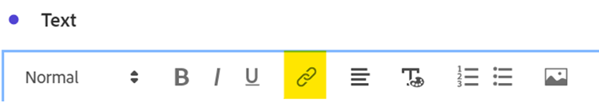

# Mehr als nur Wörter - Verwenden von Textvisualisierungen und Beschreibungen in Analysis Workspace

Als [!DNL Adobe Analytics] Analysis Workspace-Anwender ist es normal, dass Ihr Fokus oft auf Ihre Daten und Datenvisualisierungen gerichtet ist - jeder kann eine Zusammenfassung eingeben, nicht wahr? Wenn Sie jedoch Funktionen in Analysis Workspace wie die Textvisualisierung oder die Visualisierungsbeschreibungen übersehen, kann dies bedeuten, dass Sie eine wertvolle Gelegenheit verpassen, Ihre Einblicke mit wertvollem Text, Bildern, GIFs und Links zu kombinieren. Indem Sie Verweise und mehr Kontext bereitstellen, um Ihre Benutzer über die Bedeutung Ihrer Daten zu informieren, können diese effektiver und wirkungsvoller werden.

Stellen Sie zunächst sicher, dass Sie wissen, wo Sie diese Funktionen finden:

- Um die Beschreibung einer Visualisierung hinzuzufügen oder zu ändern, klicken Sie einfach mit der rechten Maustaste auf den oberen Bereich des Elements und wählen Sie den Link „Beschreibung bearbeiten“ aus:

  

- Um ein separates Textbedienfeld hinzuzufügen, klicken Sie auf das Menü Visualisierungen in der linken Navigationsleiste:

  

Während dieses Handbuch ein Beispiel mit einer dieser beiden Methoden zeigt, können Sie ähnliche Ergänzungen sowohl in Beschreibungen als auch in Textvisualisierungen vornehmen. Sie können auch die Schriftzeicheneinstellung, die Ausrichtung und die Farbe anpassen und Listen mit Aufzählungszeichen oder nummerierten Listen erstellen:

Fangen wir an! Ein sehr hilfreicher Kontext, der zu einem Analysis Workspace-Projekt hinzugefügt werden kann, ist ein Hyperlink. Dazu können Links zur URL der im Bericht beschriebenen Seite, Links zu anderen Analysis Workspace-Projekten, externe Berichtskontextseiten oder alles andere gehören, was beim Anzeigen des Berichts nützlich sein kann. Sie können auf diese Funktion zugreifen, indem Sie einen beliebigen Teil Ihres Textes auswählen und auf das Symbol „Link“ klicken:

Das Ergebnis ist, dass jeder, der das Analysis Workspace-Projekt betrachtet, mit einem einzigen Klick jede Seite erreichen kann, auf die er online oder im Intranet Ihres Unternehmens zugreifen kann:

Wenn Sie es vorziehen, den Inhalt direkt in Ihren Bericht einzufügen, können Sie einen Bild-Link verwenden, um den Inhalt neben Ihren Daten zu platzieren:

Sie können ein Bild zu Ihrem Bericht hinzufügen, auf das über eine beliebige öffentliche URL zugegriffen werden kann, sofern die URL im *https*-Format vorliegt und als .png, .jpeg, .jpg oder .gif formatiert ist. Dies kann zwar restriktiv klingen, aber alle Online-Tools zum Freigeben von Bildern oder GIF wie imgur oder GIPHY können eine schnelle Methode zum Hochladen von Workspace-zugänglichen Dateien über einen Freigabe-Link bereitstellen.

Das Ergebnis? Sie können die Webseite anzeigen, auf die Ihre Daten direkt in Ihrem Projekt verweisen:

Sie können GIF in Ihren Projekten auch verwenden, um bewegte Bilder wie eine Site-exemplarische Vorgehensweise, einen Idealpfad durch Ihre Site oder eine Aufgabe in Ihre App einzuschließen, oder einfach Ihrem Team zeigen, wie ***überwältigend*** Ihre Berichte jetzt geworden sind:

## Autor

Dieses Dokument wurde verfasst von:

**Dan Cummings**, Sr. Product Engineering [!DNL Analytics] Manager bei McDonald&#39;s Corporation

[!DNL Adobe Analytics] Champion
