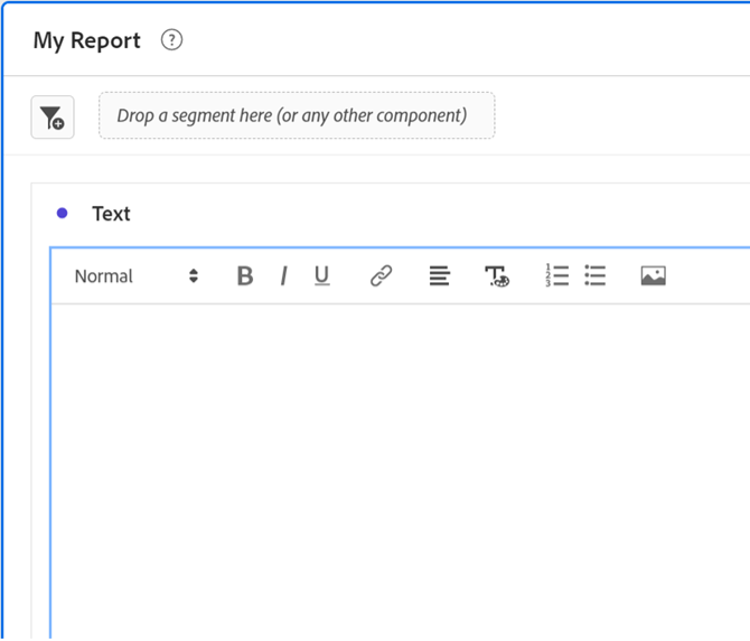
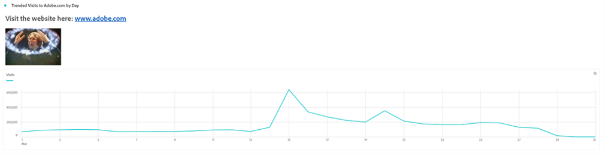

# Mehr als Wörter - Verwenden von Textvisualisierungen und -beschreibungen in Analysis Workspace

Als Benutzer von [!DNL Adobe Analytics] Analysis Workspace ist es natürlich, dass Ihr Fokus häufig auf Ihre Daten- und Datenvisualisierungen gerichtet ist - jeder kann eine Zusammenfassung eingeben, oder? Wenn Sie jedoch Funktionen in Analysis Workspace übersehen, wie z. B. die Textvisualisierung oder die Visualisierungsbeschreibungen, kann dies bedeuten, dass Ihnen eine wertvolle Gelegenheit fehlt, Ihre Einblicke mit wertvollem Text, Bildern, GIF-Dateien und Links zu kombinieren. Wenn Sie Referenzen und mehr Kontext bereitstellen, um Ihre Benutzer über die Bedeutung Ihrer Daten zu informieren, können diese effizienter und wirkungsvoller werden.

Stellen Sie zunächst sicher, dass Sie wissen, wo Sie diese Funktionen finden:

- Um die Beschreibung einer Visualisierung hinzuzufügen oder zu ändern, klicken Sie einfach mit der rechten Maustaste auf den oberen Bereich des Elements und wählen Sie den Link &quot;Beschreibung bearbeiten&quot;:

  

- Um einen separaten Textbereich hinzuzufügen, klicken Sie auf das Menü Visualisierungen in der linken Navigationsleiste:

  

Während dieses Handbuch ein Beispiel mit einer dieser beiden Methoden zeigt, können Sie ähnliche Ergänzungen sowohl in Beschreibungen als auch in Textvisualisierungen vornehmen. Sie können auch Schriftartenhöhe, -ausrichtung, -farbe und Listen mit Aufzählungszeichen oder Nummerierungen erstellen:

Fangen wir an! Ein sehr hilfreicher Kontext, der zu einem Analysis Workspace-Projekt hinzugefügt werden kann, ist ein Hyperlink. Dazu gehören die Verknüpfung mit der URL der im Bericht detaillierten Seite, Links zu anderen Analysis Workspace-Projekten, externe Berichtskontextseiten oder alles andere, was bei der Anzeige Ihres Berichts hilfreich sein kann. Auf diese Funktion können Sie zugreifen, indem Sie einen beliebigen Teil Ihres Textes auswählen und auf das Symbol &quot;Link&quot;klicken:

Dadurch kann jeder Benutzer, der das Analysis Workspace-Projekt anzeigt, mit einem Klick jede Seite erreichen, auf die er online oder im Intranet Ihres Unternehmens zugreifen kann:

Wenn Sie nun den Inhalt lieber direkt in Ihren Bericht einfügen möchten, können Sie einen Bild -Link verwenden, um den Inhalt neben Ihren Daten zu platzieren:

Sie können einem Bericht ein Bild hinzufügen, auf das über eine beliebige öffentliche URL zugegriffen werden kann, vorausgesetzt die URL weist das Format *https* auf und ist als .png, .jpeg, .jpg oder .gif formatiert. Dies klingt zwar restriktiv, aber alle Online-Tools, die zum Freigeben von Bildern verwendet werden, oder GIF wie imgur oder GIPHY können eine schnelle Methode zum Hochladen von Dateien mit Workspace bereitstellen.

Das Ergebnis? Sie können die Webseite anzeigen, auf die Ihre Daten direkt in Ihrem Projekt verweisen:

Sie können in Ihren Projekten auch GIF verwenden, um bewegte Bilder wie eine Website-Umgehung, einen idealen Pfad durch Ihre Site oder eine Aufgabe in Ihrer App einzuschließen oder einfach Ihrem Team zu zeigen, wie ***störend*** Ihre Berichte jetzt geworden sind:

## Autor

Dieses Dokument wurde geschrieben von:

**Dan Cummings**, Sr. Product Engineering [!DNL Analytics] Manager bei McDonald&#39;s Corporation

[!DNL Adobe Analytics] Champion
