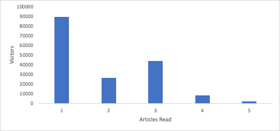

# Erschließen von Einblicken mit Histogrammen: Über die Durchschnittswerte in [!DNL Analytics]

_Entdecken Sie die Auswirkungen von Histogrammen in Analytics für Einblicke über den Durchschnitt hinaus. Histogramme zeigen Datenmuster beim Kundenverhalten, bei der Besucherinteraktion, bei der technischen Leistung und bei Formularfehlern auf und ermöglichen tiefere Einblicke sowie fundierte Entscheidungen in [!DNL Adobe] Workspace._

Springen wir gleich rein. Sie sollten &quot;[&quot; ](https://experienceleague.adobe.com/docs/analytics/analyze/analysis-workspace/visualizations/histogram.html). Ich werde erklären warum, aber ich will Ihre erste Frage beantworten: Was in aller Welt ist ein Histogramm? Ich verstehe. Meistens denkt man, wenn man einige Balken nach oben sieht, dass es ein Balkendiagramm ist. Ja, Histogramme sehen ähnlich aus, aber ich versichere Ihnen, sie sind unterschiedlich. Ein Balkendiagramm vergleicht die Dinge, während ein Histogramm zeigt, wie oft eine Variable aufgetreten ist. Sehen Sie selbst. Hier ist ein Balkendiagramm:

Wir haben sechs Modelle, und wir können den Umsatz mit jedem Modell vergleichen. Wir sehen, dass das Modell von Johannesburg die meisten Einnahmen hat, während Berlin die geringsten Einnahmen hat.

Sehen wir uns nun ein Histogramm an:

Am unteren Ende der X-Achse sehen wir die Anzahl der Einheiten, die von jedem Kunden gekauft wurden. Der erste Balken gibt an, wie oft ein Kunde eine Einheit gekauft hat, der zweite Balken zeigt an, wie viele Kunden zwei Einheiten gekauft haben usw., bis Kunden zehn oder mehr Einheiten kaufen.

Also, wie ist das nützlich? Nun, wir sehen, dass die meisten Leute nur eine Einheit kaufen. Es sinkt weiter bis wir fünf Einheiten erreichen. Dann fällt er wieder ab, bis wir auf zehn Einheiten kommen. Dies zeigt, dass Kunden wirklich gerne mit mehreren Fünfern kaufen, und vielleicht sollten wir spezielle Preise oder Verpackungen anbieten, um dies zu nutzen. Aber es gibt sicherlich auch viele andere Verwendungszwecke.

## Verstehen der Besucherinteraktion

Wenn Ihre Site oder Ihr Programm auf wiederkehrenden Traffic angewiesen ist, möchten Sie wissen, wie viele Besucher wie oft wiederkommen. Eines der einfachsten Histogramme, das Sie verwenden können, ist herauszufinden, wie viele Besucher mehrmals zurückkehren. Wenn man das Histogramm über die Zeit verfolgt, kann man den Fortschritt sehen. Hoffentlich werden die Balken auf der rechten Seite höher und die auf der linken Seite kürzer.

Vielleicht möchten Sie Leute auf der Website behalten, die Artikel lesen. Ein Histogramm, das zeigt, wie viele Besucher eine unterschiedliche Anzahl von Artikeln lesen, gibt Ihnen einen Einblick in den Grad der Interaktion. Warum ist das hilfreich? Nehmen wir an, die meisten Besucher lesen einen Artikel und gehen, aber einige hochengagierte Besucher lesen drei Artikel und gehen. Das ist eine großartige Information! Jetzt wissen Sie, dass Sie die Seite für den ersten und dritten gelesenen Artikel personalisieren sollten, um Besucher dazu zu bringen, einen weiteren Artikel zu lesen.

## Verstehen des Kundenverhaltens

Der Produkteigentümer für Patientenakten in einem Krankenhaus bat mich um einige Daten. Es gab sechs Regionen zur Auswahl, um Ihre Krankenakten zu bekommen. Sie wollte wissen, wie viele Leute auf mehr als einen geklickt haben. Ich habe ein Histogramm erstellt, das anzeigt, wie viele Besucher auf 1, 2, 3, 4, 5 oder 6 Optionen geklickt haben. Das mag übertrieben erscheinen, aber mehr als die Hälfte der Besucher klickte auf mindestens zwei Optionen, und volle 3,2 % der Besucher klickten auf alle sechs. Mit diesem Histogramm vor ihr sprang sie in Aktion, ordnete ihre Roadmap um und vereinfachte die Optionen auf zwei herunter. Das machte die Erfahrung des Patienten sehr viel einfacher.

## Grundlegendes zur technischen Leistung

Wenn Sie ein Histogramm dafür einrichten, wie viele Besucher wie viele technische Fehler erleben, können Sie ein großartiges Verständnis davon gewinnen, wie Ihre Site technisch funktioniert. Viele Besucherinnen und Besucher, die viele technische Fehler erleben, sind ein Zeichen dafür, mit der Priorisierung dieser technischen Korrekturen zu beginnen.

## Grundlagen zur Formularleistung

Fehlermeldungen in einem Formular sind etwas Anderes. Dabei handelt es sich um Besucherfehler, nicht um Fehler Ihrerseits. Sie können jedoch von einem Histogramm profitieren, das Ihnen zeigt, wie viele Besucher wie viele Fehler auftreten. Wenn Sie ein Histogramm sehen, das anzeigt, dass bei vielen Besuchern viele Fehler auftreten, liegt es möglicherweise nicht an ihnen. Dies wäre ein guter Hinweis darauf, dass das Formular schlecht benannte Felder, unklare Anweisungen oder möglicherweise ein Design enthält, das Pflichtfelder ausblendet.

## Warum keine berechnete Metrik?

Sie fragen sich vielleicht, worin sich das von der bloßen Verwendung einer berechneten Metrik unterscheidet. Hey, ich liebe eine gute berechnete Metrik. Ich denke, sie sind absolut unverzichtbare Werkzeuge, um die Leistung Ihrer Seite zu verstehen. Das Problem bei vielen der aufgelisteten Anwendungsfälle ist jedoch, dass ein Durchschnittswert die Größe des Problems anzeigen, aber seine Tragweite verdecken kann. Lassen Sie uns durchgehen, wie Histogramme Ihnen zusätzliche Informationen für einige der oben genannten Anwendungsfälle geben:

- Interaktion mit Besuchern - Wenn Sie im Durchschnitt 1,2 Storys gelesen haben, ist die Personalisierung des ersten Artikels ziemlich offensichtlich. Sie werden vermissen, dass es eine weitere große Gruppe gibt, die nach dem Lesen des dritten Artikels existiert, was das Histogramm deutlich macht.

  

- Technische Fehler - Wenn pro Besucher durchschnittlich 8,7 Fehler auftreten, wissen Sie, dass ein Problem vorliegt. Das Histogramm könnte zeigen, dass 97 % der Besucher einen oder weniger Fehler erleben, aber eine Handvoll Ausreißer treiben den Durchschnitt nach oben. Vielleicht finden Sie dann heraus, dass es sich nicht lohnt, der Verbesserung des Erlebnisses für diese kleine Gruppe von Ausreißern viel Zeit zu widmen.

  

- Formularfehler : Wenn Sie durchschnittlich 3,6 Formularfehlermeldungen pro Besucherin bzw. Besucher haben, ist dies ein Hinweis auf ein Problem. Möglicherweise haben Sie dasselbe Problem mit den technischen Fehlern, aber Sie können auch Einsichten gewinnen, wenn Sie eine Spitze im Histogramm bei einer bestimmten Anzahl von Fehlern sehen. Eine riesige Spitze bei einem Fehler? Dies könnte entweder ein häufiges Problem sein, das alle diese Besucher erleben, oder sie alle haben einen anderen Fehler einmal. Eine gigantische Spitze bei drei Fehlern? Ah, jetzt ist das interessant. Wenn eine Untersuchung ergibt, dass es dieselben drei Fehler sind, haben Sie Daten zugeschnitten, die Ihnen das Verständnis Ihrer Besucher vermitteln und Ihnen helfen, eine Gruppe miteinander verbundener Probleme zu lösen.

  

Wie Sie sehen können, haben Histogramme nicht nur ihre eigene Verwendung, sondern sie vertiefen auch die Einsicht, die Sie durch einen Durchschnitt gewinnen. Sie sind eine sofort einsetzbare Visualisierung in [!DNL Adobe Analytics] und einfach zu erstellen. Hoffentlich sind diese Anwendungsfälle hilfreich für Sie oder inspirieren Sie. Glücklich visualisieren!

## Autor

Dieses Dokument wurde verfasst von:

**Gitai Ben-Ammi**, Principal Consultant bei Concentrix Catalyst

[!DNL Adobe Analytics] Champion
