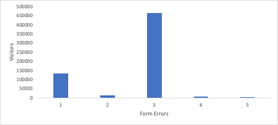

# Erschließen von Erkenntnissen mit Histogrammen: über Durchschnittswerte in hinaus[!DNL Analytics]

_Entdecken Sie die Auswirkungen von Histogrammen in der Analyse für Erkenntnisse, die über Durchschnittswerte hinausgehen. Histogramme zeigen Datenmuster im Kundenverhalten, in der Besucherinteraktion, in der technischen Leistung und Formularfehlern auf und ermöglichen so tiefere Einblicke und fundierte Entscheidungen in [!DNL Adobe] Arbeitsbereich._

Springen wir gleich rein! Sie sollten [Histogramme](https://experienceleague.adobe.com/docs/analytics/analyze/analysis-workspace/visualizations/histogram.html?lang=de). Ich werde erklären, warum, aber ich möchte Ihre erste Frage beantworten: Was in der Welt ist ein Histogramm? Ich verstehe es. Meistens, wenn Sie einen Haufen Balken hochfahren sehen, denken Sie vielleicht, dass es ein Balkendiagramm ist. Ja, Histogramme sehen ähnlich aus, aber ich versichere Ihnen, sie sind anders. Ein Balkendiagramm vergleicht die Dinge, während ein Histogramm zeigt, wie oft eine Variable aufgetreten ist. Sehen Sie selbst. Im Folgenden finden Sie ein Balkendiagramm:

Wir haben sechs Modelle, und wir können den Umsatz für jedes Modell vergleichen. Wir sehen, dass das Johannesburger Modell die meisten Einnahmen hat, während Berlin am wenigsten hat.

Sehen wir uns nun ein Histogramm an:

Unten auf der X-Achse haben wir die Anzahl der von jedem Kunden gekauften Einheiten. Die erste Leiste gibt an, wie oft ein Kunde eine Einheit gekauft hat, die zweite Leiste zeigt, wie viele Kunden zwei Einheiten gekauft haben, bis Kunden zehn oder mehr Einheiten gekauft haben.

Wie ist das also nützlich? Wir sehen, dass die meisten Leute nur eine Einheit kaufen. Es nimmt weiter ab, bis wir auf fünf Einheiten angekommen sind. Dann fällt es wieder zurück, bis wir auf zehn Einheiten kommen. Dies weist darauf hin, dass die Kunden wirklich gerne mehrere Fünftel kaufen, und vielleicht sollten wir Sonderpreise oder Verpackungen anbieten, um davon zu profitieren. Aber es gibt sicherlich auch viele andere Verwendungen.

## Informationen zur Besucherinteraktion

Wenn Ihre Site oder App auf wiederholten Traffic angewiesen ist, möchten Sie wissen, wie viele Besucher zurückkehren und wie oft. Eines der einfachsten Histogramme, das Sie verwenden können, ist herauszufinden, wie viele Besucher mehrmals zurückkehren. Wenn man dieses Histogramm im Laufe der Zeit verfolgt, kann man seinen Fortschritt sehen, wie hoffentlich die Balken auf der rechten Seite größer werden und die auf der linken Seite kürzer werden.

Vielleicht möchten Sie Leute auf der Website halten, Artikel lesen. Ein Histogramm, das anzeigt, wie viele Besucher verschiedene Artikelzahlen lesen, gibt Ihnen einen Einblick in den Grad der Interaktion. Warum ist das hilfreich? Nehmen wir an, Sie finden die meisten Besucher einen Artikel lesen und gehen, aber einige stark engagierte Besucher lesen drei Artikel und gehen. Das ist großartige Information! Jetzt wissen Sie, dass Sie die Seite in den ersten und dritten Artikeln personalisieren sollten, um Besucher dazu zu bringen, einen weiteren Artikel zu lesen.

## Grundlegendes zum Kundenverhalten

Der Produkteigentümer für Patientenakten in einem Krankenhaussystem bat mich um einige Daten. Es gab sechs Regionen, aus denen Sie Ihre Krankenakten abrufen konnten. Sie wollte wissen, wie viele Leute auf mehr als einen geklickt haben. Ich erstellte ein Histogramm, das anzeigte, wie viele Besucher auf 1, 2, 3, 4, 5 oder 6 Optionen klickten. Dies mag übertrieben erscheinen, aber mehr als die Hälfte der Besucher klickte auf mindestens zwei Optionen, und 3,2 % der Besucher klickten auf alle sechs. Mit diesem Histogramm vor ihr sprang sie in die Tat, sorgte für ihre Roadmap und vereinfachte die Optionen auf zwei. Dies hat die Erfahrung des Patienten deutlich vereinfacht.

## Technische Leistung

Wenn Sie ein Histogramm einrichten, mit dem ermittelt wird, wie viele technische Fehler bei Besuchern auftreten, erhalten Sie ein gutes Verständnis davon, wie technisch Ihre Site funktioniert. Viele Besucher, die viele technische Fehler haben, sind ein Zeichen dafür, diese technischen Korrekturen priorisieren zu können.

## Formularleistung

Fehlermeldungen in einem Formular sind eine andere Angelegenheit. Dies sind Besucherfehler, keine Fehler von Ihrer Seite. Sie können jedoch von einem Histogramm profitieren, das anzeigt, wie viele Fehler bei Besuchern auftreten. Wenn ein Histogramm angezeigt wird, das angibt, dass viele Besucher viele Fehler aufweisen, ist dies möglicherweise nicht deren Fehler. Dies wäre ein großartiger Hinweis darauf, dass Ihr Formular schlecht benannte Felder, unklare Anweisungen oder möglicherweise ein Design enthält, das Pflichtfelder ausblendet.

## Warum keine berechnete Metrik?

Sie können fragen, wie unterscheidet sich dies von einer errechneten Metrik? He, ich habe eine gute berechnete Metrik entfernt. Ich denke, sie sind absolut unverzichtbare Werkzeuge, um die Leistung Ihrer Site zu verstehen. Das Problem bei vielen der Anwendungsfälle, die ich aufgelistet habe, ist jedoch, dass ein Durchschnitt Ihnen die Größe des Problems zeigen kann, aber dessen Umfang verdeckt. Sehen wir uns an, wie Histogramme Ihnen zusätzliche Informationen zu einigen der oben genannten Anwendungsfälle liefern:

- Besucherinteraktion - Wenn Sie im Durchschnitt 1.2 Geschichten lesen, ist es ziemlich offensichtlich, den ersten Artikel zu personalisieren. Sie werden vermissen, dass es eine weitere große Gruppe gibt, die nach dem Lesen des dritten Artikels verlässt, was das Histogramm deutlich macht.

  

- Technische Fehler - Wenn Sie durchschnittlich 8,7 Fehler pro Besucher gesehen haben, wissen Sie, dass Sie ein Problem hatten. Das Histogramm könnte zeigen, dass 97 % der Besucher einen oder mehrere Fehler aufweisen, aber eine Handvoll Ausreißer treiben den Durchschnitt in die Höhe. Dann könnten Sie entscheiden, dass es nicht sinnvoll ist, viel Zeit für die Verbesserung der Erfahrung für diese winzige Gruppe von Ausreißern zu widmen.

  

- Formularfehler - Wenn Sie durchschnittlich 3,6 Formularfehlermeldungen pro Besucher haben, ist dies ein Anzeichen für ein Problem. Sie haben vielleicht dasselbe Ausreißerproblem wie die technischen Fehler, aber es gibt auch Einblicke, die man gewinnen kann, wenn man eine Spitze im Histogramm bei einer bestimmten Anzahl von Fehlern sieht. Eine riesige Spitze bei einem Fehler? Dies könnte entweder ein häufig auftretendes Problem sein, das alle diese Besucher erleben, oder sie haben vielleicht alle einmal einen anderen Fehler. Eine riesige Spitze bei drei Fehlern? Ah, jetzt ist das interessant. Wenn dies zu einer Untersuchung führt, aus der hervorgeht, dass es sich um die gleichen drei Fehler handelt, haben Sie Daten, die Ihnen ein Verständnis Ihrer Besucher vermitteln und Ihnen helfen, die wahrscheinliche Gruppe von miteinander zusammenhängenden Problemen zu beheben, nullt.

  

Wie Sie sehen können, haben Histogramme nicht nur ihre eigenen Verwendungen, sondern sie vertiefen auch die Einsichten, die Sie aus dem Durchschnitt gewinnen. Es handelt sich um eine vordefinierte Visualisierung in [!DNL Adobe Analytics] und leicht zu erstellen. Hoffentlich sind diese Anwendungsfälle hilfreich für Sie oder lassen Sie sich inspirieren. Gute Visualisierung!

## Autor

Dieses Dokument wurde verfasst von:

**Gitai Ben-Ammi**, Principal Consultant bei Concentrix Catalyst

[!DNL Adobe Analytics] Champion
