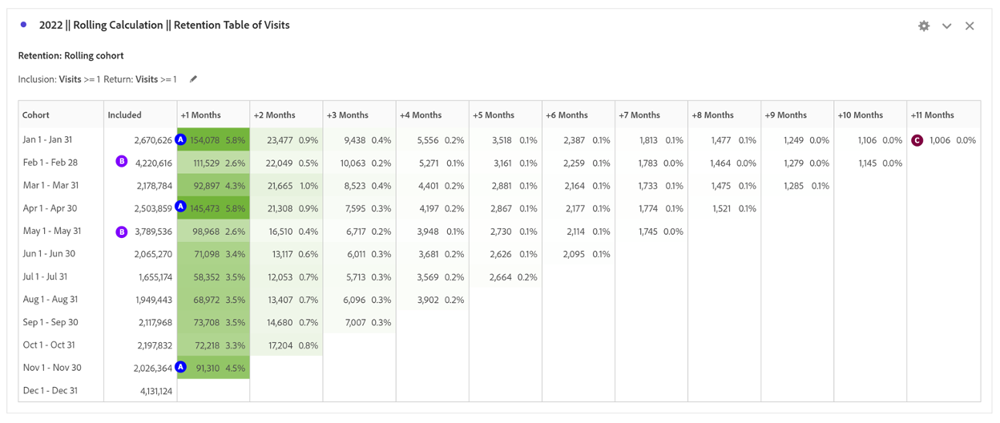

# Verwenden der Kohortenanalyse zum Verständnis des Kundenverhaltens

Um das Kundenerlebnis und den Umsatz zu verbessern, müssen Unternehmen das Kundenverhalten verstehen. Die Kohortenanalyse kann dabei helfen, Interaktion und Bindung zu verstehen, was zu Aktionen wie der Verbesserung der Kontoerstellung und der Erstellung von Kampagnen für Monate mit hohem Volumen führt.

Die Analyse der digitalen Leistung ist entscheidend, um zu verstehen, wie Kunden mit einem Unternehmen interagieren und welche Maßnahmen ergriffen werden können, um ihre Erfahrung zu verbessern. In diesem Blogpost werden wir untersuchen, wie wir die Kohortenanalyse verwenden können, um das Kundenverhalten besser zu verstehen.

## Teil 1: Vergleich der digitalen Leistung zwischen ersten und rückkehrenden Besuchen

### Festlegen der Bühne

Ein Kunde möchte die digitale Leistung der letzten zwei Jahre verstehen und erwägt die Entwicklung eines Treueprogramms zur Steigerung der digitalen Leistung. Zunächst können wir uns den aktuellen Site-Mix zwischen neuen und wiederholten Benutzern ansehen, um zu verstehen, wie sich die beiden Besuchergruppen heute verhalten.

Aktuelle digitale Leistung

1. 2022 stammten 62 % der Bestellungen von Erstbesuchen, verglichen mit 38 % der Bestellungen von wiederkehrenden Besuchen (abhängig von Cookies und mehreren Geräten).
1. Erstmalige Besuche werden in einer etwas höheren Rate konvertiert als Wiederkehrbesuche für beide, 11,6 % vs. 11,4 %.
1. Im Vergleich zu 2021 sanken die Konversionsraten in beiden Segmenten.

## Teil 2: Kohortenanalyse - Besuche essbare Arrangements Global Prod

Um die Treue des digitalen Kanals und die Möglichkeit, wiederholte Käufer zu fördern, zu verstehen, lautet die nächste Frage: Wie viele Besucher kehren 2022 jeden Monat auf die Site zurück?

### Einführung in die Kohortenanalyse

Die Kohortenanalyse ist ein nützliches Werkzeug, um zu verstehen, wie Kohorten im Laufe der Zeit mit einer Marke interagieren. Zunächst haben wir bestimmt, welche Fragen beantwortet werden sollen:

1. Wie hoch ist die durchschnittliche Aufbewahrungsfrist pro Monat in einem bestimmten Jahr?
1. Welches Volumen an Besuchern der Site kehrt in einem bestimmten Jahr monatlich zurück?
1. Wie wirkt sich die Anmeldung auf die Aufbewahrung aus?
1. Gibt es bestimmte Produkte, die zu einer höheren Aufbewahrung geführt haben?

Einrichten der Kohortentabelle

1. Datumsbereich auf Januar bis Dezember 2022 festlegen
1. **Aufnahmekriterien:** Besuche
1. **Rückkehrkriterien:** Besuche
1. **Granularität:** Monat
1. **Einstellungen:** Rollierende Berechnung
\*\*Ermöglicht die Berechnung der Beibehaltung auf der Grundlage der vorherigen Spalte, nicht der eingeschlossenen Spalte. Das bedeutet, dass ein Benutzer in jedem der Monate enthalten ist\*\*
1. **Segmente:** Sie können bestimmte Segmente auswählen, um diese Analyse weiter voranzutreiben.
   1. Spezifische Landingpages
   1. Device Type
   1. Marketing-Kanäle
   1. usw.

### Interpretation der Ergebnisse

**Im Jahr 2022:**

1) Die Monate mit den höchsten Treueraten +1 Monat umfassen Januar, April und November
1) Die Monate mit dem größten Volumen umfassen Februar und Mai
1) Es gibt rund 1.000 Besucher, die jeden Monat zur Site zurückkehren

**Im Jahr 2021:**

1) Die Monate mit den höchsten Treueraten +1 Monat umfassen April, Januar und März
1) Die Monate mit dem größten Volumen umfassen Februar und Mai

**Aktionselemente:**

Erstellen Sie ein Segment basierend auf den ~1.000 Besuchern und erfahren Sie mehr darüber:

- Wo sind sie?
- Welche Produkte kaufen sie das ganze Jahr über?
- Aus welchen Geschäften kaufen sie?

Wichtige Monate zeigen die Möglichkeit, die Bindung auf Grundlage des Volumens zu steigern:

- Gibt es spezielle Taktiken, die zusätzliche Stickeits im Februar und Mai fördern können, um die Lautstärke zu nutzen?

Wiederholungsanalyse für Bestellungen zum Verständnis von Wiederholungskäufern

- Sind die höchsten +1-Monats-Bindungsraten für dieselben Monate?
- Sind die höchsten Besuchsmonate bei Bestellungen gleich?

## Teil 3: Hinzufügen von zwei Metriken zu Aufnahmekriterien

### Auswirkungen der Anmeldung verstehen

Da dieser Kunde den Wert eines Treueprogramms verstehen möchte, umfasste der nächste Schritt in der Analyse das Hinzufügen der Erfolgsereignis bei der Anmeldung als Einschlussmetrik zur Kohorte.

Warnung: Die Kohortenanalyse kann nicht für berechnete Metriken (z. B. Konversionsrate) oder Metriken ohne Ganzzahl (z. B. Umsatz) verwendet werden. In der Kohortenanalyse können nur Metriken verwendet werden, die in Segmenten verwendet werden können, und sie können jeweils nur um mehr als 1 inkrementiert werden.

Hält die Site Benutzer, die sich anmelden, mit höherer Wahrscheinlichkeit an?

Welche Auswirkungen hätte es, wenn wir mehr Benutzer zur Anmeldung bewegen könnten? Ist das ein Aufklebererlebnis?

### Einrichten der Kohortentabelle

1. **Datumsbereich festlegen:** auf Jan bis Dezember 2022 festlegen
1. **Aufnahmekriterien:** Besuche + Erfolgsereignis bei der Anmeldung
1. **Rückkehrkriterien:** Besuche
1. **Granularität:** Monat
1. **Einstellungen:** Rollierende Berechnung
\*\*Ermöglicht die Berechnung der Beibehaltung auf der Grundlage der vorherigen Spalte, nicht der eingeschlossenen Spalte. Das bedeutet, dass ein Benutzer in jedem der Monate enthalten ist\*\*

### Interpretieren der Ergebnisse

**Im Jahr 2022:**

1) Monate mit den höchsten Treueraten +1 Monat umfassen Januar, April und November (dieselben Monate wie die erste Kohortentabelle)
1) Die Monate mit dem größten Volumen umfassen Februar und Mai und Dezember
1) Es gibt ~2500 Besucher, die jeden Monat zurückkehren \*\*mehr als doppelt\*\*

**Aktionselemente:**

Untersuchen Sie das Benutzererlebnis auf der Site, um Benutzer dazu zu bringen, während des Checkout ein Konto zu erstellen.

## Teil 4: Angepasste Kohorte der Dimension

Angepasste Kohorte: Erstellen Sie Kohorten auf Grundlage der ausgewählten Dimension und nicht auf Grundlage zeitbasierter Kohorten (Standard). Viele Kunden möchten ihre Kohorten nach etwas anderem analysieren als nach der Zeit. Die neue Funktion der angepassten Dimension-Kohorte bietet Ihnen die Flexibilität, Kohorten basierend auf Dimensionen ihrer Auswahl zu erstellen. Verwenden Sie Dimensionen wie Marketing-Kanal, Kampagne, Produkt, Seite, Region oder jede andere Dimension in [!DNL Adobe Analytics], um anzuzeigen, wie sich die Bindung basierend auf den verschiedenen Werten dieser Dimensionen ändert. Die Menüauswahlmöglichkeiten für die 

Die Segmentdefinition für die Kohorte benutzerspezifische Dimension wendet das Dimensionselement nur als Teil des Aufnahmezeitraums an, nicht als Teil der Rückgabedefinition.

Nach Auswahl der Option Angepasste Dimension Kohorte können Sie jede beliebige Dimension in die Dropzone ziehen. Auf diese Weise können Sie ähnliche Dimensionselemente über denselben Zeitraum hinweg vergleichen. Sie können beispielsweise die Leistung von Städten nebeneinander vergleichen

-Seite, Produkten, Kampagnen usw. Es werden Ihre 14 wichtigsten Dimensionselemente zurückgegeben. Sie können jedoch einen Filter verwenden (auf den Sie zugreifen können, indem Sie den Mauszeiger auf der rechten Seite der gezogenen Dimension bewegen), um nur die gewünschten Dimensionselemente anzuzeigen. Eine Kohorte Benutzerspezifische Dimension kann nicht mit der Funktion Latenztabelle verwendet werden.

### Welche Produkte treiben die Site-Stickigkeit?

Die Kohortentabelle für benutzerdefinierte Dimensionen zeigt Produkte, die zu höheren Bindungsraten als im Durchschnitt führen.  Diese Tabelle hilft Ihnen dabei, Ihre wichtigsten Produkte zu identifizieren, um interne und externe Marketing-Kampagnen mit hochgradig achtungswürdigen Produkten zu fördern.

**Im Februar:** 3 Produkte mit höheren Rückhaltungsraten ausfallen

1) Produkt 1
1) Produkt 2
1) Produkt 3

**In mar:**

1) Produkt 1
1) Produkt 2
1) Produkt 3 - ist häufig leistungsstärker als bei einer höheren Retentionsrate im Vergleich zur durchschnittlichen Bindung.

## Zusammenfassung

Die Kohortenanalyse und die Kohorte &quot;Benutzerspezifische Dimension&quot;sind leistungsstarke Tools zum Verständnis des Kundenverhaltens und zur Verbesserung der digitalen Leistung. Durch die Analyse von Aufbewahrungsraten, Anmelderaten und Auswirkungen bestimmter Produkte können Unternehmen datengesteuerte Entscheidungen treffen, um das Kundenerlebnis zu verbessern und das Wachstum zu fördern.

## Autor

Dieses Dokument wurde geschrieben von:

**Jennifer Yacenda**, Senior Director at Marriott

[!DNL Adobe Analytics] Champion
