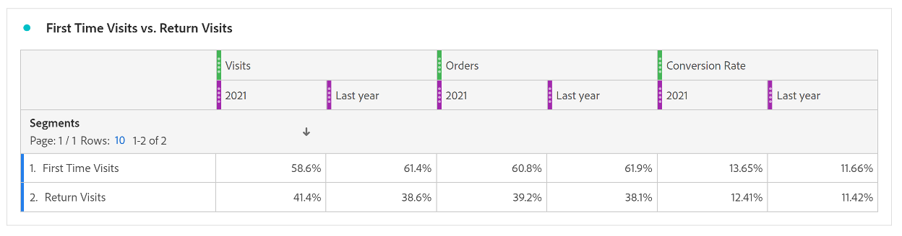
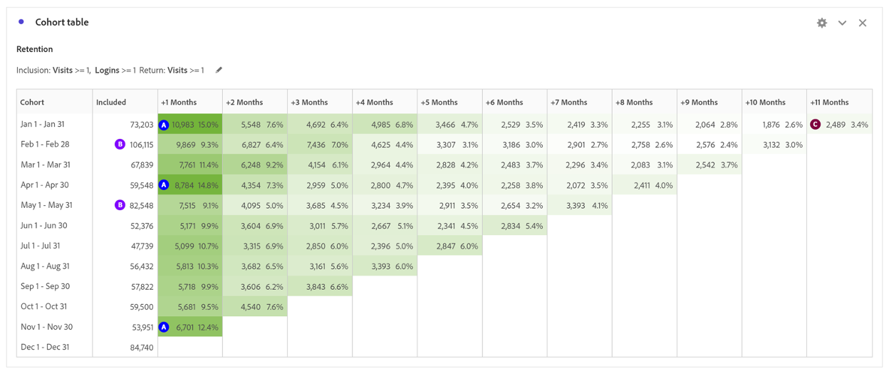

# Verwenden der Kohortenanalyse , um das Kundenverhalten zu verstehen

Um das Kundenerlebnis und den Umsatz zu verbessern, müssen Unternehmen das Kundenverhalten verstehen. Die Kohortenanalyse kann dabei helfen, Interaktion und Kundenbindung zu verstehen, was zu Aktionen führt wie die Verbesserung der Kontoerstellung und die Erstellung von Kampagnen für Monate mit hohem Volumen.

Die Analyse der digitalen Leistung ist von entscheidender Bedeutung, um zu verstehen, wie Kunden mit einem Unternehmen interagieren und welche Maßnahmen ergriffen werden können, um ihr Erlebnis zu verbessern. In diesem Blogpost erfahren Sie, wie Sie die Kohortenanalyse verwenden können, um das Kundenverhalten besser zu verstehen.

## Teil 1: Vergleich der digitalen Leistung zwischen ersten und wiederkehrenden Besuchen

### Bühne bereiten

Ein Kunde möchte die digitale Leistung in den letzten zwei Jahren verstehen und erwägt die Entwicklung eines Treueprogramms zur Steigerung der digitalen Leistung. Zunächst können wir uns den aktuellen Site-Mix zwischen neuen und wiederholten Benutzern ansehen, um zu verstehen, wie sich die beiden Besuchergruppen heute verhalten.

Aktuelle digitale Leistung

1. Im Jahr 2022 gingen 62 % der Bestellungen auf Erstbesuche zurück, verglichen mit 38 % der Bestellungen bei Rückkehrbesuchen (abhängig von Cookies, mehreren Geräten).
1. Erstbesuche konvertieren mit einer etwas höheren Rate als wiederkehrende Besuche für beide, 11,6 % vs. 11,4 %.
1. Im Vergleich zu 2021 gingen die Konversionsraten in beiden Segmenten zurück.

## Teil 2: Kohortenanalyse - Besuche zu essbaren Anordnungen Global Prod

Um die Stickiness des digitalen Kanals und die Möglichkeit, Wiederholungskäufer zu fördern, zu verstehen, ist die nächste zu beantwortende Frage: Wie hoch ist die Anzahl der Besucher, die im Jahr 2022 jeden Monat zur Website zurückkehren?

### Einführung in die Kohortenanalyse

Die Kohortenanalyse ist ein nützliches Tool, um zu verstehen, wie Kohorten im Laufe der Zeit mit einer Marke interagieren. Zunächst haben wir festgelegt, welche Fragen zu beantworten sind:

1. Wie hoch ist die durchschnittliche Aufbewahrungsfrist in einem bestimmten Jahr nach Monat?
1. Welches Besuchervolumen kehrt in einem bestimmten Jahr monatlich auf die Website zurück?
1. Welche Auswirkungen hat die Anmeldung auf die Datenspeicherung?
1. Gibt es bestimmte Produkte, die zu einer höheren Kundenbindung geführt haben?

Einrichten der Kohortentabelle

1. Datumsbereich auf Januar bis Dezember 2022 festlegen
1. **Einschlusskriterien:** Besuche
1. **Rückkehrkriterien:** Besuche
1. **Granularität:** Monat
1. **Einstellungen:** Berechnung
\*\*Ermöglicht die Berechnung der Beibehaltung basierend auf der vorherigen Spalte, nicht auf der eingeschlossenen Spalte. Das bedeutet, dass ein Benutzer in jedem Monat enthalten ist.\*\*
1. **Segmente** Sie können bestimmte Segmente auswählen, um diese Analyse weiter voranzutreiben
   1. Spezifische Landingpages
   1. Device Type
   1. Marketing-Kanäle
   1. usw.

### Interpretieren der Ergebnisse

**2022:**

1) Die Monate mit den höchsten Bindungsraten von +1 Monat umfassen Januar, April und November
1) Die Monate mit dem höchsten Volumen umfassen Februar und Mai
1) Es gibt ~1.000 Besucher, die jeden Monat zur Website zurückkehren

**2021:**

1) Die Monate mit den höchsten Bindungsraten von +1 Monat umfassen April, Januar und März
1) Die Monate mit dem höchsten Volumen umfassen Februar und Mai

**Aktionselemente:**

Erstellen Sie ein Segment basierend auf den ~1.000 Besuchern und erfahren Sie mehr über sie:

- Wo befinden sie sich?
- Welche Produkte kaufen sie das ganze Jahr über?
- Aus welchen Geschäften kaufen sie?

Die wichtigsten Monate zeigen die Möglichkeit, die Kundenbindung auf der Basis des Volumens zu steigern:

- Gibt es bestimmte Taktiken, die im Februar und Mai zu zusätzlichen Verklebungen führen können, um das Volumen zu nutzen?

Wiederholungsanalyse für Bestellungen zum Verständnis von Wiederholungskäufern

- Sind die höchsten Einbehaltungsraten von +1 Monat für dieselben Monate?
- Sind die höchsten Besuchsmonate bei Bestellungen gleich?

## Teil 3: Hinzufügen von zwei Metriken zu Einschlusskriterien

### Auswirkungen der Anmeldung verstehen

Da dieser Client den Wert eines Treueprogramms verstehen möchte, umfasst der nächste Schritt in der Analyse das Hinzufügen des Erfolgsereignisses „Anmeldung“ als Einschlussmetrik zur Kohorte.

Einschränkung: Die Kohortenanalyse kann nicht für berechnete Metriken (z. B. Konversionsrate) oder Nicht-Ganzzahlmetriken (z. B. Umsatz) verwendet werden. In der Kohortenanalyse können nur Metriken verwendet werden, die auch in Segmenten verwendet werden können. Darüber hinaus können diese Metriken jeweils nur um > 1 inkrementiert werden.

Ist es wahrscheinlicher, dass die Site Benutzer beibehält, die sich anmelden?

Was wäre die Auswirkung, wenn sich mehr Benutzer anmelden könnten? Ist das eine klebrigere Erfahrung?

### Kohortentabelle einrichten

1. **Datumsbereich festlegen:** bis Januar bis Dezember 2022
1. **Einschlusskriterien:** Besuche + Erfolgsereignis bei der Anmeldung
1. **Rückkehrkriterien:** Besuche
1. **Granularität:** Monat
1. **Einstellungen:** Berechnung
\*\*Ermöglicht die Berechnung der Beibehaltung basierend auf der vorherigen Spalte, nicht auf der eingeschlossenen Spalte. Das bedeutet, dass ein Benutzer in jedem Monat enthalten ist.\*\*

### Interpretieren der Ergebnisse

**2022:**

1) Die Monate mit den höchsten Bindungsraten +1 Monat umfassen Januar, April und November (dieselben Monate wie die erste Kohortentabelle)
1) Die Monate mit dem höchsten Volumen umfassen Februar und Mai und Dezember
1) Es gibt ~2500 Besucher, die jeden Monat zurückkommen \*\*mehr als das Doppelte\*\*

**Aktionselemente:**

Erkunden des Site-Benutzererlebnisses, um Benutzer dazu zu bringen, während des Checkouts ein Konto zu erstellen

## Teil 4: Kohorte mit benutzerdefinierter Dimension

Kohorte mit benutzerdefinierter Dimension: Erstellen Sie Kohorten basierend auf der ausgewählten Dimension und nicht auf zeitbasierten Kohorten (Standard). Viele Kunden möchten ihre Kohorten nach etwas anderem als der Zeit analysieren, und die neue Funktion für benutzerdefinierte Dimensionen-Kohorten bietet Ihnen die Flexibilität, Kohorten basierend auf Dimensionen ihrer Wahl zu erstellen. Verwenden Sie Dimensionen wie Marketing-Kanal, Kampagne, Produkt, Seite, Region oder jede andere Dimension in [!DNL Adobe Analytics], um zu zeigen, wie sich die Kundenbindung basierend auf den verschiedenen Werten dieser Dimensionen ändert. Die Menüauswahlmöglichkeiten für die 

Die Definition eines Kohortensegments mit benutzerdefinierter Dimension wendet das Dimensionselement nur als Teil des Einschlusszeitraums an, nicht als Teil der Rückgabedefinition.

Nachdem Sie die Option „Kohorte mit benutzerdefinierter Dimension&quot; ausgewählt haben, können Sie die gewünschte Dimension per Drag-and-Drop in den Ablagebereich ziehen. Auf diese Weise können Sie ähnliche Dimensionselemente über denselben Zeitraum hinweg vergleichen. Beispielsweise können Sie die Leistung von Städten nebeneinander vergleichen

Seite, Produkte, Kampagnen usw. Dadurch werden Ihre 14 wichtigsten Dimensionselemente zurückgegeben. Sie können jedoch einen Filter verwenden (greifen Sie darauf zu, indem Sie den Mauszeiger rechts neben der Dimension bewegen, auf die gezogen wurde), um nur die gewünschten Dimensionselemente anzuzeigen. Eine benutzerdefinierte Dimension-Kohorte kann nicht mit der Latenztabellen-Funktion verwendet werden.

### Welche Produkte treiben die Website-Klebrigkeit an?

Die Kohortentabelle mit benutzerdefinierter Dimension zeigt Produkte, die zu höheren Kundenbindungsraten als der Durchschnitt führen.  Diese Tabelle hilft bei der Identifizierung Ihrer Top-Produkte, um interne und externe Marketing-Kampagnen mit Top-Aufmerksamkeit-würdigen Produkten zu fördern.

**Im Februar:** 3 Produkte zeichnen sich durch höhere Kundenbindungsraten aus

1) Produkt 1
1) Produkt 2
1) Produkt 3

**März:**

1) Produkt 1
1) Produkt 2
1) Produkt 3: Übertrifft häufig die Leistung mit einer höheren Kundenbindungsrate als die durchschnittliche Kundenbindung.

## Zusammenfassung

Die Kohortenanalyse und benutzerdefinierte Dimension sind leistungsstarke Tools, mit denen Sie das Kundenverhalten verstehen und die Digitalleistung verbessern können. Durch die Analyse der Kundenbindungsraten, Anmeldequoten und der Auswirkungen bestimmter Produkte können Unternehmen datengesteuerte Entscheidungen treffen, um das Kundenerlebnis zu verbessern und das Wachstum zu steigern.

## Autor

Dieses Dokument wurde verfasst von:

**Jennifer**, Senior Director bei Marriott

[!DNL Adobe Analytics] Champion
