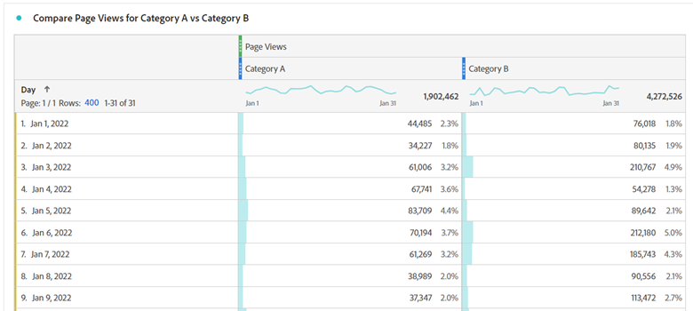
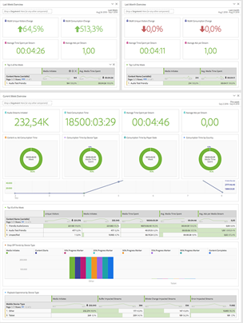

# Umfassende Anleitung für die Umstellung auf [!DNL Adobe Analytics] von Google [!DNL Analytics]{#comprehensive-guide-for-transitioning-to-adobe-analytics}

## 1. Einführung

Eine der größten Herausforderungen bei der Umstellung von einem Tool auf ein anderes besteht darin, zu lernen, wo die entsprechenden Funktionen zu finden sind und wie man sie effizient nutzt. Diese Diskussion ist Teil einer größeren Anleitung, die Benutzern beim Übergang zu [!DNL Adobe Analytics] (entweder als neuer Benutzer oder von Google [!DNL Analytics]) einfacher. Ein ausführlicher Vergleich mit GA (dem Vergleichs-Tool, mit dem wahrscheinlich die meisten Benutzenden vertraut sind) sollte Ihnen helfen, Ihr vorhandenes Wissen auf das neue Toolset anzuwenden. Wenn es keine anderen Möglichkeiten zum Üben gibt, hilft Ihnen das, den Einstieg zu finden und Frustrationen, die möglicherweise während dieser Zeit auftreten, zu reduzieren.

Lassen Sie uns kurz die Terminologie vergleichen:

| **Beschreibung** | **[!DNL Adobe Analytics]** | **Google[!DNL Analytics]** |
|--------------------------------------------------------------------------------------------------------------------------------|---------------------|----------------------|
| Eine Ereignismetrik, die anzeigt, dass eine Seite (oder ein Bildschirm in einer Mobile App) angesehen wurde | Seitenansicht | Seitenansicht |
| Eine Metrik, die eine Reihe von Interaktionen auf Ihrer Website oder Mobile App darstellt, welche im gleichen Zeitrahmen stattfinden | Besuch | Session |
| Eine Metrik, die ein identifiziertes Gerät definiert (basierend auf mehreren Kriterien, einschließlich Cookies und anderen Verhaltensmustern, um Benutzerinformationen zu vereinen) | Unique Visitor | Benutzer |

## 2. Die Benutzeroberfläche

Wenn Menschen vergleichen [!DNL Adobe Analytics] und Google [!DNL Analytics], kommentieren sie Folgendes [!DNL Adobe]Die Benutzeroberfläche von ist anfangs beängstigend. Das stimmt, es ist aber – ob Sie es glauben oder nicht – eine Stärke und keine Schwäche. [!DNL Adobe] bietet eine breite Palette von Tools und Flexibilität in Ihrer Datenvisualisierung, sodass Sie viel mehr Freiheit beim Erstellen Ihrer Daten haben.

Beginnen wir mit dem „In-Site“-Reporting.

### 2.1. In-Site-Reporting

#### 2.1.1. Startbildschirm

Beide [!DNL Adobe Analytics] und Google [!DNL Analytics] bieten eine Möglichkeit, die erste Ansicht anzupassen, die ein Benutzer bei seiner Anmeldung sieht.

##### 2.1.1.1. Arbeitsbereich/Startbildschirm für benutzerdefinierte Sets ([!DNL Adobe Analytics])

[!DNL Adobe Analytics] Es wird nicht davon ausgegangen, dass ein vordefinierter Bericht erstellt wird, der allen Benutzern bei der Anmeldung angezeigt wird. Die standardmäßige Startseite bringt Benutzende zum Startbildschirm für Workspace, auf dem für alle Benutzenden Workspace-Berichte angezeigt werden, die sie erstellt haben oder die für sie freigegeben wurden. Außerdem haben alle Benutzenden die Möglichkeit, einen dieser Berichte als Startbildschirm festzulegen, wenn sie dies möchten.

Weitere Einzelheiten zu Workspace werden später in diesem Handbuch erläutert. Siehe Abschnitt 2.1.2.1

>[!TIP]
>
>Erstellen/Teilen Sie einige Standardberichte für Ihre Organisation, damit die Benutzer einen Ausgangspunkt haben, um Informationen zu sehen, ohne gleich ihre eigenen Berichte erstellen zu müssen.

##### 2.1.1.2. Home Screen Insights (Google) [!DNL Analytics])

* Google [!DNL Analytics] Der Startbildschirm enthält einige vordefinierte Visualisierungen für Sie. Diese umfassen u. a. Folgendes:
* Benutzende, Sitzungen, Absprungrate und Sitzungsdauer in den letzten sieben Tagen
* Benutzer nach Tageszeit in den letzten 30 Tagen
* Aktuelle Benutzer und die aktivsten Seiten
* Traffic-Kanal, Quelle/Medium und Empfehlungen in den letzten sieben Tagen
* Sitzungen nach Land in den letzten sieben Tagen
* Top-Seiten der letzten sieben Tage
* Trend der aktiven Benutzer für die letzten 30 Tage
* und vieles mehr

Bei GA4 haben die Benutzer mehr Möglichkeiten, den Startbildschirm anzupassen und ihre eigenen Berichte hinzuzufügen.

Das ist wahrscheinlich eine Sache, die Sie am meisten vermissen in [!DNL Adobe Analytics]. Es gibt keinen vorgefertigten Startbildschirm für Sie. Sie können jedoch ganz einfach einen benutzerdefinierten Arbeitsbereich einrichten, um das zu replizieren, was Sie aus der obigen Liste benötigen, und diesen als Ihren Startbildschirm festlegen. Weitere Informationen zu diesem Thema finden Sie später (oder siehe Abschnitt 2.1.2.1 [!DNL Adobe] Arbeitsbereich).

#### 2.1.2. In-Site-Berichterstellung

Zusätzlich zu den einfachen Berichten, die die Analyse-Tools bereitstellten, bietet jedes Tool auch leistungsfähigere Tools, mit denen Sie Ihre eigenen benutzerdefinierten Berichte erstellen können.

##### 2.1.2.1. [!DNL Adobe Analytics] Arbeitsbereich

Das ist das Kraftwerk [!DNL Adobe Analytics], seit seiner Einführung im Jahr 2017 ist es der richtige Ort für [!DNL Analytics] Analyse und der Hauptgrund, warum der Abschnitt Berichte in Kürze eingestellt wird.

Mit diesem Tool können Sie Berichte mit umfassender Freiheit erstellen.

Der Bericht kann in Bereiche unterteilt werden, die eine beliebige Anzahl von Visualisierungen enthalten können. Die Bereiche können auf allgemeine Informationen wie Datumsbereiche und allgemeine Segmentfilter eingestellt werden.

Sowohl die Bereiche als auch die darin enthaltenen Visualisierungen können in der Größe verändert und verschoben werden, um Elemente nebeneinander oder übereinander anzuzeigen. Wenn Sie also zwei verschiedene Datenreihen nebeneinander vergleichen möchten, können Sie Bereiche erstellen, die in der Mitte 50/50 geteilt sind und die beiden Sites nebeneinander zeigen, um einen einfachen Vergleich zu ermöglichen.

Benutzern steht eine Vielzahl von Visualisierungen zur Verfügung:

* Freiformtabelle
* Kohortentabelle
* Fallout
* Fluss
* Diagramme
   * Fläche (gestapelt und ungestapelt)
   * Linie
   * Streuung
   * Balken (gestapelt und ungestapelt)
   * Horizontales Säulendiagramm
   * Ringdiagramm
   * Histogramm
   * Horizontaler Balken (gestapelt und ungestapelt)
* Zuordnung
* Zusammenfassende Blöcke
   * Zusammenfassende Änderung
   * Zusammenfassender Text
   * Text (freies Textfeld zur Eingabe zusätzlicher Informationen, um den Kontext zu verdeutlichen)
* Venn

Jeder Bereich und jede Visualisierung kann betitelt und mit einer Beschreibung versehen werden, um den Kontext der angezeigten Informationen zu verdeutlichen.
In [!DNL Adobe], werden Segmente (im Wesentlichen Filter für Daten) rückwirkend angewendet und können in Spalten Ihrer Freiformtabellen eingefügt werden, um Daten nebeneinander zu vergleichen. Wenn ein Benutzer beispielsweise zwei verschiedene Kategorien auf seiner Website hinsichtlich der Besucherzahlen vergleichen möchte, kann er ein Segment für „Kategorie A“ und ein anderes Segment für „Kategorie B“ erstellen.

Freiformtabellen ermöglichen mehrere Spalten und eine beliebige Segmentierung, um Daten nach Wunsch darzustellen.

Wenn Sie keine Aufschlüsselung nach Datum sehen möchten, ziehen Sie einfach per Drag-and-Drop eine andere Dimension oder ein Segment dorthin, um die Daten auf eine andere Weise anzuzeigen. Verwenden Sie beispielsweise Segmente für den Gerätetyp und fügen Sie dann eine Aufschlüsselung nach Betriebssystem für Ihre Mobile-/Tablet-Benutzenden hinzu:

Mit Workspace können Sie Ihrer Kreativität freien Lauf lassen, Sie sind nicht auf Standard-Aufschlüsselungen beschränkt. Sie können die Visualisierungen erstellen, die Sie benötigen, um aufschlussreiche Vergleiche auszuführen.

>[!TIP]
>
>Scheuen Sie sich nicht, zu spielen und zu forschen. Es gibt so viele Möglichkeiten, über den Tellerrand zu schauen. Überprüfen Sie außerdem, ob das, was Sie erstellt haben, auch das zeigt, was Sie vermuten. Erfahrung hilft!

Sie können ad-hoc berechnete Metriken oder Segmente erstellen, die nur innerhalb des Berichts verwendet werden, um zu verhindern, dass Ihr Segment- und Berechnungs-Repository überflutet wird. So können Sie zielgerichtete Elemente erstellen, die für bestimmte Berichte benötigt werden, ohne Ihr Unternehmen durch Dinge zu belasten, die in anderen Kontexten nicht verwendbar sind.

Diese Ausführungen sind nur eine Einführung in dieses Tool. Es existieren weitere umfassende Handbücher, die Ihnen den Einstieg erleichtern. Sobald Sie diese Handbücher durchgesehen haben, erstellen Sie umfassende Berichte wie den folgenden:

Arbeitsbereiche werden nicht automatisch gespeichert. So ist es einfacher, einen einmaligen Ad-hoc-Bericht zu erstellen, ohne das Repository Ihres Berichts zu verstopfen.

Ein weiteres leistungsstarkes Merkmal von Arbeitsbereichen ist die Möglichkeit, interaktive Modifikatoren in Form von Dropdown-Menüs auf Ihre Berichte anzuwenden. Diese Dropdown-Menüs funktionieren nicht bei exportierten CSV- oder PDF-Dateien Ihrer Berichte. Im Live-Bericht können Sie jedoch alle Visualisierungen in einem Bedienfeld aktualisieren, um denselben Bericht unter verschiedenen Bedingungen anzuzeigen. Es können mehrere Dropdown-Menüs verwendet werden. Solange sich die Optionen nicht gegenseitig ausschließen, werden die ausgewählten Elemente gestapelt, um eine übersichtliche Darstellung der Informationen zu ermöglichen.

>[!IMPORTANT]
>
>Weitere Informationen über die Verwendung von Dropdown-Menüs und Freiform-Aufgliederungen finden Sie unter <https://experienceleaguecommunities.adobe.com/t5/adobe-analytics-discussions/the-power-of-dropdown-filters-and-dimension-breakdowns-in-adobe/td-p/434680>

##### 2.1.2.2. Google [!DNL Analytics]: Dashboards, benutzerdefinierte Berichte und gespeicherte Berichte

Google verfügt über einige Tools zur Erstellung von Berichten innerhalb der Benutzeroberfläche, die jedoch die gleiche Darstellung und die gleichen Einschränkungen wie der Bereich mit den Berichten aufweisen.

Jetzt für die in Google versierten [!DNL Analytics] Während Sie das lesen, könnten Sie sagen: &quot;Warte mal kurz, was ist mit Google Data Studio, ist nicht so besser, als [!DNL Adobe]&quot;s Workspace?&quot; Ja, aber Data Studio ist technisch nicht Teil der [!DNL Analytics] und ermöglicht Verbindungen zu verschiedenen Datenquellen. Dieses Tool wird später im Abschnitt „Erweiterter Zugriff auf Berichte“ behandelt, insbesondere in Abschnitt 2.2.3.

Google-Dashboards und benutzerdefinierte Berichte ermöglichen es Ihnen, mehrere Visualisierungen in einem Bericht zusammenzufassen. Im Gegensatz zu Workspace sind Sie aber immer noch auf einfache Korrelationen beschränkt und können nicht festlegen, welche Daten in welche Spalten eingefügt werden können.

Bei benutzerdefinierten Berichten besteht eine der größten Herausforderungen darin, dass ein Filter, den Sie erstellen, für alle Registerkarten des Berichts gilt. Es gibt keine Möglichkeit, zwei verschiedene Filter innerhalb desselben Berichts zu vergleichen.

Für Oberflächenvergleiche ist das jedoch kein Problem. Diese ähneln alle dem [!DNL Adobe] Legacy-Dashboards, benutzerdefinierte Berichte und Lesezeichen. Grundlegende Tools zur Erfüllung Ihrer Anforderungen, die in der Report Suite enthalten sind.

#### 2.1.3. Berichte

Google und [!DNL Adobe] verfügen über einige navigierbare Berichte, die aus integrierten Tabellen und grundlegenden Zeitleistendiagrammen bestehen, die auf einer Dimension basieren.

##### 2.1.3.1. [!DNL Adobe Analytics] Berichte

[!DNL Adobe Analytics] Es gibt auch einen Abschnitt Berichte , der jedoch schrittweise zugunsten von Analysis Workspace eingestellt wird. Tatsächlich wurde das Ende des Lebenszyklus für diese Benutzeroberfläche angekündigt, da Workspace ein leistungsfähigeres Tool ist. Die meisten dieser Tabellen können einfacher erstellt und geändert werden. [!DNL Adobe]Die Abschnitte von sind weitaus mehr aufgeschlüsselt, und das kann beängstigend sein:

Da der Zugriff auf die meisten oben genannten Elemente über Workspaces erfolgt, gebe ich einen kurzen Überblick über diese Abschnitte und ihre Beziehung zu Google [!DNL Analytics]und markieren Sie die Berichte hier, die noch relevant sind.

Website-Metriken sind das, was Sie erwarten würden, also die Standardmetriken (Seitenaufrufe, eindeutige Besucher, Besuche und benutzerdefinierte Ereignisse, die Sie eingerichtet haben). Dies ähnelt dem Bericht &quot;Verhalten&quot;allgemein, enthält jedoch auch einige Informationen, die Sie in Audience finden würden (da [!DNL Adobe] teilt die Metriktypen nicht auf).

Hier finden Sie „Bot“-Berichte. Der Traffic von Bots wird von allen Standardberichten ausgeschlossen. Es gibt jedoch zwei Berichte, die Aufschluss darüber geben, was passiert und welche Bots auf Ihre Website kommen. Dies ist besonders nützlich, wenn Sie benutzerdefinierte Bot-Regeln eingerichtet haben, um bekannte Spam-Bots auszuschließen, die häufig Ihre Website besuchen. So erhalten Sie einen Einblick in die Aktivitäten dieser Bots, ohne dass Ihre Hauptberichte mit deren Traffic überflutet werden. Bot-Berichte sind derzeit nicht über Workspace verfügbar (aber neue Berichtsfunktionen, die in Kürze verfügbar sein werden, ermöglichen es Benutzenden, diese Informationen auch dort abzurufen).

Site-Content ist eine Gruppierung von [!DNL Adobe] Standarddimensionen: Seitenname, Sitebereiche, Hierarchien, Server und mehr. Alle diese Dimensionen sind in Workspace verfügbar.

Mobile ist eine Gruppierung mobilgerätespezifischer Daten, einschließlich Geräten, Gerätetypen und mehr. Diese sind in Workspace verfügbar.

Pfade sind in Workspace nicht verfügbar. Workspace verfügt über ein Flussdiagramm, in dem Sie die Ein- und Ausgangsströme für eine einzelne Seite/einen einzelnen Wert sehen können. Im Gegensatz dazu können Sie mit „Paths“ die am häufigsten verwendeten Pfade in Ihrer Website anzeigen. Standardmäßig ist „Seiten“ der erste Pfadbericht, der für Sie eingerichtet wird. Sie können dieses jedoch für benutzerdefinierte Eigenschaften wie den Wert „Seitentyp“ aktivieren. Sie können sich die Pfade innerhalb der Seitentypen ansehen. Ein weiterer Punkt, der mir persönlich an der Funktion „Pfade“ gefällt, ist die einfache Art und Weise, in der die Informationen präsentiert werden... Das Flussdiagramm in Workspace kann (abhängig von der angezeigten Datenmenge) schnell überwältigend werden. Ich empfehle, beide auszuprobieren... beide haben ihren Nutzen und Wert, je nachdem, was Sie erreichen wollen. Es sollte beachtet werden, dass für „Flüsse“ jede Dimension verwendet werden kann, während die Pfadbestimmung in einer Prop in der Verwaltungskonsole eingerichtet werden muss.

Traffic-Quellen [!DNL Campaign]Die Berichte &quot;s&quot;und &quot;Marketing-Kanäle&quot;ähneln dem Akquise-Bericht des Google-Produkts. Traffic-Quellen konzentrieren sich auf tatsächliche Referrer, [!DNL Campaign]Fokus auf Ihre [!DNL Campaign] Codes und Marketingkanäle konzentrieren sich ebenfalls auf [!DNL Campaign] Codes, wendet aber auch zusätzliche Logik an, die von Ihnen für die Verarbeitung der Informationen festgelegt wird. [!DNL Adobe] bietet mehr Freiheit bei der Einrichtung Ihrer Regeln. Im Gegensatz dazu erledigt Google zahlreiche Dinge für Sie, und das bedeutet ein Umdenken. Die Google-Attribution für [!DNL Campaign] Die Codes sind sechs Monate. [!DNL Adobe]Die Attribution von ist standardmäßig auf eine Woche eingestellt. Sie können dies zwar in Ihren Admin-Einstellungen ändern, aber in Workspace können Sie tatsächlich eine benutzerdefinierte Attribution auf jede Dimension anwenden, was Ihnen viel mehr spontanen Spielraum bietet.

Die Berichte zur Besuchertreue und zum Besucherprofil ähneln den Zielgruppenberichten in Google [!DNL Analytics]. Die Besucherbindung konzentriert sich eher auf die Häufigkeit der Wiederkehr, während das Besucherprofil eher auf die Geografie und Technologie der Nutzer ausgerichtet ist.

Benutzerspezifische Konversions- und Traffic-Berichte sind beide benutzerspezifische Dimensionsberichte. Konversionen sind eVars. Sie können für einen benutzerdefinierten Ablauf den Wert festlegen, wie Treffer, Besuch, Monat und Jahr. Dieser Wert bleibt für einen Benutzer für den konfigurierten Zeitrahmen persistent, es sei denn, er wurde überschrieben. Traffic-Variablen sind Props. Sie können diese auch für Pfadberichte oder als Listenelemente einrichten, wobei Mehrfachwerte auf der Grundlage eines von Ihnen gewählten Trennzeichens aufgeteilt werden.

„Medien“ ist z. B. für Videos oder Audiodateien, für die Sie ein spezielles Medien-Tracking eingerichtet haben.

„Benutzerdefinierte Berichte“ ist ein Bereich, in dem ein Benutzer die Spalten und Aufschlüsselungen, die er innerhalb der Berichtsschnittstelle erstellt hat, anpassen und als benutzerdefinierten Bericht speichern kann. Da Workspace jedoch, wie bereits erwähnt, so viel leistungsfähigere Aufschlüsselungen und Korrelationen ermöglicht, sollten alle benutzerdefinierten Anpassungen dort vorgenommen werden. Dies war eine gute Lösung, bevor es Workspace gab.

Der Abschnitt „Lesezeichen“ ähnelt den benutzerdefinierten Berichten, wo häufig verwendete Berichte in der Berichtsschnittstelle mit Lesezeichen versehen werden können, damit sie leichter gefunden werden können.

Dashboard war ein älteres Produkt, das es ermöglichte, Reportlets von Daten in einer Visualisierung zu kombinieren. Die Funktionalität in Workspace (Abschnitt 2.1.2.1) ist jedoch so viel einfacher zu handhaben, dass es nur noch als Zugangspunkt zu alten Berichten existiert, die neu erstellt werden sollten, bevor diese Funktion eingestellt wird.

Zielvorgaben ermöglichen es, einen Bericht zu erstellen, der auf einer Zielvorgabe innerhalb eines bestimmten Zeitraums basiert. Teams überwachen Kampagnen, um festzustellen, ob sie auf dem richtigen Weg sind, um ihre Traffic-Ziele zu erreichen.

Alle Berichte in diesem Bereich können nach mehreren metrischen Spalten und Dimensionen aufgeschlüsselt werden. Die Einfachheit der Visualisierungen und die dahinter stehende Logik, welche Elemente miteinander in Beziehung gesetzt werden können, können manchmal jedoch frustrierend sein.

##### 2.1.3.2. Google [!DNL Analytics] Berichte

Google [!DNL Analytics] teilt diese Berichte in die folgenden Abschnitte auf: Echtzeit, Zielgruppe, Akquise, Verhalten und Konversationen (in GA3) und in den Lebenszyklus (mit den Unterabschnitten Akquise, Interaktion, Monetarisierung, Bindung) und Benutzer (mit den Unterabschnitten Demografie und Technik).

Sie können diese Visualisierungen geringfügig anpassen, eine sekundäre Dimensionsaufschlüsselung hinzufügen, die Visualisierung ändern, einen Filter für die Daten erstellen und vieles mehr Sie können Ihre Anpassungen als gespeicherten Bericht speichern.

So erhalten Sie schnell und einfach Einblicke in Ihre Daten. Sie können jedoch nicht Dinge wie Benutzer mit Seitenaufrufen für eine Seite in derselben Tabelle vergleichen und Sie können nicht mehr als eine zusätzliche Dimension hinzufügen, um zusätzliche Daten zu sehen.

Diese Berichte eignen sich gut für die schnelle Analyse von Daten, aber wenn Sie wirklich in die Tiefe gehen müssen, stellen diese Einschränkungen ein Problem dar.

### 2.2. Erweiterter Zugriff auf Berichte

Zusätzlich zum „In-Site-Reporting“ bieten die meisten Tools erweiterte Funktionen, mit denen Sie Ihre Analyse außerhalb der Tools durchführen und etwas Individuelleres erstellen können.

#### 2.2.1. [!DNL Adobe Analytics] Report Builder (Microsoft® Excel-Erweiterung)

Workspace ist ein großartiges Tool, aber manchmal müssen Sie Ihre Daten in eine benutzerdefinierte Kalkulationstabelle übertragen, möglicherweise mit dem Ziel, mehrere Datenquellen miteinander zu verknüpfen. An dieser Stelle kommt Report Builder ins Spiel.

Report Builder ist ein Plug-in für Microsoft® Excel, mit dem Sie Verbindungen zu Ihrem [!DNL Adobe Analytics] Daten, die in Tabellendaten abgerufen werden sollen, die Sie in Excel bearbeiten können. Um dies effizient zu nutzen, würden Sie in der Regel die Daten in einige Rohdaten-Registerkarten einlesen und dann Zellverweise in Excel verwenden, um die Daten aus diesen Registerkarten in einen einzigen konsolidierten Bericht einzulesen und dann Diagramme und Visualisierungen zu erstellen.

>[!NOTE]
>
>Report Builder verfügt über eine spezielle Zugriffsberechtigung, die auf Ihre Benutzer angewendet werden muss, damit sie auf dieses Plug-in zugreifen können. Diese Berechtigung sollte nur Benutzenden erteilt werden, die gelernt haben, wie man das Tool richtig verwendet.

#### 2.2.2. [!DNL Adobe Analytics] API-Verbindung

Wenn Sie [!DNL Adobe Analytics] -Daten von einer anderen als Excel-Seite erfasst werden sollen. Verwenden Sie dazu die verarbeiteten Daten einschließlich der Bot-Regelausschlüsse. [!DNL Adobe]API von , um die Daten direkt abzurufen. Verarbeiten Sie dann die Daten mithilfe eines Skripts oder fügen Sie sie einer Datenbank hinzu, um sie mit einem anderen System zu verwenden.

Es sollte beachtet werden, dass die API nach wie vor Korrelationsdaten abruft, wobei die in der Abrufanfrage angegebenen Aufschlüsselungen und Segmente angewendet werden.

[!DNL Adobe]Workspace (Abschnitt 2.1.2.1) verwendet die API, um die Berichte zu erstellen. Wenn Sie den Debug-Modus in Workspace aktivieren, werden die genauen verwendeten API-Aufrufe angezeigt. Auf diese Weise können Sie Ihre API-Aufrufe schnell erstellen. Indem Sie Workspace zum Erstellen und Überprüfen der Daten verwenden, die Sie abrufen möchten, verwenden Sie diese API-Aufrufe, um die Daten an Ihre eigene Verarbeitung weiterzugeben.

#### 2.2.3. Google [!DNL Analytics] Data Studio

Wenn Sie schon gelesen haben, wissen Sie bereits von oben, dass ich Data Studio als äquivalent zu [!DNL Adobe]Arbeitsbereich. Mit Data Studio können Sie Google abrufen [!DNL Analytics] Daten, aber auch Daten aus anderen Quellen. Dies ist hilfreich, wenn Sie Ihre Analysedaten mit anderen erfassten Daten zusammenführen möchten. Mit Google [!DNL Analytics]festgelegt ist, gibt es dieselben Visualisierungsbeschränkungen. Die Art und Weise, wie die Zeilen und Spalten aufgebaut sind, ist immer noch begrenzt.

Es ist immer noch ein leistungsstarkes Tool, und ich würde niemandem davon abraten, es zu verwenden. Meine persönliche Erfahrung ist, dass ich das unflexible Verhalten ziemlich einschränkend empfinde.

#### 2.2.4. Google Tabellen-Erweiterung

Für meine eigenen Zwecke, wenn ich Daten auf erweiterte Weise aus Google abrufen muss [!DNL Analytics], mein persönliches Tool der Wahl ist die Google-Tabellenerweiterung. Selbst wenn ich mehrere Verbindungen zu meinen GA-Tabellen herstellen muss, kann ich auf die Zellen der Rohdaten verweisen und die benötigten Berichte erstellen. Anschließend visualisiere ich sie mit den Diagrammfunktionen von Google Spreadsheet.

## 3. Exporte von Rohdaten

Wenn Sie Rohdaten benötigen, [!DNL Adobe] und Google bieten die Möglichkeiten, Informationen auf diese Weise abzurufen.

### 3.1. [!DNL Adobe] Daten-Feed

In Abschnitt 2.2.2 erwähnte ich, dass die [!DNL Adobe Analytics] API, die aus &quot;verarbeiteten Daten&quot;abgerufen wird. Der Rohdaten-Feed ruft Daten ab, die durch die im Admin-Bedienfeld festgelegten „Verarbeitungsregeln“ aufbereitet wurden. Aber diese Rohdaten enthalten alle Daten, die sonst überall ausgeschlossen sind.

Das bedeutet, dass alle Ihre Bot-Ausschlüsse, intern gefilterten IP-Daten und anderen ausgeschlossenen Daten in den Rohdaten-Feeds enthalten sind. Es gibt Flags zur Kennzeichnung dieser Daten, sodass Ihr Entwicklungs-Team beim Aufbau eines Data Lake eine Logik zur entsprechenden Verarbeitung dieser Daten erstellen kann.

Die Rohdaten-Feeds können so angepasst werden, dass alle Datenspalten oder nur bestimmte Spalten gesendet werden, wenn Sie einen spezifischeren Feed benötigen.

Die Feeds können direkt an FTP, SFTP oder S3 gesendet werden.

### 3.2. Google Big Query

Leider ist dies ein Google-Tool, mit dem ich keine Erfahrung gemacht habe. Theoretisch sollte sie der [!DNL Adobe]Daten-Feed von , über den Ihr Technikerteam auf Rohdaten aus Ihrer Google zugreifen kann [!DNL Analytics] -Konto.

Statt jedoch einen vollständigen Dump der Rohdaten bereitzustellen, ermöglicht es Ihren Ingenieuren, über SQL-Abfragen auf die Daten zuzugreifen, um gezielte Rohdaten oder alle Spalten der Rohdaten abzurufen.

## 4. Schlussfolgerung

Wie bei jedem System ist Übung erforderlich, um sich mit dem Tool vertraut zu machen. Hoffentlich hilft Ihnen dieses Handbuch bei den ersten Schritten oder bietet Tipps, wie Sie Ihre Nutzung von [!DNL Adobe Analytics].

Ich möchte jedoch betonen, dass ich empfehlen würde, beide [!DNL Adobe Analytics] und Google [!DNL Analytics] in Ihrer Implementierungsstrategie (auch wenn die Google [!DNL Analytics] ist nur die freie Version). Auf diese Weise haben Sie auch ein Backup-System, sodass immer Daten verfügbar sind, denn kein System ist unfehlbar.

Neben diesem Handbuch stehen Ihnen viele weitere Ressourcen zur Verfügung, mit denen Sie Ihre Strategie verbessern können:

* [[!DNL Adobe] Experience League](https://experienceleague.adobe.com/?lang=de#home) - Enthält Tutorials, Videos, Dokumentation und Community-Foren
* [[!DNL Adobe] Benutzergruppen](https://analytics-augs.adobe.com/) - Eine zentrale Anlaufstelle für von der Community geleitete Ereignisse, die Benutzern dabei helfen, miteinander zu kommunizieren und ihre Implementierungen zu verbessern.
* [[!DNL Adobe Analytics] YouTube-Kanal für Benutzergruppen](https://www.youtube.com/channel/UCQOHnCs7KZgsuFHVzwboQuA) - konnte keine [!DNL Adobe Analytics] Benutzergruppensitzung? Sehen Sie sich frühere Benutzergruppensitzungen auf der ganzen Welt an, um mehr darüber zu erfahren, wie Ihre Kollegen das Tool verwenden.
* [Chat-Slack-Kanal messen](https://www.measure.chat/) - Verbinden mit [!DNL Adobe Analytics] Benutzer auf der ganzen Welt und teilen branchenspezifische Erkenntnisse, stellen Fragen an Ihre Kollegen und schließen sich Messungszielgruppen an.
* und vieles mehr!

## Autor

Dieses Dokument wurde verfasst von:

Jennifer Dungan, Optimierungs-Manager [!DNL Analytics] in Torstar

[!DNL Adobe Analytics] Champion

